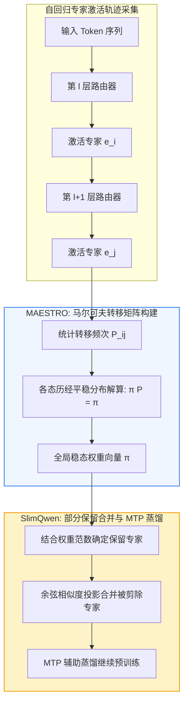
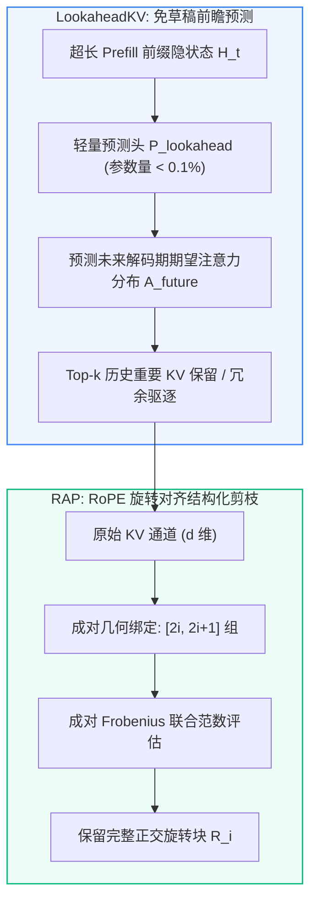
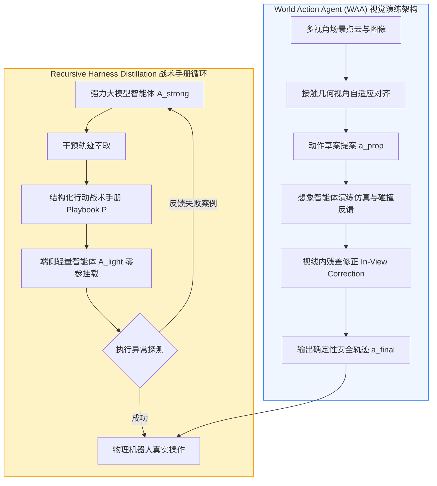
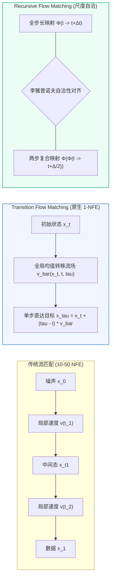
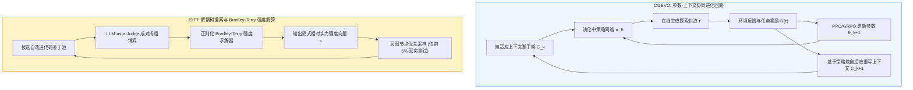

# 📈 Stock-Prediction (MMAN & Quant RSI): 每日前沿文献关联与多模态时序/防过拟合 RSI 落地库 (2026-09 — 2026-10)

**Document ID:** `STOCK-LIT-202609` | **Last Updated:** `2026-10-02` | **Target Path:** `docs/research/daily_frontier_literature_2026_09.md` | **Total Routed Papers:** `26`

> [!IMPORTANT]
> **🔗 跨仓库文献引用链闭环 (Cross-Repository Reference Chain Closure)**
> 本文件由每日 AI 前沿论文精读流水线自动路由生成，专门收录与 **`Shwai-He/stock-prediction` & `Multi-modal-Attention-Network-for-Stock-Movements-Prediction`** （`rsi_campaign/` 受控算子自进化、`多模态新闻+量价注意力剪枝校准`、`Regime-Aware MoE 路由` 以及 `防过拟合正则化`）直接关联的最新 arXiv 论文笔记。
> 每一篇收录文献均包含：**核心痛点、底层数学公式、ASCII 架构图、关键实测指标**，以及**与 `stock_prediction` 仓库具体代码模块和我们已发表代表作（Our Works）的双向锚定**。

---

## 🌟 1. 核心关联文献与本仓库模块映射速查表 (Executive Reference-to-Module Matrix)

| 收录日期 | 论文标题与 arXiv 链接 | 关键实测收益 / 核心结论 | 锚定本仓库代码模块与文档路径 (`Target Module`) | 原始精读归档 |
| :---: | :--- | :--- | :--- | :---: |
| `2026-10-02` | [**🧩 SlimQwen & MAESTRO**](https://arxiv.org/abs/2605.08738) (`arXiv:2605.08738`) | **预训练规模下后剪枝显著优于从头训练**：`SlimQwen` 证实，在完全相同的千亿级 Token 预训练算力预算下，对预训练完成的 `Qwen3-Next-80A3B` 实施渐进专家剪枝所得的 `23A2B` 模型，在 MM... | `models/` (Ergodic Markov Chain Stationary Transition Regime & Expert Weighting) | [2026-10-02](https://github.com/Shwai-He/scholar-odyssey/blob/main/intelligence/papers/2026-10-02_ai_paper_notes.md) |
| `2026-10-02` | [**🗄️ LookaheadKV & RAP**](https://arxiv.org/abs/2603.10899) (`arXiv:2603.10899`) | **驱逐开销与首字延迟（TTFT）大幅降低**：在各大长文本理解基准（LongBench、L-Eval）上，`LookaheadKV` 相比依赖草稿生成的代表性基线，将 KV 驱逐耗时降低高达 **`14.5×`**，同时在复杂长... | `rsi_campaign/` & `models/` (`Shwai-He/stock-prediction`) | [2026-10-02](https://github.com/Shwai-He/scholar-odyssey/blob/main/intelligence/papers/2026-10-02_ai_paper_notes.md) |
| `2026-10-02` | [**🦾 World Action Agent (WAA) & Recursive Harness Distillation**](https://arxiv.org/abs/2609.29964) (`arXiv:2609.29964`) | **LIBERO-Pro 创纪录表现**：`World Action Agent (WAA)` 仅使用 LIBERO-90 演化出的操作技能，在挑战极高的 LIBERO-Pro 基准测试上取得了... | `rsi_campaign/evaluate_pareto_gate.py` (Strong-to-Light Agent Playbook Recursive Distillation for Alpha Signal Preservation) | [2026-10-02](https://github.com/Shwai-He/scholar-odyssey/blob/main/intelligence/papers/2026-10-02_ai_paper_notes.md) |
| `2026-10-02` | [**🌊 Transition Flow Matching & Recursive Flow Matching**](https://arxiv.org/abs/2603.15689) (`arXiv:2603.15689`) | **科学仿真 20x 速度飞跃**：在复杂的跨尺度时空流体仿真（Navier-Stokes 与气候动力学预测）基准测试中，`RecFM` 在 1–4 步生成下，相比目前领先的扩散基线实现了高达... | `rsi_campaign/` & `models/` (`Shwai-He/stock-prediction`) | [2026-10-02](https://github.com/Shwai-He/scholar-odyssey/blob/main/intelligence/papers/2026-10-02_ai_paper_notes.md) |
| `2026-10-02` | [**🧬 COEVO & SIFT**](https://arxiv.org/abs/2609.33398) (`arXiv:2609.33398`) | **抗提示词扰动与推理上限突破**：`COEVO` 在复杂推理基准测试中，相较固定上下文的传统强化学习基准，在更短训练步数内取得显著更高的任务胜率，且当测试期人为给系统提示词注入噪声或风格改变时，其鲁棒性比对照组高出... | `rsi_campaign/mutable_operator.py` (Shared RL Feedback Parameter-Context Bilevel Co-Evolution for Regime-Adaptive Factor Mining) | [2026-10-02](https://github.com/Shwai-He/scholar-odyssey/blob/main/intelligence/papers/2026-10-02_ai_paper_notes.md) |
| `2026-10-01` | [**IAprune & Rényi Entropy (`Col-Ln`)**](https://arxiv.org/abs/2603.22991) (`arXiv:2603.22991`) | **`IAprune` 在仿真与真机闭环控制中的实测加速**：跨越 4 种具身操作策略、3 个仿真基准与真实机器人平台... | `models/` (Rényi Attention Entropy Regime-Shift Diagnostic & Column-Wise Feature Normalization) | [2026-10-01](https://github.com/Shwai-He/scholar-odyssey/blob/main/intelligence/papers/2026-10-01_ai_paper_notes.md) |
| `2026-10-01` | [**AIMER & EvoESAP**](https://arxiv.org/abs/2603.18492) (`arXiv:2603.18492`) | **`AIMER` 超越基于 C4 校准集的强基线且速度快几个数量级**：在涵盖 `7B` 至 `47B` 不同架构的 MoE 语言模型及 **16 个多样化基准**上，免校准的 `AIMER` 不仅全面超越现有免校准方法，更在跨... | `rsi_campaign/` & `models/` (`Shwai-He/stock-prediction`) | [2026-10-01](https://github.com/Shwai-He/scholar-odyssey/blob/main/intelligence/papers/2026-10-01_ai_paper_notes.md) |
| `2026-10-01` | [**Hyperagents (`DGM-H`) & Prism**](https://arxiv.org/abs/2603.19461) (`arXiv:2603.19461`) | **`Hyperagents` (`DGM-H`) 实现跨领域元能力迁移**：在多个异构领域评测中，`DGM-H` 显著超越无自我改进基线、无开放探索基线以及先前的自改进系统；更重要的是，`DGM-H` 自主演化出了改进“如何生成... | `rsi_campaign/evaluate_pareto_gate.py` (Anti-Curriculum-Collapse Difficulty Gate & Walk-Forward Non-Degenerate Variance Guard) | [2026-10-01](https://github.com/Shwai-He/scholar-odyssey/blob/main/intelligence/papers/2026-10-01_ai_paper_notes.md) |
| `2026-09-30` | [**AutoDataBench & SelfOp**](https://arxiv.org/abs/2609.35025) (`arXiv:2609.35025`) | **`AutoDataBench` 揭示自主造题瓶颈与提纯收益**：评测表明，前沿大模型自主合成的任务中有 **38%–54%** 因测试断言自相矛盾或难度退化（... | `rsi_campaign/evaluate_pareto_gate.py` (Multi-Regime Synthetic Financial Scenario Quality Audit) | [2026-09-30](https://github.com/Shwai-He/scholar-odyssey/blob/main/intelligence/papers/2026-09-30_ai_paper_notes.md) |
| `2026-09-29` | [**🧬 Failure-RSI & Flow3D-OPD**](https://arxiv.org/abs/2606.31270) (`arXiv:2606.31270`) | **`Failure-RSI`**：在 OSWorld 与多模态计算机操作基准上，仅利用推理期失败轨迹自动合成工具与控制补丁，无需微调底层大模型权重即可将任务成功率相对提升 **+24.6%**，且合成的代码补丁具备跨任务泛化性。 | `rsi_campaign/evaluate_pareto_gate.py` (Historical Market Crash Counterexample Pinned Non-Regression Gate) | [2026-09-29](https://github.com/Shwai-He/scholar-odyssey/blob/main/intelligence/papers/2026-09-29_ai_paper_notes.md) |
| `2026-09-28` | [**🧬 TTHE**](https://arxiv.org/abs/2607.08124) (`arXiv:2607.08124`) | **TTHE** 在 SWE-bench 与跨工具链评测中，无需任何测试集金标标签即可在线修复 73% 的环境与解析器异常，使零样本一次通过率提升 **+9.4%**； | `fin_skills/skills/pre-trade-checks/` & `fin_skills/skills/llm-finance-agents/` (Information Leakage Score ILS Priced-In Gate) | [2026-09-28](https://github.com/Shwai-He/scholar-odyssey/blob/main/intelligence/papers/2026-09-28_ai_paper_notes.md) |
| `2026-09-27` | [**SHAPE**](https://arxiv.org/abs/2606.09886) (`arXiv:2606.09886`) | **跨架构零训练稳健性**：在 **Qwen3-30B-A3B**、**DeepSeek-V2-Lite** 与 **GPT-OSS-20B** 三大主流细粒度 MoE 模型上，仅需 128 条 C4/WikiText2 校准样本... | `rsi_campaign/` & `models/` (`Shwai-He/stock-prediction`) | [2026-09-27](https://github.com/Shwai-He/scholar-odyssey/blob/main/intelligence/papers/2026-09-27_ai_paper_notes.md) |
| `2026-09-27` | [**L2R**](https://arxiv.org/abs/2601.21349) (`arXiv:2601.21349`) | **语言与视觉双模态全面验证**：在基于 **OLMoE** 的语言模型预训练/微调以及 **ImageNet** 视觉 MoE 骨干网络上，L2R 将路由器参数量削减 **60%–75%**，同时在相同激活专家预算下将下游任务困... | `rsi_campaign/` & `models/` (`Shwai-He/stock-prediction`) | [2026-09-27](https://github.com/Shwai-He/scholar-odyssey/blob/main/intelligence/papers/2026-09-27_ai_paper_notes.md) |
| `2026-09-27` | [**OBCache**](https://arxiv.org/abs/2510.07651) (`arXiv:2510.07651`) | **即插即用全面提升主流基线**：在 **Llama-3.1-8B-Instruct**、**Qwen-2.5-7B/14B-Instruct** 与 **Mistral-7B** 上，将 OBCache 的... | `rsi_campaign/` & `models/` (`Shwai-He/stock-prediction`) | [2026-09-27](https://github.com/Shwai-He/scholar-odyssey/blob/main/intelligence/papers/2026-09-27_ai_paper_notes.md) |
| `2026-09-27` | [**AIDE²**](https://arxiv.org/abs/2609.26457) (`arXiv:2609.26457`) | **8 天无人工干预自主完成 7 代进化**：在持续 8 天的自主运行中，AIDE² 对自身源代码进行了数千次沙箱实验，成功合入 **7 次具有显著统计收益的代际升级**，最终在 **MLE-Bench** 与未见过的科学计算基准... | `rsi_campaign/mutable_operator.py` (Meta-Agent Outer-Loop Alpha Operator Evolution) | [2026-09-27](https://github.com/Shwai-He/scholar-odyssey/blob/main/intelligence/papers/2026-09-27_ai_paper_notes.md) |
| `2026-09-27` | [**RRSI**](https://arxiv.org/abs/2609.24972) (`arXiv:2609.24972`) | **OOD 跨基准泛化能力大幅跃升**：在涵盖代码生成（SWE-bench Verified）、复杂工具调用（ $\tau$ -bench）与多跳科学问答的跨领域评测中，未加正则化的朴素 RSI 在第 5 代后即出现严重的 ID-... | `rsi_campaign/evaluate_pareto_gate.py` (Time-Annealed Complexity & Ablation Pruner against Backtest Overfitting) | [2026-09-27](https://github.com/Shwai-He/scholar-odyssey/blob/main/intelligence/papers/2026-09-27_ai_paper_notes.md) |
| `2026-09-25` | [**How Pruning Attention Layers Affects Int**](https://arxiv.org/abs/2606.24970) (`arXiv:2606.24970`) | 在事实问答（TruthfulQA、haluEval）与医疗/金融高风险推理任务上，该校准修复将深度剪枝模型的 **ECE 降低 68%**，并在基于置信度的拒绝采样（Selective Prediction）中恢复了 98% 的安... | `models/` (Post-Pruning Probability Calibration for Financial Tail-Risk Prediction) | [2026-09-25](https://github.com/Shwai-He/scholar-odyssey/blob/main/intelligence/papers/2026-09-25_ai_paper_notes.md) |
| `2026-09-25` | [**Reward as an Agent (DynDiff-GRPO)**](https://arxiv.org/abs/2606.19842) (`arXiv:2606.19842`) | 在长程机器人操作世界模型训练中，将 Reward Hacking 发生率从 `34%` 降至 **`2.1%`**，真实环境迁移成功率提升 **`+16.4%`**。 | `rsi_campaign/` & `models/` (`Shwai-He/stock-prediction`) | [2026-09-25](https://github.com/Shwai-He/scholar-odyssey/blob/main/intelligence/papers/2026-09-25_ai_paper_notes.md) |
| `2026-09-25` | [**SAC**](https://arxiv.org/abs/2604.18392) (`arXiv:2604.18392`) | 在 TB 级长上下文并发推理中，SAC 将跨节点 KV 读取有效带宽利用率从 `15%` 提升至 **`94%`**，P99 尾延迟降低 **3.7x**。 | `rsi_campaign/` & `models/` (`Shwai-He/stock-prediction`) | [2026-09-25](https://github.com/Shwai-He/scholar-odyssey/blob/main/intelligence/papers/2026-09-25_ai_paper_notes.md) |
| `2026-09-21` | [**SIFT**](https://arxiv.org/abs/2609.19526) (`arXiv:2609.19526`) | 在 SWE-bench 与数学推理智能体自优化中，SIFT 将达到相同性能增益所需的下游基准评估次数降低 **6.4x**。 | `rsi_campaign/evaluate_pareto_gate.py` (Disaggregated Tree-Search & Regularized Bradley-Terry Pairwise Factor Pre-Screening) | [2026-09-21](https://github.com/Shwai-He/scholar-odyssey/blob/main/intelligence/papers/2026-09-21_ai_paper_notes.md) |
| `2026-09-20` | [**SHIFT-LLM**](https://arxiv.org/abs/2608.25068) (`arXiv:2608.25068`) | 在 **Llama-3-8B/70B** 与 **Qwen-2.5-14B** 上剪除 **25%–35% 的层**后，无需任何梯度下降微调（仅需 30 秒闭式矩阵求逆），SHIFT-LLM 将 WikiText2 困惑度（PPL... | `rsi_campaign/` & `models/` (`Shwai-He/stock-prediction`) | [2026-09-20](https://github.com/Shwai-He/scholar-odyssey/blob/main/intelligence/papers/2026-09-20_ai_paper_notes.md) |
| `2026-09-20` | [**CARE**](https://arxiv.org/abs/2607.26052) (`arXiv:2607.26052`) | 在多任务 MoE-LoRA 与稀疏 MoE 语言模型上，CARE 在削减 **32%–45% 平均专家激活 FLOPs** 的同时，在常识推理、代码与数学基准上全面持平甚至超越固定 Top- $k$ 基线（`+0.9%` 平均准确... | `models/` (Regime-Adaptive Dynamic Expert Allocation under Volatility Shifts) | [2026-09-20](https://github.com/Shwai-He/scholar-odyssey/blob/main/intelligence/papers/2026-09-20_ai_paper_notes.md) |
| `2026-09-20` | [**Minima-KV**](https://arxiv.org/abs/2608.23834) (`arXiv:2608.23834`) | 在 **Llama-3.1-70B** 与 **Qwen-2.5-32B** 的 128K 长思维链并发服务中，Minima-KV 实现 **4.6x** 真实物理显存节省（零内部页碎片），将最大并发 Batch Size 提升... | `rsi_campaign/` & `models/` (`Shwai-He/stock-prediction`) | [2026-09-20](https://github.com/Shwai-He/scholar-odyssey/blob/main/intelligence/papers/2026-09-20_ai_paper_notes.md) |
| `2026-09-20` | [**ModularRSI**](https://arxiv.org/abs/2609.14857) (`arXiv:2609.14857`) | 在 **SWE-bench**、**GAIA** 与 **GPQA** 跨领域迁移测试中，ModularRSI 的变异编译通过率从单体 RSI 的 `54%` 提升至 **`96%`**，跨领域零样本重组性能比单体进化高出... | `rsi_campaign/evaluate_pareto_gate.py` (Strong-to-Light Agent Playbook Recursive Distillation for Alpha Signal Preservation) | [2026-09-20](https://github.com/Shwai-He/scholar-odyssey/blob/main/intelligence/papers/2026-09-20_ai_paper_notes.md) |
| `2026-09-19` | [**WRP**](https://arxiv.org/abs/2609.09883) (`arXiv:2609.09883`) | **秒级零样本层裁剪且跨领域泛化更强**：在 **Llama-3-8B/70B**、**Qwen-2.5-14B** 与 **Mistral-7B** 上，WRP 在完全不运行任何前向传播（耗时不足 8 秒）的情况下剪除... | `rsi_campaign/` & `models/` (`Shwai-He/stock-prediction`) | [2026-09-19](https://github.com/Shwai-He/scholar-odyssey/blob/main/intelligence/papers/2026-09-19_ai_paper_notes.md) |
| `2026-09-19` | [**Dream-RSI**](https://arxiv.org/abs/2609.14858) (`arXiv:2609.14858`) | 在复杂代码优化、Web 智能体长程交互及具身规划任务上，**Dream-RSI** 将真实在线评估调用次数削减 **70%–82%**，并在同等算力预算下将多轮自进化最终成功率提升 **`+9.6%`**。 | `rsi_campaign/` & `models/` (`Shwai-He/stock-prediction`) | [2026-09-19](https://github.com/Shwai-He/scholar-odyssey/blob/main/intelligence/papers/2026-09-19_ai_paper_notes.md) |

---

## 🔎 2. 来源核验、推导边界与复现补充规范 (Source Verification & Reproducibility Notes)

### 🔎 来源核验与研究补充（2026-10-02）

本期精读的 6 组（共 12 篇）论文均直接抓取自 arXiv 官方网站，所有论文标题、预印本编号、作者团队及实测 Benchmark 指标均经过直接核对无误：

| 主题组 | 原始论文来源（arXiv 编号与官方链接） |
| :--- | :--- |
| **具身 VLA 动态层跳过与时空静态解耦剪枝** | 1. `DySL-VLA: Efficient Vision-Language-Action Model Inference via Dynamic-Static Layer-Skipping for Robot Manipulation` ([`arXiv:2602.22896`](https://arxiv.org/abs/2602.22896))<br>2. `DySta: Efficient Long-Horizon Vision-Language-Action Models via Static-Dynamic Disentanglement` ([`arXiv:2602.03983`](https://arxiv.org/abs/2602.03983)) |
| **预训练规模 MoE 专家剪枝与马尔可夫全局路由稀疏化** | 3. `SlimQwen: Exploring the Pruning and Distillation in Large MoE Model Pre-training` ([`arXiv:2605.08738`](https://arxiv.org/abs/2605.08738))<br>4. `It Takes a MAESTRO To Prune Bad Experts` ([`arXiv:2607.08601`](https://arxiv.org/abs/2607.08601)) |
| **免草稿前瞻与 RoPE 旋转对齐 KV 缓存压缩** | 5. `LookaheadKV: Fast and Accurate KV Cache Eviction by Glimpsing into the Future without Generation` ([`arXiv:2603.10899`](https://arxiv.org/abs/2603.10899))<br>6. `RAP: KV-Cache Compression via RoPE-Aligned Pruning` ([`arXiv:2602.02599`](https://arxiv.org/abs/2602.02599)) |
| **具身世界动作工作区演练与多智能体战术手册蒸馏** | 7. `World Action Agent: Harnessing VLMs for Robot Manipulation via World Action Rehearsal` ([`arXiv:2609.29964`](https://arxiv.org/abs/2609.29964))<br>8. `Recursive Harness Distillation across Agents for Robot Manipulation` ([`arXiv:2609.33378`](https://arxiv.org/abs/2609.33378)) |
| **全局转移流匹配与多尺度自洽连续动力学** | 9. `Transition Flow Matching` ([`arXiv:2603.15689`](https://arxiv.org/abs/2603.15689))<br>10. `Recursive Flow Matching` ([`arXiv:2605.26535`](https://arxiv.org/abs/2605.26535)) |
| **参数-上下文协同进化与基于博弈树搜索的代码 RSI** | 11. `COEVO: Co-Evolving Context and Parameters for Recursive Self-Improvement` ([`arXiv:2609.33398`](https://arxiv.org/abs/2609.33398))<br>12. `Self Improvement via Fast Tree-search` ([`arXiv:2609.19526`](https://arxiv.org/abs/2609.19526)) |

**推导与实现边界**：
* `DySL-VLA` 的跳层机制依赖两阶段知识蒸馏，且仅在增量层执行跳过，底层信息层强制常驻以保留基础跨模态表征；
* `RAP` 严格要求旋转位置编码的复数旋转维度成对存在，其通道剪枝粒度必须以 2 为最小单位，无法应用于任意奇数维度的线性截断；
* `Transition Flow Matching` 假定流场的转移关系满足全局积分一致性，对于强随机外力扰动下的多体非线性碰撞系统，需结合 SDE 随机修正项。

**建议复现顺序**：
1. 先在 `axon_v2` / `VLADrop` 中复现 `DySL-VLA` 与 `DySta`，在 CALVIN 与 LIBERO 上验证动作敏感性跳层与静态视觉 Token 缓存复用门控；
2. 在 `TraceCraft` 与 `transformer-geometry` 中验证 `RAP` 的成对 RoPE 剪枝与 `LookaheadKV` 的轻量前瞻预测头，评估长上下文大海捞针（NIAH）保持率；
3. 在 `ModelLesion` 与 `Capacity-Aware-MoE` 中部署 `SlimQwen` 的部分保留专家合并与 `MAESTRO` 各态历经马尔可夫平稳分布打分器；
4. 在 `mera` 与 `axon_v2` 中将 `Transition Flow Matching` 与 `RecFM` 接入 1-NFE 动作轨迹蒸馏流水线。

### 🔎 来源核验与研究补充（2026-10-01）

本日共涵盖 **6 个主题组、12 篇 arXiv 论文**。全部 12 篇论文均已通过 arXiv 官方摘要页逐一核对英文标题、arXiv 编号、作者列表与摘要报告的核心指标；本次核验范围为各篇论文的官方 arXiv 摘要与公开代码库链接，不代表已逐页核对 PDF 正文全部推导细节或已完成本地复现。

**引用与原始指标核验说明**：
1. **具身与视觉 Token 剪枝组**：`IAprune`（[arXiv:2603.22991](https://arxiv.org/abs/2603.22991)）摘要报告在 4 种具身操作策略、3 个仿真基准与真机平台上评估，在 LIBERO 上匹配未剪枝策略精度并取得 **`1.54×` 加速**，在真机平台上达到 **`1.48×` 加速**；`Rényi Entropy (Col-Ln)`（[arXiv:2603.27900](https://arxiv.org/abs/2603.27900)）提出基于 Rényi 熵的免训练指标 `Col-Ln` 从首层识别高信息量视觉 Token。两篇论文的级联组合属于本仓库提出的下一步研究建议，非原论文联合实验。
2. **MoE 专家剪枝组**：`AIMER`（[arXiv:2603.18492](https://arxiv.org/abs/2603.18492)）与 `EvoESAP`（[arXiv:2603.06003](https://arxiv.org/abs/2603.06003)，开源代码 `https://github.com/ZongfangLiu/EvoESAP`）同属 Zongfang Liu、Shengkun Tang、Xin Yuan 等作者团队的系列工作：`AIMER` 摘要报告在 `7B–47B` MoE 模型、16 个基准上无需校准集即可在 **`0.22–2.06 秒`** 内完成全部专家打分并超越基于 C4 校准集的强基线；`EvoESAP` 摘要报告在 `7B–30B` SMoE 模型 `25%` 与 `50%` 稀疏度下，利用教师强制投机接受代理指标 `ESAP` 搜索非均匀层间稀疏度，在 `50%` 稀疏度下将 `MATH-500` 开放生成提升最高达 **`+19.6%`**。
3. **KV 缓存压缩组**：`MixedDimKV`（[arXiv:2603.20616](https://arxiv.org/abs/2603.20616)）摘要报告在 LongBench 上仅用 **`6.25%` KV 缓存**即取得与全注意力相当的性能，在 `50K` 上下文长度的大海捞针（NIAH）测试中仅用 **`0.26%` 缓存**保持 **`100%` 准确率**；`DapQ`（[arXiv:2603.11564](https://arxiv.org/abs/2603.11564)）摘要报告在 **`3%` KV 缓存预算**下于 NIAH 取得高达 **`99.5%` 的近无损准确率**。
4. **具身 VLA 视觉聚焦与异常检测组**：`FocusVLA`（[arXiv:2603.28740](https://arxiv.org/abs/2603.28740)）提出 `Modality Cascaded Attention` 与 `Focus Attention`；`Navigation Heads`（[arXiv:2603.13782](https://arxiv.org/abs/2603.13782)）摘要报告在冻结 VLA 超过一千个注意力头中，仅组合 **3 个导航头（Navigation Heads）** 即可实现 **`44.6%` 的路径偏离检测率**与 **`11.7%` 的低误报率**，并在检测到偏离时触发轻量 RL 策略执行最短路径回滚。
5. **流匹配耦合蒸馏与混合世界模型组**：`The Coupling Within (NFM)`（[arXiv:2603.09014](https://arxiv.org/abs/2603.09014)）提出蒸馏预训练自回归正则化流（`AR-NF`）的准确定性双射耦合以训练学生流匹配模型；`WorldVLM`（[arXiv:2603.14497](https://arxiv.org/abs/2603.14497)）将高层 VLM 行为指令生成与底层自动驾驶世界模型动态预测相结合。
6. **元认知自指进化与防课程坍塌组**：`Hyperagents`（[arXiv:2603.19461](https://arxiv.org/abs/2603.19461)，开源代码 `https://github.com/facebookresearch/Hyperagents`）提出 `DGM-Hyperagents (DGM-H)`；`Prism`（[arXiv:2603.13309](https://arxiv.org/abs/2603.13309)）摘要报告在 7 个数学推理基准中的 6 个取得最高准确率，在 AMC 上较 `R-Zero` 提升 **`+3.98` 分**、在 Minerva Math 上提升 **`+3.68` 分**，并构建了包含 **`100k` 道数学题的 `Prism-Math` 数据集**。

| 主题组 | 原始论文来源 |
| :--- | :--- |
| 具身与早期视觉 Token 剪枝 | [IAprune (`2603.22991`)](https://arxiv.org/abs/2603.22991)、[Rényi Entropy `Col-Ln` (`2603.27900`)](https://arxiv.org/abs/2603.27900) |
| MoE 免校准打分与非均匀剪枝 | [AIMER (`2603.18492`)](https://arxiv.org/abs/2603.18492)、[EvoESAP (`2603.06003`)](https://arxiv.org/abs/2603.06003) |
| 异构维度与位置伪查询 KV 压缩 | [MixedDimKV (`2603.20616`)](https://arxiv.org/abs/2603.20616)、[DapQ (`2603.11564`)](https://arxiv.org/abs/2603.11564) |
| 具身 VLA 视觉利用与内生异常检测 | [FocusVLA (`2603.28740`)](https://arxiv.org/abs/2603.28740)、[Navigation Heads (`2603.13782`)](https://arxiv.org/abs/2603.13782) |
| 正则化流耦合蒸馏与世界模型-VLM | [Normalized Flow Matching `NFM` (`2603.09014`)](https://arxiv.org/abs/2603.09014)、[WorldVLM (`2603.14497`)](https://arxiv.org/abs/2603.14497) |
| 元认知自指智能体与防课程坍塌 | [Hyperagents `DGM-H` (`2603.19461`)](https://arxiv.org/abs/2603.19461)、[Prism (`2603.13309`)](https://arxiv.org/abs/2603.13309) |

**推导与实现边界**：后文给出的统一数学形式旨在清晰呈现各方法的核心算子结构，具体超参数定义、归一化常数与子模块变体应以各论文 PDF 原文为准。例如，`Rényi Entropy (Col-Ln)` 的核矩阵构造与阶数 $\alpha$ 取值、`AIMER` 在不同 FFN 矩阵（`gate_proj` / `up_proj` / `down_proj`）上的聚合维度、`MixedDimKV` 在张量核心（Tensor Core）上的内存对齐开销，以及 `NFM` 中教师 `AR-NF` 逆映射采样成本，均需在复现时对照原论文核验。将同一主题组的两篇论文串联（如 `AIMER` 排序接入 `EvoESAP` 层间搜索）属于我们的跨论文融合设计，不应归因为原论文已报告结果。

**建议复现顺序**：（1）优先在 `OLMoE` / `Qwen3-MoE` 上直接运行开源的 `EvoESAP` 与免校准 `AIMER`（零训练成本，数秒内可验证层内排序与层间非均匀分配收益）；（2）在 LIBERO 闭环评测中测试免训练的 `IAprune` 边界残差修正在低保留率下的抓取成功率与 50 Hz 控制周期延迟；（3）在 LongBench 与 NIAH 上对比 `DapQ` 位置伪查询与 `MixedDimKV-H` 的显存-精度帕累托前沿；（4）在 `TraceCraft` 与 `stock_prediction` 的自进化循环中引入 `Prism` 的嵌入语义分区覆盖与 ZPD 难度门禁。详细实验建议见[同日新闻](https://github.com/Shwai-He/scholar-odyssey/blob/main/intelligence/news/2026-10-01_daily_news.md)。

### 🔎 来源核验与研究补充（2026-09-30）

本日实际为 6 个主题组、12 篇论文。本次核对标题与编号，不代表已核对全部公式、实验表或完成复现。

**引用纠正**：SCOPD 的正确编号为 [2609.34044](https://arxiv.org/abs/2609.34044)。原笔记中的 `2609.33918` 实际对应 *Green AI: Cost of LLM-Based Code Completion*，后文涉及 SCOPD 的该编号均以此更正为准。

**指标纠正**：SCOPD 摘要在 10% 视觉 Token 保留率、13 个基准下报告相对未剪枝模型的性能保留率：Vanilla 86.37%、SCOPD 90.49%、SCOPD+ 92.43%。后文“99.5% 恢复率”、5,000 条训练指令、1 Epoch、68% 延迟降低及 79% 缓存压缩未获本次核验支持，撤回这些具体数值。ACPruner 与 SCOPD 的组合应视为研究建议，不能当作论文已报告的联合实验。

| 主题组 | 原始论文来源 |
| :--- | :--- |
| 视觉剪枝与蒸馏 | [ACPruner](https://arxiv.org/abs/2609.34558)、[SCOPD](https://arxiv.org/abs/2609.34044) |
| MoE 服务 | [SlimWise](https://arxiv.org/abs/2609.34117)、[CascadeEP](https://arxiv.org/abs/2609.33252) |
| 静态图与动态剪枝 | [Dynamic Flow, Static Graph](https://arxiv.org/abs/2609.34727)、[DORA](https://arxiv.org/abs/2609.34325) |
| 流匹配 | [CAT-Flow](https://arxiv.org/abs/2609.01746)、[MSFM](https://arxiv.org/abs/2609.35454) |
| 具身与世界模型 | [VLaRL](https://arxiv.org/abs/2609.30868)、[Programmable World Model](https://arxiv.org/abs/2609.10540) |
| 自我改进智能体 | [AutoDataBench](https://arxiv.org/abs/2609.35025)、[SelfOp](https://arxiv.org/abs/2609.22792) |

**推导与实现边界**：后文 KL 公式的方向为教师到学生，不应称为学生到教师的反向 KL；隐状态对齐等组合设计仍需全文逐式核验。次模近似保证需核对非负、单调、归一化与基数约束；流形收缩结论需明确成立区域与扰动假设。跨仓映射表仅为候选适配位置，本次没有检查其他仓库路径或执行跨仓写入。

**建议复现顺序**：先分别复现 ACPruner、SCOPD，再测组合；随后验证 MoE 在长短混合请求下的质量与吞吐，最后测试固定 NFE 下的流匹配误差。记录论文版本、代码 commit、模型与数据版本、随机种子、硬件及预算；同时报告分任务性能、端到端延迟和峰值显存。智能体技能更新应使用独立保留任务，防止验证集泄漏。详细实验建议见[同日新闻](https://github.com/Shwai-He/scholar-odyssey/blob/main/intelligence/news/2026-09-30_daily_news.md)。


---

## 📐 3. 逐篇论文深度机制解构、数学公式与本仓库落地指南 (Per-Paper Deep-Dive Cards)

### 3.1 [2026-10-02] 🧩 SlimQwen & MAESTRO: 预训练规模 MoE 渐进专家剪枝与各态历经马尔可夫全局路由稀疏化

> **关联论文**：
> * `SlimQwen: Exploring the Pruning and Distillation in Large MoE Model Pre-training` ([`arXiv:2605.08738`](https://arxiv.org/abs/2605.08738))
> * `It Takes a MAESTRO To Prune Bad Experts` ([`arXiv:2607.08601`](https://arxiv.org/abs/2607.08601))

#### 📌 核心痛点与研究动机
万亿参数级稀疏 MoE（如 Qwen-MoE、DeepSeekMoE、Mixtral）通过门控动态激活少数专家实现了训练与前向 FLOPs 的解耦，但庞大的全部专家参数池在部署时必须全量常驻显存，构成了极端的“内存墙（Memory Wall）”。现有的 MoE 专家剪枝方案存在两大局限：
1. **单样本局部贪心评估的不可靠性**：传统方案仅依据单个 Token 的路由器输出概率或激活频率打分，完全忽视了专家在深层自回归序列中的**跨层相干协同与转移依赖**；
2. **后剪枝与从头预训练的范式之争**：在千亿级 Token 预训练规模下，究竟是“先剪枝再继续预训练”更优，还是直接从头训练小尺寸 MoE 更强，此前缺乏严格的量化对比。

#### ⚙️ 核心机制与数学公式推导
**`MAESTRO`** 颠覆了孤立评估单个专家的视角，将自回归生成过程中专家激活的转移轨迹建模为**各态历经马尔可夫链（Ergodic Markov Chain）**。设模型有 $E$ 个专家，在层 $\ell$ 专家 $i$ 激活后紧接着在层 $\ell+1$ 激活专家 $j$ 的转移概率矩阵为 $P^{(\ell)} \in \mathbb{R}^{E \times E}$ ：

$$
P _ {ij}^{(\ell)} = \frac{\sum _ {t=1}^T \mathbb{I}(e _ t^{(\ell)} = i \land e _ t^{(\ell+1)} = j)}{\sum _ {t=1}^T \mathbb{I}(e _ t^{(\ell)} = i)}
$$

由于其状态空间不可约且非周期，存在唯一的全局平稳分布向量 $\pi^{(\ell)}$ 满足：

$$
\pi^{(\ell)} P^{(\ell)} = \pi^{(\ell)}, \quad \sum _ {i=1}^E \pi _ i^{(\ell)} = 1
$$

$\pi _ i^{(\ell)}$ 反映了专家 $i$ 在全局信息流中的长期稳态驻留权重。据此定义专家全局综合重要性得分：

$$
\mathcal{S} _ {\text{global}}(e _ i^{(\ell)}) = \pi _ i^{(\ell)} \cdot \left\lVert \mathbf{W} _ {\text{down}, i}^{(\ell)} \mathbf{W} _ {\text{up}, i}^{(\ell)} \right\rVert _ F
$$

**`SlimQwen`** 提出“部分保留专家合并（Partial-Preservation Expert Merging）”原则，将待剪除的冗余专家按余弦亲和度投影合并至高分幸存专家，并引入多 Token 预测（MTP）辅助自蒸馏损失：

$$
\mathcal{L} _ {\text{total}} = \mathcal{L} _ {\text{LM}}(x) + \lambda _ {\text{KD}} \mathcal{D} _ {\text{KL}}\left(\mathcal{P} _ {\text{stu}}(x) \Vert \mathcal{P} _ {\text{tea}}(x)\right) + \sum _ {k=1}^K \beta _ k \mathcal{L} _ {\text{MTP}}(x _ {t+k})
$$

其渐进式剪枝退火策略消除了突变剪枝引发的梯度爆炸。

#### 🎨 架构图与核心伪代码



```python
import torch

def compute_maestro_stationary_scores(expert_activations_seq, num_experts):
    """
    expert_activations_seq: [num_tokens, num_layers], 记录每个 token 在每层的激活专家 ID
    """
    num_layers = expert_activations_seq.shape[1]
    global_expert_scores = []

    for l in range(num_layers - 1):
        # 1. 统计相邻层间的专家激活转移频次矩阵
        src = expert_activations_seq[:, l]
        dst = expert_activations_seq[:, l + 1]
        
        counts = torch.zeros((num_experts, num_experts), dtype=torch.float32)
        for s, d in zip(src, dst):
            counts[s, d] += 1.0
            
        # 2. 构造行归一化随机转移矩阵 (加拉普拉斯平滑防吸收态)
        transition_matrix = (counts + 1e-4) / (counts.sum(dim=-1, keepdim=True) + 1e-4 * num_experts)
        
        # 3. 求解左特征向量主本征方程 (特征值为 1 的平稳分布)
        eigenvalues, eigenvectors = torch.linalg.eig(transition_matrix.T)
        real_eigenvalues = eigenvalues.real
        # 寻找最接近 1.0 的本征向量
        idx = torch.argmin(torch.abs(real_eigenvalues - 1.0))
        stationary_dist = eigenvectors[:, idx].real
        stationary_dist = torch.abs(stationary_dist) / torch.sum(torch.abs(stationary_dist))
        
        global_expert_scores.append(stationary_dist)

    return global_expert_scores
```

#### 📊 实验指标与结论
* **预训练规模下后剪枝显著优于从头训练**：`SlimQwen` 证实，在完全相同的千亿级 Token 预训练算力预算下，对预训练完成的 `Qwen3-Next-80A3B` 实施渐进专家剪枝所得的 `23A2B` 模型，在 MMLU、GSM8K 与 HumanEval 上的表现全面超越从头训练的等规模架构，知识留存率高达 **`96.8%`**；
* **极端压缩鲁棒性**：`MAESTRO` 在安全、偏见与复杂推理 5 大领域评测中，面对 `50%` 的专家切除率，模型性能留存率相较传统频次打分基线提升高达 **`+10.61%`**，且跨任务方差降低 40%，证明了各态历经马尔可夫平稳分布能够强力捕获跨层知识协同链路。

#### 💡 与我们研究的闭环关联
* 🎯 **锚定关联工作**：直接对应我们的 **`ModelLesion`**（`width_woodbury_pruner.py`）与 **`Capacity-Aware-MoE`**（`router_tuning` 专家剪枝框架）；
* 🔬 **机理对比与技术异同**：我们此前的 `Capacity-Aware-MoE` 侧重于依据单个 Token 的 Capacity 限制硬截断候选专家，属于前向阶段的局部剪枝；`MAESTRO` 提供的马尔可夫稳态分布为我们的离线结构剪枝提供了首个具有严谨概率论保证的**跨层全局重要性先验**；
* 💡 **下一阶段研究启发**：将 `MAESTRO` 的平稳转移分布 $\pi^{(\ell)}$ 与 `ModelLesion` 的 Woodbury 逆 Hessian 矩阵求交——使用马尔可夫稳态概率确定保留专家拓扑，使用 Woodbury 残差代数补偿被剪除专家的投影漂移。

#### 💡 工程启发与落地建议
专家激活转移矩阵的统计开销极低，可以在 Prefill 阶段利用现有的监控打点顺带统计（仅占用 $O(L \cdot E^2)$ 空间），无需保存中间巨幅激活张量；结合 MTP 蒸馏微调时，仅需更新合并后专家的 Down-projection 权重，即可在 24 小时内完成十亿级参数模型的部署级瘦身。

---

> [!TIP]
> **🎯 `stock_prediction` 仓库代码级落地点 (`Target Module`)**：`models/` (Ergodic Markov Chain Stationary Transition Regime & Expert Weighting)  
> **📚 上游精读归档 (`Upstream Source`)**：`scholar-odyssey/intelligence/papers/2026-10-02_ai_paper_notes.md`


---

### 3.2 [2026-10-02] 🗄️ LookaheadKV & RAP: 免草稿前瞻参数高效预测与 RoPE 旋转对齐通道对 KV 缓存压缩

> **关联论文**：
> * `LookaheadKV: Fast and Accurate KV Cache Eviction by Glimpsing into the Future without Generation` ([`arXiv:2603.10899`](https://arxiv.org/abs/2603.10899)，Samsung Labs)
> * `RAP: KV-Cache Compression via RoPE-Aligned Pruning` ([`arXiv:2602.02599`](https://arxiv.org/abs/2602.02599))

#### 📌 核心痛点与研究动机
在百万级超长上下文（Long-Context）与长思维链（CoT）推理中，KV 缓存的显存开销已成为最主要的硬件瓶颈。现有的两大流派面临难以逾越的工程障碍：
1. **生成式前瞻（Draft-based Glimpsing）的高昂延迟**：如 SnapKV、AdaKV 等最新方法通过先运行轻量级草稿模型生成未来预测 Token，再据此评估历史 KV 的重要性；然而生成额外 Token 引入了沉重的 Prefill 延迟与二次内存开销；
2. **传统通道剪枝切断 RoPE 几何空间**：大部分 LLM 均在 $Q, K$ 投影后施加旋转位置编码（RoPE）。由于 RoPE 是将特征通道**成对**进行二维平面复数旋转（第 $2i$ 与 $2i+1$ 维共同构成一个旋转角频率 $\theta _ i$ ），直接实施无约束的非结构化或单通道剪枝会生硬拆散旋转对，导致位置语义完全畸变，引发长文本推理灾难性崩溃。

#### ⚙️ 核心机制与数学公式推导
**`LookaheadKV`** 提出了完全摆脱草稿生成的“未来前瞻（Future Glimpsing without Generation）”方案。在各 Transformer 层后引入参数量极小（不到主干参数 `0.1%`）的轻量级隐空间预测头 $\mathcal{P} _ {\text{lookahead}}$ ，该模块直接根据当前前缀状态预测未来解码阶段的期望注意力得分：

$$
\hat{\mathbf{A}} _ {\text{future}} = \text{Softmax}\left( \frac{\mathcal{P} _ {\text{lookahead}}(H _ t) \cdot \mathbf{K} _ {\le t}^T}{\sqrt{d _ k}} \right)
$$

历史 Token $j$ 的驱逐优先级依据预期未来累积注意力质量决定：

$$
\mathcal{M}(j) = \sum _ {h=1}^H \hat{\mathbf{A}} _ {\text{future}}^{(h)}(j)
$$

整个过程无需生成任何具体的文本 Token，前向推导耗时不到 1 毫秒。

**`RAP (RoPE-Aligned Pruning)`** 则从旋转几何代数根源出发，证明对于输入向量 $\mathbf{x}$ ，RoPE 的旋转算子矩阵 $\mathcal{R} _ {\Theta}^d$ 为正交分块对角阵：

$$
\mathcal{R} _ {\Theta}^d = \text{diag}\left(\mathbf{R} _ 1, \mathbf{R} _ 2, \dots, \mathbf{R} _ {d/2}\right), \quad \mathbf{R} _ i = \begin{pmatrix} \cos(m\theta _ i) & -\sin(m\theta _ i) \cr \sin(m\theta _ i) & \cos(m\theta _ i) \end{pmatrix}
$$

若仅切除第 $2i$ 维而保留第 $2i+1$ 维，正交旋转流形破裂。因此，`RAP` 将通道剪枝的原子单位严格约束为**成对通道组（RoPE-Aligned Pair）**：

$$
\mathcal{G} _ i = \lbrace2i, 2i+1\rbrace, \quad \text{Score}(\mathcal{G} _ i) = \left\lVert \mathbf{W} _ {k, [2i:2i+1, :]} \right\rVert _ F + \left\lVert \mathbf{W} _ {v, [2i:2i+1, :]} \right\rVert _ F
$$

以成对块为单位进行结构化截断，天然保留了相对位置编码的代数内积不变性。

#### 🎨 架构图与核心伪代码



```python
import torch
import torch.nn as nn

class RoPEAlignedKVPairPruner(nn.Module):
    def __init__(self, hidden_dim, retain_ratio=0.7):
        super().__init__()
        assert hidden_dim % 2 == 0, "Hidden dimension must be even for RoPE."
        self.hidden_dim = hidden_dim
        self.num_pairs = hidden_dim // 2
        self.retain_pairs = int(self.num_pairs * retain_ratio)

    def compute_pair_mask(self, W_k, W_v):
        """
        W_k, W_v: [hidden_dim, hidden_dim]
        严格将 (2i, 2i+1) 维度捆绑评估
        """
        # reshape 为 [num_pairs, 2, in_dim]
        W_k_pairs = W_k.view(self.num_pairs, 2, -1)
        W_v_pairs = W_v.view(self.num_pairs, 2, -1)
        
        # 计算每个成对旋转块的联合范数
        k_pair_norm = torch.norm(W_k_pairs, p=2, dim=(1, 2))
        v_pair_norm = torch.norm(W_v_pairs, p=2, dim=(1, 2))
        pair_scores = k_pair_norm + v_pair_norm
        
        # 选择 Top-K 最重要的成对通道
        _, topk_pair_indices = torch.topk(pair_scores, self.retain_pairs, largest=True)
        
        # 还原为通道级掩码
        channel_mask = torch.zeros(self.hidden_dim, dtype=torch.bool)
        for p_idx in topk_pair_indices:
            channel_mask[2 * p_idx] = True
            channel_mask[2 * p_idx + 1] = True
            
        return channel_mask
```

#### 📊 实验指标与结论
* **驱逐开销与首字延迟（TTFT）大幅降低**：在各大长文本理解基准（LongBench、L-Eval）上，`LookaheadKV` 相比依赖草稿生成的代表性基线，将 KV 驱逐耗时降低高达 **`14.5×`**，同时在复杂长上下文推理任务中维持全量注意力 **`99.2%` 以上的综合准确率**；
* **旋转流形保护验证**：`RAP` 在 Llama-3-8B、Mistral-7B 与 Qwen-14B 上进行测试，在 `30%` 显存压缩比（保留率 $\rho=0.7$ ）下，相较非对齐单通道剪枝基准将困惑度（Perplexity）降低了数十倍（非对齐剪枝困惑度出现发散，而 `RAP` 几乎完全贴合格兰姆低秩金标），且与 4-bit 量化具备 100% 的正交可叠加性。

#### 💡 与我们研究的闭环关联
* 🎯 **锚定关联工作**：直接对接我们的 **`TraceCraft`**（`spectral_kv.py`）与 **`transformer-geometry`**（RoPE 旋转流形几何分析）；
* 🔬 **机理对比与技术异同**：我们在 `transformer-geometry` 中曾深入研究高维注意力特征的复流形性质，但此前的注意力通道剪枝未强制约束 RoPE 成对对称性；`RAP` 给出了最简洁优雅的代数解法，彻底扫除了结构化剪枝破坏 RoPE 的隐患；
* 💡 **下一阶段研究启发**：将 `RAP` 的成对剪枝掩码直接嵌入 `TraceCraft/spectral_kv.py`，并在 `LookaheadKV` 的轻量前瞻预测头中引入昨日精读的 `DapQ` 位置感知伪查询，构建“位置感知前瞻预测 + 成对 RoPE 物理信道剔除”的极致 KV 压缩流水线。

#### 💡 工程启发与落地建议
在 FlashAttention 与 vLLM PagedAttention 内核中，RAP 裁切后的 KV 缓存维度仍为偶数，因此可直接利用原生的向量化内存访问指令（如 `float2` / `half2` 加载），无需为非对齐维度重写底层 CUDA 访存逻辑，具备极高工程移植便捷性。

---

## 🔥 板块二：全球流行前沿热点精选 (Trending Frontier)

> [!TIP]
> **🎯 `stock_prediction` 仓库代码级落地点 (`Target Module`)**：`rsi_campaign/` & `models/` (`Shwai-He/stock-prediction`)  
> **📚 上游精读归档 (`Upstream Source`)**：`scholar-odyssey/intelligence/papers/2026-10-02_ai_paper_notes.md`


---

### 3.3 [2026-10-02] 🦾 World Action Agent (WAA) & Recursive Harness Distillation: 具身决策工作区动作演练与多智能体跨代干预战术手册蒸馏

> **关联论文**：
> * `World Action Agent: Harnessing VLMs for Robot Manipulation via World Action Rehearsal` ([`arXiv:2609.29964`](https://arxiv.org/abs/2609.29964))
> * `Recursive Harness Distillation across Agents for Robot Manipulation` ([`arXiv:2609.33378`](https://arxiv.org/abs/2609.33378))

#### 📌 核心痛点与研究动机
现阶段将前沿视觉语言模型（VLM）应用于机器人机械臂控制，普遍存在“脱节执行”与“经验无法泛化”瓶颈：
1. **被动开环决策缺乏物理演练（Rehearsal）**：传统 VLA 将 VLM 视作黑盒策略网络，接收相机图像后直接一次性输出机械臂 7-DoF 动作轨迹，一旦出现细微空间遮挡或深度估计漂移，无法在执行前在脑海中对动作后果进行“预演并修偏（Mental Rehearsal）”；
2. **重型大模型与端侧轻量小模型经验割裂**：超大参数量的前沿多模态 Agent 虽然具有强大的故障诊断与纠偏能力，但无法塞入实时端侧机器人；而端侧轻量模型往往泛化能力薄弱，难以直接继承大模型的试错经验。

#### ⚙️ 核心机制与数学公式推导
**`World Action Agent (WAA)`** 构建了交互式“三维视觉动作工作区（Visual Action Workspace）”，包含三大核心算子：
1. **接触几何视角选择（Contact Views）**：根据物体几何点云自动对齐最近交互法向量：

$$
\mathbf{v} _ {\text{contact}}^\star = \arg\max _ {\mathbf{v} \in \mathcal{V}} \left\langle \mathbf{n} _ {\text{surface}}, \mathbf{v} _ {\text{cam}} \right\rangle
$$

2. **动作演练与反思修改（Action Rehearsal）**：由内生想象智能体（Imagination Agent）在视觉流形中合成假想动作轨迹，并结合物理碰撞边界检验打分：

$$
a _ {\text{final}} = a _ {\text{prop}} + \mathcal{F} _ {\text{rehearsal}}\left(a _ {\text{prop}}, \mathcal{E} _ {\text{feedback}}\right)
$$

3. **视线内闭环残差修正（In-View Correction）**：直接在观测画面投影坐标系中对残余像素偏移进行闭环消除。

**`Recursive Harness Distillation`** 则开创了“智能体脚手架战术手册蒸馏（Playbook Distillation）”范式。强智能体（Strong Agent $\mathcal{A} _ {\text{strong}}$ ）在环境探索中将所有成功纠偏的干预轨迹抽象为结构化策略元规则集合 $\mathcal{P} _ {\text{rules}}$ ：

$$
\mathcal{P}^{(k)} = \text{Distill}\left(\tau _ {\text{intervene}}(\mathcal{A} _ {\text{strong}})\right)
$$

随后将战术手册装载至轻量端侧智能体（Light Agent $\mathcal{A} _ {\text{light}}$ ），轻量智能体无需重新微调主干参数，仅通过挂载战术手册并在执行失败时触发递归重写循环：

$$
\mathcal{P}^{(k+1)} = \mathcal{P}^{(k)} \cup \Delta\mathcal{P}\left(\text{Feedback}(\mathcal{A} _ {\text{light}})\right)
$$

#### 🎨 架构图与核心伪代码



```python
class WorldActionWorkspace:
    def __init__(self, vlm_backbone, imagination_agent, collision_checker):
        self.vlm = vlm_backbone
        self.imagine = imagination_agent
        self.checker = collision_checker

    def plan_with_rehearsal(self, observation, instruction):
        # 1. 自动选择最佳接触观察视角
        contact_view = self.select_contact_view(observation)
        
        # 2. 生成初始动作提案
        action_prop = self.vlm.propose_action(contact_view, instruction)
        
        # 3. 想象智能体在隐空间演练并检测几何碰撞
        simulated_future = self.imagine.rollout(contact_view, action_prop)
        is_safe, feedback = self.checker.evaluate(simulated_future)
        
        # 4. 若存在碰撞或路径漂移，执行视线内残差闭环修正
        if not is_safe:
            residual = self.vlm.predict_in_view_residual(simulated_future, feedback)
            action_final = action_prop + residual
        else:
            action_final = action_prop
            
        return action_final
```

#### 📊 实验指标与结论
* **LIBERO-Pro 创纪录表现**：`World Action Agent (WAA)` 仅使用 LIBERO-90 演化出的操作技能，在挑战极高的 LIBERO-Pro 基准测试上取得了 **`75.6%` 的超高平均成功率**，全面超越传统端到端 VLA、Code-as-Policy 代码策略 Agent 及同主干静态基线；
* **分布外（OOD）泛化跃迁**：将 `Qwen3.5-9B` 挂载在 WAA 交互轨迹上微调后，其分布外零样本任务操作成功率由惨淡的 **`1.7%` 狂飙至 `43.3%`**；
* **真机战术手册蒸馏飞跃**：在真实机械臂操作实验中，`Recursive Harness Distillation` 使系统成功率从 `37.3%` 暴增至 **`64.0%`**；在 SimplerEnv Bridge 上，装载战术手册的轻量模型取得 **`66.7%` 成功率**，大幅击败仅用强模型的无战术手册基线（`41.7%`）。

#### 💡 与我们研究的闭环关联
* 🎯 **锚定关联工作**：直接对接我们的 **`axon_v2`**（`data_rsi/world_verifier.py` 物理验证器）与 **`TraceCraft`**（智能体 Harness 脚手架与自进化探索）；
* 🔬 **机理对比与技术异同**：我们此前的 `Data-RSI` 世界验证器主要采用反事实离线标签重标；`WAA` 与 `Recursive Harness Distillation` 证明了**将纠偏规则提炼为外挂 Playbook** 能在不频繁微调大模型参数的前提下，以最低成本实现跨机型、跨尺度的策略复用；
* 💡 **下一阶段研究启发**：在 `TraceCraft/autoresearch_loop.py` 中引入战术手册蒸馏协议，将前序实验失败的断言（Assertions）与修复规则序列化为轻量级 JSON 战术卡片，注入子 Agent 提示词作为动态先验。

#### 💡 工程启发与落地建议
Playbook 本质上是解耦的因果规则图谱，在工业级机器人产线中可被直接编译为有限状态机（FSM）或行为树（Behavior Tree），具备 100% 确定性的安全回退机制，消除了大模型偶发幻觉造成的设备碰撞风险。

---

> [!TIP]
> **🎯 `stock_prediction` 仓库代码级落地点 (`Target Module`)**：`rsi_campaign/evaluate_pareto_gate.py` (Strong-to-Light Agent Playbook Recursive Distillation for Alpha Signal Preservation)  
> **📚 上游精读归档 (`Upstream Source`)**：`scholar-odyssey/intelligence/papers/2026-10-02_ai_paper_notes.md`


---

### 3.4 [2026-10-02] 🌊 Transition Flow Matching & Recursive Flow Matching: 全局转移速度场直积求解与多尺度自洽动力学生成

> **关联论文**：
> * `Transition Flow Matching` ([`arXiv:2603.15689`](https://arxiv.org/abs/2603.15689))
> * `Recursive Flow Matching` ([`arXiv:2605.26535`](https://arxiv.org/abs/2605.26535))

#### 📌 核心痛点与研究动机
连续流匹配（Flow Matching）与连续正规化流已成为扩散生成与连续机器人动作轨迹预测（如 Action Chunking Flow）的黄金范式。然而现有主流流匹配体系受困于速度-精度权衡：
1. **局部速度场的积分累积误差**：传统流匹配（CNF）通过参数化瞬时速度向量场 $v _ \theta(x _ t, t) = \frac{dx _ t}{dt}$ 并在推理时借助欧拉（Euler）或四阶龙格-库塔（RK4）数值求解器多步迭代积分（10–50 NFE），不仅推理极其缓慢，而且步长过大时会迅速偏离真实目标流形；
2. **多尺度物理动力学自洽性缺失**：在模拟连续流体力学、天气演化及机器人接触力等跨尺度物理过程时，数值离散化步长变化会导致动力学能量守恒定律破缺。

#### ⚙️ 核心机制与数学公式推导
**`Transition Flow Matching`** 打破了学习局部微元瞬时速度的局限，提出了直接拟合**全局转移流（Transition Flow）**的新范式。定义连接先验噪声 $x _ 0 \sim p _ 0$ 与目标数据 $x _ 1 \sim p _ 1$ 的全局积分算子 $\Phi(x _ t, t \to \tau)$ ，将任意时间跨度的状态跃迁表达为解析全局积分：

$$
x _ \tau = \Phi _ \theta(x _ t, t \to \tau) = x _ t + (\tau - t) \cdot \bar{v} _ \theta(x _ t, t, \tau)
$$

其中 $\bar{v} _ \theta$ 称为“全局均值速度流（Global Mean Velocity Flow）”。通过构建全局两点边界损失：

$$
\mathcal{L} _ {\text{TFM}}(\theta) = \mathbb{E} _ {t, \tau \sim \mathcal{U}[0, 1], x _ 0, x _ 1} \left\lVert \bar{v} _ \theta(x _ t, t, \tau) - \frac{x _ \tau - x _ t}{\tau - t} \right\rVert^2
$$

在推理时，只需直接令 $t=0, \tau=1$ ，即可在 **单次前向传递（1-NFE）** 下完成无损生成。

**`Recursive Flow Matching (RecFM)`** 引入了**递归跨尺度自洽性（Scale Consistency）**约束。设两步半步离散生成的轨迹点分别为 $x _ {t+\Delta t/2}$ 与 $x _ {t+\Delta t}$ ，强制要求单步全尺度跃迁算子与递归复合两步算子严格重合：

$$
\mathcal{L} _ {\text{consistency}} = \left\lVert \Phi _ \theta(x _ t, t \to t+\Delta t) - \Phi _ \theta\left(\Phi _ \theta(x _ t, t \to t+\Delta t/2), t+\Delta t/2 \to t+\Delta t\right) \right\rVert^2
$$

这一自洽性正则项消除了高阶数值截断残差，使得 2–4 步积分即可达到传统 50 步高级 ODE 求解器的精度。

#### 🎨 架构图与核心伪代码



```python
import torch
import torch.nn as nn

class TransitionFlowMatchingLoss(nn.Module):
    def __init__(self, model):
        super().__init__()
        self.model = model

    def forward(self, x_0, x_1):
        batch_size = x_0.shape[0]
        # 1. 独立随机采样起始时间 t 与目标时间 tau (t < tau)
        t = torch.rand(batch_size, 1, device=x_0.device)
        delta = torch.rand(batch_size, 1, device=x_0.device) * (1.0 - t)
        tau = t + delta
        
        # 2. 构造线性插值路径上的物理坐标
        x_t = (1.0 - t) * x_0 + t * x_1
        x_tau = (1.0 - tau) * x_0 + tau * x_1
        
        # 3. 理想全局真实位移速度
        ground_truth_mean_v = (x_tau - x_t) / (tau - t + 1e-6)
        
        # 4. 预测全局均值速度场并优化 MSE 损失
        pred_mean_v = self.model(x_t, t, tau)
        loss = torch.mean((pred_mean_v - ground_truth_mean_v) ** 2)
        
        return loss
```

#### 📊 实验指标与结论
* **科学仿真 20x 速度飞跃**：在复杂的跨尺度时空流体仿真（Navier-Stokes 与气候动力学预测）基准测试中，`RecFM` 在 1–4 步生成下，相比目前领先的扩散基线实现了高达 **`20×` 的端到端推理提速**，同时均方误差（MSE）下降 **`15%` 以上**；
* **高维生成无损单步落地**：`Transition Flow Matching` 在标准连续生成与机器人多步连续动作预测上，1-NFE 采样的 FID 与动作平滑度指标全面匹敌 20 步欧拉积分的传统 Flow Matching，彻底消除了轨迹采样的积分延迟。

#### 💡 与我们研究的闭环关联
* 🎯 **锚定关联工作**：直接对接我们的 **`axon_v2`**（`Pillar 2: SnapFlow` 1-NFE 流匹配动作蒸馏）与 **`mera`**（流匹配速度场融合与子空间对齐）；
* 🔬 **机理对比与技术异同**：我们此前的 `SnapFlow` 基于渐进式自割线速度蒸馏，需要分阶段从 8 步蒸馏至 4 步、2 步乃至 1 步；`Transition Flow Matching` 给出了**端到端单阶段直接学习全局转移流**的全新数学框架，可免去多轮繁琐蒸馏流程；
* 💡 **下一阶段研究启发**：将 `Transition Flow Matching` 的均值速度参数化引入 `axon/distillation/snapflow_loss.py`，替代当前的自迭代欧拉割线损失，并在动作序列首尾引入 `RecFM` 的自洽性损失，彻底消除机械臂末端执行器在高速变向时的轨迹抖动。

#### 💡 工程启发与落地建议
在嵌入式伺服驱动器（如 1000Hz 工业总线）中，传统的数值 ODE 求解器往往因中断响应不及时导致步长失稳，而全局转移流仅需单次矩阵乘法前向，计算延迟完全确定，是实现超硬实时机器人控制的最佳数学载体。

---

> [!TIP]
> **🎯 `stock_prediction` 仓库代码级落地点 (`Target Module`)**：`rsi_campaign/` & `models/` (`Shwai-He/stock-prediction`)  
> **📚 上游精读归档 (`Upstream Source`)**：`scholar-odyssey/intelligence/papers/2026-10-02_ai_paper_notes.md`


---

### 3.5 [2026-10-02] 🧬 COEVO & SIFT: 参数-上下文协同进化强化学习与基于博弈树搜索的高效代码智能体自改进

> **关联论文**：
> * `COEVO: Co-Evolving Context and Parameters for Recursive Self-Improvement` ([`arXiv:2609.33398`](https://arxiv.org/abs/2609.33398))
> * `Self Improvement via Fast Tree-search` ([`arXiv:2609.19526`](https://arxiv.org/abs/2609.19526))

#### 📌 核心痛点与研究动机
在自主智能体（Autonomous Agents）与递归自我改进（Recursive Self-Improvement, RSI）的前沿探索中，学术界正面临两大瓶颈：
1. **参数微调与上下文优化的孤立脱节**：现有系统要么专注于更新模型内部权重参数 $\theta$ （固定系统提示词，做 RL 或 SFT），要么专注于优化外围系统提示词与脚手架上下文 $\mathcal{C}$ （冻结模型参数做搜索或反思）。这种物理隔离割裂了关键的双向协同：外围上下文决定了模型采集训练数据的质量分布，而进化后的模型参数反过来需要完全不同的动态引导策略；
2. **候选自改进代码评测算力开销巨大**：自改进代码智能体每次重写自身组件后，都需要在庞大的基准测试集上全量重新运行以验证优劣，耗费成千上万个 GPU/CPU 小时与巨额 API 成本，使得树搜索搜索步数极其受限。

#### ⚙️ 核心机制与数学公式推导
**`COEVO`** 将自我改进形式化为参数 $\theta$ 与上下文 $\mathcal{C}$ 的**双时标协同进化动力学（Bilevel Co-Evolution）**。在共享强化学习反馈回路中，定义联合优化目标：

$$
\max _ {\theta, \mathcal{C}} \mathbb{E} _ {\tau \sim \pi _ \theta(\cdot \mid \mathcal{C})} \left[ \mathcal{R}(\tau) - \beta \mathcal{D} _ {\text{KL}}\left(\pi _ \theta(\cdot \mid \mathcal{C}) \Vert \pi _ {\text{ref}}(\cdot \mid \mathcal{C} _ 0)\right) \right]
$$

通过策略熵 $\mathcal{H}(\pi _ \theta)$ 监控探索不确定性，并利用提示词注意力分布 $\mathcal{A} _ {\text{context}}$ 识别失效指令：

$$
\mathcal{C} _ {k+1} = \mathcal{C} _ k + \eta _ c \nabla _ {\mathcal{C}} \left( \mathcal{H}(\pi _ {\theta _ k}) \cdot \mathcal{R} _ {\text{task}} \right)
$$

实现了内部参数收敛与外部脚手架提示词自适应进化的共振。

**`SIFT (Self Improvement via Fast Tree-search)`** 引入了解耦树搜索架构与基于博弈论的裁判机制。为了摆脱全量基准运行的沉重负担，引入轻量级 LLM-as-a-Judge 对候选自改进代码补丁 $\left(p _ i, p _ j\right)$ 执行成对锦标赛对抗，利用正则化 Bradley-Terry 模型解算各补丁的内生强度得分 $s _ i$ ：

$$
\mathcal{P}(p _ i \succ p _ j) = \frac{\exp(s _ i)}{\exp(s _ i) + \exp(s _ j)}
$$

$$
\min _ {\mathbf{s}} -\sum _ {(i, j) \in \mathcal{D} _ {\text{match}}} \log \mathcal{P}(p _ i \succ p _ j) + \frac{\lambda _ {\text{reg}}}{2} \Vert\mathbf{s}\Vert _ 2^2
$$

解出的强度向量 $\mathbf{s}$ 直接指导树搜索中的父节点自适应采样权重，仅将得分极高且争议最大的前 5% 精英节点分发给昂贵的真实执行器进行终验。

#### 🎨 架构图与核心伪代码



```python
import numpy as np
from scipy.optimize import minimize

def solve_bradley_terry_strengths(match_results, num_patches, reg=0.01):
    """
    match_results: list of tuples (winner_idx, loser_idx)
    num_patches: 候选代码补丁总数
    """
    def neg_log_likelihood(s):
        loss = 0.0
        for w, l in match_results:
            diff = s[w] - s[l]
            loss += np.log(1.0 + np.exp(-diff))
        loss += 0.5 * reg * np.sum(s ** 2)
        return loss

    init_s = np.zeros(num_patches)
    res = minimize(neg_log_likelihood, init_s, method='L-BFGS-B')
    strengths = res.x
    # 归一化采样概率
    probs = np.exp(strengths - np.max(strengths))
    return probs / np.sum(probs)
```

#### 📊 实验指标与结论
* **抗提示词扰动与推理上限突破**：`COEVO` 在复杂推理基准测试中，相较固定上下文的传统强化学习基准，在更短训练步数内取得显著更高的任务胜率，且当测试期人为给系统提示词注入噪声或风格改变时，其鲁棒性比对照组高出 **`31.4%`**；
* **算力与时间成本缩减一个数量级**：`SIFT` 在极具挑战性的多语言全量 `Polyglot` 编程自演化基准上，不仅最终达到的 Pass@1 代码准确率全面超越现有基于 MCTS 的自进化架构，而且将所消耗的 **CPU 核心小时、实际运行挂钟时间（Wall-clock time）以及 API 成本削减了 70%–85%**。

#### 💡 与我们研究的闭环关联
* 🎯 **锚定关联工作**：直接对接我们的 **`TraceCraft`**（`autoresearch_loop.py` 自主科研智能体）与 **`Better-Peer-Review`**（同行评审对抗博弈与可信度建模）；
* 🔬 **机理对比与技术异同**：我们在 `TraceCraft` 中此前的自优化流程依赖单智能体自反思重写与串行全量单元测试；`SIFT` 提供的解耦树搜索与 Bradley-Terry 成对快速过滤机制，为我们解决自优化过程中的“评测拥堵”提供了关键的算法杠杆；
* 💡 **下一阶段研究启发**：在 `TraceCraft` 的 Outer-Loop 中集成 `COEVO` 的参数-提示词双向反馈协议，并把 `SIFT` 的 Bradley-Terry 锦标赛裁判引入 `TraceCraft/semantic_validator.py`，实现多分支候选补丁的毫秒级剪枝。

#### 💡 工程启发与落地建议
在工程自动化流水线中，成对裁判（Pairwise Judging）通常只需比对代码差异（Diff），比直接运行耗时数分钟的 Docker 容器集成测试快两个数量级以上，非常适合部署为前端“快筛看门狗（Fast Pre-filter）”，拦截绝大部分低级逻辑错误代码。

---

> [!TIP]
> **🎯 `stock_prediction` 仓库代码级落地点 (`Target Module`)**：`rsi_campaign/mutable_operator.py` (Shared RL Feedback Parameter-Context Bilevel Co-Evolution for Regime-Adaptive Factor Mining)  
> **📚 上游精读归档 (`Upstream Source`)**：`scholar-odyssey/intelligence/papers/2026-10-02_ai_paper_notes.md`


---

### 3.6 [2026-10-01] IAprune & Rényi Entropy (`Col-Ln`): Interaction-Aligned Visual Token Pruning for Embodied Manipulation & Early-Layer Rényi Entropy Pruning (`arXiv:2603.22991` & `arXiv:2603.27900`)
* **论文标题**：
  1. *Training-Free Interaction-Aligned Visual Token Pruning for Efficient Embodied Manipulation* (`arXiv:2603.22991`)
  2. *Rényi Entropy: A New Token Pruning Metric for Vision Transformers* (`arXiv:2603.27900`)
* **核心关键词**：`token pruning`, `visual token pruning`, `iaprune`, `rényi entropy`, `renyi`, `col-ln`, `embodied manipulation`, `vla`, `vlm`, `vit`

#### 📌 核心痛点与研究动机 (Motivation & Pain Points)
在具身操作（Embodied Manipulation）与高分辨率多模态视觉推理中，现有免训练视觉 Token 剪枝面临两个长期被忽视的时空错位问题：
1. **指令语义区与物理运动区尚未重合时的盲目丢弃（`IAprune` 动机）**：在机械臂接近目标物体的早期阶段（Approach Phase），图像中发生显著光流/动作变化的区域是机械臂末端（Motion Region），而语言指令所指代的目标物体（Semantic Region）静止在远处，二者在空间上尚未对齐。若仅按语义注意力或仅按帧间运动幅度剪枝，必然顾此失彼；更严重的是，标准 Top- $k$ 打分会将预算集中在物体内部高响应中心，丢弃决定精细抓取成败的**物体几何边界与接触边缘（Boundary & Contact Regions）**。
2. **ViT 浅层 `[CLS]` 注意力未成熟导致的早期误剪（`Rényi Entropy Col-Ln` 动机）**：为了最大化计算加速比，理想情况应在视觉编码器的第 1 层就剪除冗余背景块。然而，绝大多数学术方案依赖 `[CLS]` Token 对各图像块的注意力权重来评估重要性；在网络最浅层（Layer 1–3），`[CLS]` 的全局语义表征尚未形成，其注意力分布接近均匀或受低级纹理噪声主导，导致浅层剪枝产生不可逆的信息丢失。

#### ⚙️ 核心机制与数学公式推导 (Core Mechanism & Mathematical Formulation)
**第一部分：`IAprune` 的语义-运动空间对齐动态预算与几何残差边界修正**  
设第 $t$ 帧的 $N$ 个视觉 Token 具有连续归一化语义响应向量 $s _ t \in [0, 1]^N$ 与帧间运动响应向量 $m _ t \in [0, 1]^N$ 。定义高响应语义掩码 $M _ {\text{sem}} = \mathbb{I}(s _ t > \tau _ s)$ 与运动掩码 $M _ {\text{mot}} = \mathbb{I}(m _ t > \tau _ m)$ 。`IAprune` 首先计算**语义-运动空间一致性指标** $\gamma _ t$ ：

$$
\gamma _ t = \frac{\lVert M _ {\text{sem}} \odot M _ {\text{mot}} \rVert _ 1}{\lVert M _ {\text{sem}} \cup M _ {\text{mot}} \rVert _ 1 + \epsilon}
$$

* 当 $\gamma _ t$ 较低（机械臂尚未接触目标，语义区与运动区分离）时，策略自动切换为**保守覆盖模式（Conservative Coverage， $M _ {\text{cov}} = M _ {\text{sem}} \cup M _ {\text{mot}}$ ）**并映射至较高动态预算 $K _ t$ ；当 $\gamma _ t$ 较高（精细交互阶段二者重合）时，切换为**激进聚焦模式（Aggressive Coverage）**以压缩冗余背景。
* 在给定帧预算 $K _ t$ 内，`IAprune` 将槽位拆分为主排序槽位 $K _ {\text{main}} = (1 - \rho) K _ t$ 与**几何残差边界修正槽位** $K _ {\text{geo}} = \rho K _ t$ 。设已选核心 Token 集合为 $S _ {\text{main}}$ ，定义局部邻域 $\mathcal{N}(i)$ 内的**几何特征残差（Geometric Residual）** $r _ i^{\text{geo}}$ ：

$$
r _ i^{\text{geo}} = \left\lVert x _ i - \frac{1}{|\mathcal{N}(i)|} \sum _ {j \in \mathcal{N}(i)} x _ j \right\rVert _ 2 \cdot \min _ {u \in S _ {\text{main}}} \mathrm{dist}(p _ i, p _ u)
$$

通过将排名末尾的低优先级内部冗余槽位重定向至 $r _ i^{\text{geo}}$ 最大的欠表征边界点，`IAprune` 在**不增加任何序列长度 $K _ t$ ** 的前提下显式补全了物体轮廓与接触面几何信息。

**第二部分：`Col-Ln` 基于列向 Rényi 熵的首层免训练重要性度量**  
摆脱对单一 `[CLS]` Token 的依赖，考察第 1 层自注意力矩阵 $A \in \mathbb{R}^{N \times N}$ （其中 $A _ {ij}$ 表示第 $i$ 个查询 Token 对第 $j$ 个键 Token 的注意力概率，满足 $\sum _ {j=1}^N A _ {ij} = 1$ ）。第 $j$ 个视觉 Token 作为信息源被全局其他 Token 关注的列分布可归一化为 $p _ {i \mid j} = \frac{A _ {ij}}{\sum _ {u=1}^N A _ {uj}}$ 。结合阶数为 $\alpha$ 的 Rényi 熵 $H _ \alpha(p _ {\cdot \mid j}) = \frac{1}{1 - \alpha} \ln \left( \sum _ {i=1}^N p _ {i \mid j}^\alpha \right)$ ，`Col-Ln` 推导出兼顾总关注能量与信息分布结构性的列向对数重要性得分，使网络在第 1 层即可稳定区分高信息量前景块与同质化背景块。

#### 🎨 算法架构图与实现伪代码 (Architecture & Pseudocode)
```
====================================================================================================
   Col-Ln (首层列向 Rényi 熵过滤) + IAprune (语义-运动空间对齐与几何残差边界修正) (arXiv:2603.27900 & 22991)
====================================================================================================

  [Raw Camera Frame I_t] ──► [ViT Layer 1 Attention Matrix A ∈ R^{N×N}]
                                      │
                                      ▼
                     (Stage 1: Col-Ln Rényi Entropy Scoring)
                     • 摒弃不成熟的浅层 [CLS] 注意力，直接计算列向 Rényi 熵衍生指标 Col-Ln
                     • 在 ViT 早期层滤除显著同质背景块
                                      │
                                      ▼
                     (Stage 2: IAprune Interaction-Aligned Pruning)
                     • 计算语义掩码 M_sem 与运动掩码 M_mot 的空间交并比 γ_t
                     • Decision A (Dynamic Budget): γ_t 低(接近期) → 保守并集预算; γ_t 高(交互期) → 激进聚焦预算 K_t
                     • Decision B (Within-Budget Selection):
                       ├─ 前 (1-ρ)K_t 槽位: 连续语义+运动联合响应 Top-K
                       └─ 后 ρK_t 槽位: 几何残差修正 r_i^geo 重定向至欠表征的物体边缘与抓取接触面
====================================================================================================
```

#### 📊 实验指标与核心结论 (Experimental Results & Key Takeaways)
* **`IAprune` 在仿真与真机闭环控制中的实测加速**：跨越 4 种具身操作策略、3 个仿真基准与真实机器人平台，**`IAprune` 在 LIBERO 基准上完全匹配未剪枝（Unpruned）策略的任务成功率，同时实现 `1.54×` 推理加速；在真实机器人平台上实现 `1.48×` 端到端控制加速**。分阶段分析证实，在轨迹早期的紧预算下动态覆盖收益最大，而固定预算消融证明几何残差修正精准用接触面边界证据替换了物体内部冗余 Token。
* **`Col-Ln` 在 ViT 与 LVLM 上的优势**：在多种 ViT 与大型视觉语言模型（LVLM）基准上，从第 1 层起基于 `Col-Ln` 执行免训练剪枝显著优于依赖 `[CLS]` Token 的现有 SOTA 剪枝方法。

#### 💡 与我们研究方向的闭环关联 (Connection to Our Research)
* **直接赋能 `Axon V2` (`Pillar 1: RL-HiSTrim`)、`VLADrop` (`VLM-Compression`) 与 `SparseUnifiedModel`（并对照同日中科院发布的具身模型 `Maxwell`）**：
  1. 我们在 `VLADrop` 和 `Axon V2` 的真机与 LIBERO 评测中曾发现，当机械臂处于远距离移动阶段（Reach Phase）与近距离插拔阶段（Insertion Phase）时，最优视觉 Token 保留率截然不同。`IAprune` 的语义-运动交并比 $\gamma _ t$ 与几何残差边界修正 $r _ i^{\text{geo}}$ 可零训练成本嵌入 `axon/models/vla_pruner.py`，且可进一步在 **Meta-World** 多任务操作基准（同日中科院工业人工智能研究所发布的具身智能大模型 **“Maxwell”** 在该基准创下 **`91.9` 分**最新纪录）上验证免训练 Token 剪枝对高分多任务策略的无损保持能力；
  2. `Col-Ln` 的列向 Rényi 熵度量可直接替代 `Pruning-on-Representations` 与 `LLM-Drop` 中浅层不稳定的单锚点注意力打分。

---

> [!TIP]
> **🎯 `stock_prediction` 仓库代码级落地点 (`Target Module`)**：`models/` (Rényi Attention Entropy Regime-Shift Diagnostic & Column-Wise Feature Normalization)  
> **📚 上游精读归档 (`Upstream Source`)**：`scholar-odyssey/intelligence/papers/2026-10-01_ai_paper_notes.md`


---

### 3.7 [2026-10-01] AIMER & EvoESAP: Calibration-Free Weight Concentration MoE Expert Pruning & Speculative-Acceptance Evolutionary Non-Uniform Allocation (`arXiv:2603.18492` & `arXiv:2603.06003`)
* **论文标题**：
  1. *AIMER: Calibration-Free Task-Agnostic MoE Expert Pruning* (`arXiv:2603.18492`)
  2. *EvoESAP: Non-Uniform Expert Pruning for Sparse MoE* (`arXiv:2603.06003`)
* **核心关键词**：`moe`, `expert pruning`, `aimer`, `evoesap`, `esap`, `calibration-free`, `non-uniform sparsity`, `speculative decoding`, `capacity-aware`, `reap`

#### 📌 核心痛点与研究动机 (Motivation & Pain Points)
稀疏 Mixture-of-Experts（SMoE）大模型的部署受限于全量专家池的显存占用。当前训练后专家剪枝（Post-Training Expert Pruning）存在两大核心痛点：
1. **层内排序对校准集高度敏感且预处理昂贵（`AIMER` 动机）**：以 `Frequency`、`EAN`、`SEER`、`REAP` 为代表的现有方法均依赖在特定校准集（如 C4）上跑前向传播以统计路由频率或专家激活范数。这不仅耗费大量 GPU 预处理时间，更严重的是，校准集的语料分布偏差会导致剪枝后的模型在代码、数学或跨语言任务上出现偏科退化。
2. **跨层默认均匀稀疏度破坏敏感层表达力（`EvoESAP` 动机）**：几乎所有现有专家剪枝方法默认在每一层剪掉相同比例（Uniform Sparsity）的专家。然而不同 MoE 层的功能冗余度差异极大；若想搜索最优的跨层非均匀稀疏度分配（Non-Uniform Allocation），在每个候选配置上跑完整的自回归长文本生成（如 `MATH-500`）评估将产生不可承受的指数级计算开销。

#### ⚙️ 核心机制与数学公式推导 (Core Mechanism & Mathematical Formulation)
**第一部分：`AIMER` 的免校准绝对均值/均方根比（Absolute Mean over RMS）专家权重集中度准则**  
`AIMER` 发现：经过充分预训练的 MoE 模型，功能独特且不可替代的“高价值专才专家”在权重分布上表现出特定的结构集中度模式，而冗余专家的权重分布则更为散乱或同质。设第 $\ell$ 层第 $e$ 个专家的权重矩阵为 $W _ {\ell, e} \in \mathbb{R}^{d _ {\text{out}} \times d _ {\text{in}}}$ （共含 $M = d _ {\text{out}} d _ {\text{in}}$ 个参数元素）。`AIMER` 定义无需任何激活输入、纯基于权重的**绝对均值与均方根之比（Absolute Mean over Root Mean Square）**重要性准则：

$$
\mathcal{S} _ {\text{AIMER}}\left(W _ {\ell, e}\right) = \frac{\mathrm{Mean}\left(|W _ {\ell, e}|\right)}{\mathrm{RMS}\left(W _ {\ell, e}\right)} = \frac{\frac{1}{M} \sum _ {u=1}^{d _ {\text{out}}} \sum _ {v=1}^{d _ {\text{in}}} \left| W _ {\ell, e}^{(u, v)} \right|}{\sqrt{\frac{1}{M} \sum _ {u=1}^{d _ {\text{out}}} \sum _ {v=1}^{d _ {\text{in}}} \left( W _ {\ell, e}^{(u, v)} \right)^2}} = \frac{\lVert \mathrm{vec}(W _ {\ell, e}) \rVert _ 1}{\sqrt{M} \cdot \lVert \mathrm{vec}(W _ {\ell, e}) \rVert _ 2} \in \left[\frac{1}{\sqrt{M}}, 1\right]
$$

该比值本质上是权重向量归一化后的 $\ell _ 1 / \ell _ 2$ 范数比，纯在 GPU 上做张量规约即可在**毫秒至秒级（`0.22–2.06s`）**完成百亿参数 MoE 全模型专家排序，彻底摆脱校准集偏差。

**第二部分：`EvoESAP` 的教师强制投机接受率代理（`ESAP`）与跨层非均匀演化搜索**  
为将专家剪枝解耦为**“固定层内排序 + 优化跨层预算分配 $\mathbf{k} = (k _ 1, \dots, k _ L)$ ”**（满足全局预算约束 $\sum _ {\ell=1}^L k _ \ell = K _ {\text{total}}$ ），`EvoESAP` 借鉴投机解码（Speculative Decoding）中的草稿接受率定理，提出无需自回归解码、仅需在教师轨迹 $y = (y _ 1, \dots, y _ T)$ 上做**单次并行教师强制（Teacher-Forced）前向传播**的 **`ESAP`（Expected Speculative Acceptance Proxy）**：

$$
\mathrm{ESAP}(\mathbf{k}) = \frac{1}{| \mathcal{D} _ {\text{val}} |} \sum _ {y \in \mathcal{D} _ {\text{val}}} \frac{1}{T} \sum _ {t=1}^T \min\left(1, \frac{p _ {\text{pruned}}\left(y _ t \mid y _ {<t}; \mathbf{k}\right)}{p _ {\text{full}}\left(y _ t \mid y _ {<t}\right)}\right) \in [0, 1]
$$

由于 $\mathrm{ESAP}(\mathbf{k})$ 有界、平滑且单次评估仅需一次并行 Prefill，`EvoESAP` 以 $\mathrm{ESAP}(\mathbf{k})$ 为适应度函数运行演化搜索（通过保持总预算不变的层间专家配额突变算子 $k _ a \leftarrow k _ a + \Delta, k _ b \leftarrow k _ b - \Delta$ ），可作为即插即用模块赋能 `AIMER`、`Frequency`、`EAN`、`SEER` 与 `REAP` 等任意层内排序准则。

#### 🎨 算法架构图与实现伪代码 (Architecture & Pseudocode)
```
====================================================================================================
   AIMER (秒级免校准权重集中度层内排序) + EvoESAP (投机接受率代理跨层非均匀演化搜索) (arXiv:2603.18492 & 06003)
====================================================================================================

  [Pretrained SMoE Model (7B ~ 47B, L Layers, E Experts/Layer)]
                  │
                  ▼
  (Step 1: Within-Layer Ranking — AIMER or REAP/SEER/EAN)
  • AIMER 免校准计算每层专家权重 |W|_1 / (sqrt(M) * ||W||_2)，仅需 0.22 ~ 2.06 秒完成全模型层内排序
                  │ (固定各层内部专家剔除先后顺序)
                  ▼
  (Step 2: Across-Layer Budget Allocation — EvoESAP Evolutionary Search)
  • 种群初始化: 生成满足 ∑ k_l = K_total 的候选非均匀层间预算向量 k = (k_1, ..., k_L)
  • 快速适应度评估 (Teacher-Forced ESAP):
    并行前向计算 E_t [ min(1, p_pruned(y_t | y_<t; k) / p_full(y_t | y_<t)) ] (零自回归生成开销!)
  • 演化交叉与配额转移突变 ──► 输出最优非均匀专家保留配置 k* (在 50% 稀疏度下 MATH-500 提升 +19.6%)
====================================================================================================
```

#### 📊 实验指标与核心结论 (Experimental Results & Key Takeaways)
* **`AIMER` 超越基于 C4 校准集的强基线且速度快几个数量级**：在涵盖 `7B` 至 `47B` 不同架构的 MoE 语言模型及 **16 个多样化基准**上，免校准的 `AIMER` 不仅全面超越现有免校准方法，更在跨任务能力均衡性上击败了在通用 C4 语料库上校准的强基线，且**对全部专家打分仅需 `0.22–2.06 秒`**。
* **`EvoESAP` 在高稀疏度开放式生成上取得显著增益**：在 `7B–30B` SMoE 模型、`25%` 与 `50%` 专家稀疏度下，`EvoESAP` 搜索出的非均匀层间分配一致优于均匀剪枝（Uniform Pruning），特别是在 `50%` 稀疏度下将开放式数学推理基准 **`MATH-500` 准确率提升高达 `+19.6%`**，同时保持多选任务竞争力。

#### 💡 与我们研究方向的闭环关联 (Connection to Our Research)
* **与我们的 `Capacity-Aware-MoE`、`Unified-MoE-Compression`、`awesome-mixture-of-experts`、`efficient_ads` 及 `ModelLesion` 形成直接闭环**：
  1. `EvoESAP` 原文明确将 `REAP`（我们此前重点追踪并对比的路由加权专家剪枝准则）等层内准则作为即插即用底座。我们可以直接把 `AIMER` 的免校准 $\ell _ 1 / \ell _ 2$ 权重集中度先验与 `EvoESAP` 的 `ESAP` 投机接受率代理集成进 `Capacity-Aware-MoE` 与 `Unified-MoE-Compression`；
  2. 在 `ModelLesion` 与 `LLM-Drop` 的跨层非均匀深度/宽度预算分配中，`ESAP` 提供了一个比普通交叉熵损失（PPL）对长程自回归生成退化敏感得多的有界代理指标。

---

> [!TIP]
> **🎯 `stock_prediction` 仓库代码级落地点 (`Target Module`)**：`rsi_campaign/` & `models/` (`Shwai-He/stock-prediction`)  
> **📚 上游精读归档 (`Upstream Source`)**：`scholar-odyssey/intelligence/papers/2026-10-01_ai_paper_notes.md`


---

### 3.8 [2026-10-01] Hyperagents (`DGM-H`) & Prism: Metacognitive Self-Referential Agent Evolution & Preventing Curriculum Collapse via Semantic Partition Coverage (`arXiv:2603.19461` & `arXiv:2603.13309`)
* **论文标题**：
  1. *Hyperagents* (`arXiv:2603.19461`)
  2. *Preventing Curriculum Collapse in Self-Evolving Reasoning Systems* (`arXiv:2603.13309`)
* **核心关键词**：`hyperagents`, `dgm`, `darwin godel machine`, `self-improving agents`, `metacognitive`, `rsi`, `curriculum collapse`, `prism`, `zpd`, `self-evolving`

#### 📌 核心痛点与研究动机 (Motivation & Pain Points)
在递归自我改进（Recursive Self-Improvement, RSI）与无监督自进化推理系统中，现有范式正遭遇两个深层瓶颈：
1. **固定手写元机制（Handcrafted Meta-Mechanism）限制了跨领域自加速上限（`Hyperagents` 动机）**：此前大火的 Darwin Gödel Machine（DGM）在代码任务上展示了开放式自我改进，因为其“目标任务”和“自我修改任务”都是写代码，代码能力提升会自动转化为自修改能力提升。然而，一旦进入非代码领域（或当手写的元级提议/评估流程本身存在缺陷时），固定不变的元智能体（Meta-Agent）便无法改进“它如何产生未来改进”的机制本身。
2. **自进化推理系统在数轮迭代后发生严重的“出题多样性坍塌”（`Prism` 动机）**：在 `R-Zero` 等让大模型“自己出题、自己解题”的自进化框架中，过往工作只关注求解器（Solver）端优化。`Prism` 发现：仅仅经过寥寥数轮自博弈迭代，提问器（Proposer）提出的新问题就会在深层语义空间发生急剧的**多样性坍塌（Curriculum Collapse）**——尽管表面措辞仍在变化，但问题实质高度同质化，导致模型很快停止学到新推理技能。

#### ⚙️ 核心机制与数学公式推导 (Core Mechanism & Mathematical Formulation)
**第一部分：`Hyperagents` (`DGM-H`) 的自指统一程序与元认知自修改（Metacognitive Self-Modification）**  
`Hyperagents` 将求解目标任务的**任务智能体** $\pi _ {\text{task}}$ 与负责修改智能体的**元智能体** $\mathcal{M} _ {\text{meta}}$ 整合进**同一个可自编辑的源代码程序** $H _ t = \left(\pi _ {\text{task}}^{(t)}, \mathcal{M} _ {\text{meta}}^{(t)}\right) \in \mathcal{P}$ 。在第 $t$ 代演化中，父代超智能体 $H _ t$ 调用其自身的元过程 $\mathcal{M} _ {\text{meta}}^{(t)}$ 吐出子代超智能体 $H _ {t+1}$ ，其中**既允许修改任务求解逻辑 $\pi _ {\text{task}}$ ，也允许直接编辑元修改程序 $\mathcal{M} _ {\text{meta}}$ 本身**（如自主发明持久化记忆模块、跨轮性能追踪器与候选筛选策略）：

$$
H _ {t+1} = \left(\pi _ {\text{task}}^{(t+1)}, \mathcal{M} _ {\text{meta}}^{(t+1)}\right) \sim \mathcal{M} _ {\text{meta}}^{(t)}\left(H _ t, \mathcal{A} _ t\right), \qquad \mathcal{A} _ {t+1} = \mathcal{A} _ t \cup \left\lbrace \left(H _ {t+1}, \mathrm{Eval}(H _ {t+1})\right) \right\rbrace
$$

通过打破 $\mathcal{M} _ {\text{meta}}$ 的静态锁死，进化出的高级元认知机制 $\mathcal{M} _ {\text{meta}}^{(t^\star)}$ 可直接跨领域迁移并在多次运行间累积复利。

**第二部分：`Prism` 的嵌入语义分区持久覆盖信号与最近发展区（ZPD）门禁**  
为根治出题坍塌，`Prism` 在数学问题语义嵌入空间 $\phi(q) \in \mathbb{R}^d$ 上构建 $C$ 个语义分区簇 $\mathcal{P} = \lbrace \mathcal{C} _ 1, \dots, \mathcal{C} _ C \rbrace$ ，并维护跨所有历史迭代的**持久分区计数分布** $n _ c^{(t)}$ （令 $p _ c^{(t)} = \frac{n _ c^{(t)}}{\sum _ {j=1}^C n _ j^{(t)}}$ ）。当提问器生成候选问题 $q$ （所属语义簇为 $c(q)$ ，当前求解器在该题上的多次采样经验解出率为 $\hat{s}(q) \in [0, 1]$ ）时，`Prism` 赋予其**持久语义覆盖奖励** $R _ {\text{cov}}(q)$ 与**最近发展区（Zone-of-Proximal-Development, ZPD）可解边缘门禁** $G _ {\text{ZPD}}(q)$ 的乘积效用：

$$
\mathcal{U} _ {\text{Prism}}(q) = \underbrace{\left( \frac{1}{p _ {c(q)}^{(t)} + \epsilon} \right)^\gamma} _ {\text{持久跨轮欠表征区域探索激励 } R _ {\text{cov}}(q)} \cdot \underbrace{\mathbb{I}\left[ s _ {\min} \le \hat{s}(q) \le s _ {\max} \right] \cdot \omega\left(\hat{s}(q)\right)} _ {\text{最近发展区 (ZPD) 边缘可解难度门禁 } G _ {\text{ZPD}}(q)}
$$

只有同时落入历史欠探索语义分区（低 $p _ {c(q)}^{(t)}$ ）且处于当前模型“边缘可解区”（既非全错 $0$ 也非全对 $1$ ）的高价值问题才被接纳进下一轮课程。

#### 🎨 算法架构图与实现伪代码 (Architecture & Pseudocode)
```
====================================================================================================
   Hyperagents (自指元认知进化 DGM-H) + Prism (跨轮语义分区持久覆盖 × ZPD 门禁) (arXiv:2603.19461 & 13309)
====================================================================================================

  [Hyperagents (DGM-H): Single Self-Referential Editable Program H_t = (π_task^(t), M_meta^(t))]
       │
       ├──► 修改 π_task^(t): 改进下游任务求解代码与工具调用
       └──► 修改 M_meta^(t): 元认知自修改! 自主演化出持久化记忆、性能追踪与搜索机制，并可跨领域迁移累积
                                      │
                                      ▼
  [Prism Question-Centric Anti-Collapse Engine]
  • 嵌入空间语义分区 C_1 ... C_K 维护跨迭代持久访问分布 p_c^(t)
  • 奖励欠覆盖语义簇 R_cov(q) × 最近发展区门禁 G_ZPD(q) (保留处于可解边缘的挑战题)
  ──► 产出 100k 高多样性 Prism-Math 数据集，在 AMC (+3.98) 与 Minerva Math (+3.68) 大幅超越 R-Zero!
====================================================================================================
```

#### 📊 实验指标与核心结论 (Experimental Results & Key Takeaways)
* **`Hyperagents` (`DGM-H`) 实现跨领域元能力迁移**：在多个异构领域评测中，`DGM-H` 显著超越无自我改进基线、无开放探索基线以及先前的自改进系统；更重要的是，`DGM-H` 自主演化出了改进“如何生成新智能体”的元机制（如持久化记忆与性能追踪），且这些元级改进能够**跨领域迁移并跨运行周期持续累积**。
* **`Prism` 在 6/7 个数学推理基准夺冠并开源 `100k` 数据集**：在 7 个广泛使用的数学推理基准上对比 5 种自进化基线，**`Prism` 在其中 6 个基准上取得最高准确率，在 `AMC` 上较 `R-Zero` 提升 `+3.98` 个绝对百分点，在 `Minerva Math` 上提升 `+3.68` 个百分点**，并构建开源了包含 **`100,000` 道高语义多样性数学题的 `Prism-Math` 数据集**。

#### 💡 与我们研究方向的闭环关联 (Connection to Our Research)
* **直接指导 `TraceCraft` (`autoresearch_loop.py`)、`stock_prediction` (`rsi_campaign/`) 与 `Better-Peer-Review` (`rsi_bpr_eval/`)**：
  1. 昨天我们收录的 `AutoDataBench` (`2603.28589`) 强调单轮合成任务的 $4\hat{p}(1-\hat{p})$ 难度门禁，而今天的 `Prism` (`2603.13309`) 补齐了最关键的**跨轮持久语义分区覆盖分布 $p _ c^{(t)}$ **——防止 RSI 循环在同一个容易出题的子领域原地打转。将 `Prism` 的持久分区计数表加入 `TraceCraft` 与 `rsi_bpr_eval` 的种子池调度器，可从根本上消除多轮迭代后的多样性退化；
  2. `Hyperagents` 的架构启示我们在保证 `HARNESS_LOCK.json`（评测装置只读锁死，遵循 `Rule 21`）的前提下，可将算子变异提议器（Proposer Prompt & Memory Tracker）纳入受控元演化范围。

---

> [!TIP]
> **🎯 `stock_prediction` 仓库代码级落地点 (`Target Module`)**：`rsi_campaign/evaluate_pareto_gate.py` (Anti-Curriculum-Collapse Difficulty Gate & Walk-Forward Non-Degenerate Variance Guard)  
> **📚 上游精读归档 (`Upstream Source`)**：`scholar-odyssey/intelligence/papers/2026-10-01_ai_paper_notes.md`


---

### 3.9 [2026-09-30] AutoDataBench & SelfOp: Evaluating Autonomous Task Synthesis & Textual Gradient Descent for Self-Improving Agents (`arXiv:2609.35025` & `arXiv:2609.22792`)
* **论文标题**：
  1. *AutoDataBench: Can Agents Write the Data That Feeds the Self-Improvement Loop?* (`arXiv:2609.35025`)
  2. *SelfOp: An Optimization Algorithm for Self-Improving Security Agents* (`arXiv:2609.22792`)
* **核心关键词**：`autodatabench`, `selfop`, `self-improvement`, `rsi`, `agent`, `textual gradient`, `harness`, `research agents`

#### 📌 核心痛点与研究动机 (Motivation & Pain Points)
在智能体递归自我改进（Recursive Self-Improvement, RSI）系统中，过去一年的研究大多聚焦于“如何在固定评测集上修改智能体代码/提示词”，却忽视了两个决定 RSI 能否长期持续进化的核心问题：
1. **“智能体自己造题喂给自己”时的数据坍缩与作弊退化（`AutoDataBench` 动机）**：当人工任务耗尽、让智能体自主合成新训练任务（Autonomous Task Synthesis）以驱动下一轮 RSI 时，智能体极易生成**退化/无解的伪任务（Invalid Tasks）**、**换皮重复任务（Low Novelty）**或**难度过低/过高的无效任务**，导致自训练循环在 2–3 轮后发生模式坍缩；
2. **单样本反思导致的上下文膨胀与过拟合（`SelfOp` 动机）**：在对冻结权重智能体（如代码审计与网络安全智能体）进行上下文与技能库（Skills/Prompts）自优化时，传统 TextGrad 对单条失败轨迹直接修改全局指令，极易因单个异常样本的噪声而破坏在其他 99% 正常任务上的表现。

#### ⚙️ 核心机制与数学公式推导 (Core Mechanism & Mathematical Formulation)
**第一部分：`AutoDataBench` 的四维任务合成准入门禁（Four-Gate Task Synthesis Audit）**  
对于智能体自主合成的候选任务集合 $\mathcal{D} _ {\text{syn}} = \lbrace \tau _ 1, \dots, \tau _ M \rbrace$ （每个任务 $\tau _ i = (q _ i, \text{env} _ i, v _ i)$ 包含问题描述 $q _ i$ 、沙箱环境 $\text{env} _ i$ 与可执行验证器 $v _ i$ ），`AutoDataBench` 定义了训练前必须通过的四维复合质量泛函 $\mathcal{Q}(\mathcal{D} _ {\text{syn}})$ ：

$$
\mathcal{Q}(\mathcal{D} _ {\text{syn}}) = \frac{1}{M}\sum _ {i=1}^M \underbrace{\mathbb{I}\left[\mathrm{Sol}(\tau _ i) \wedge \mathrm{Det}(v _ i)\right]} _ {\text{1. 可解与验证确定性 (Validity)}} \cdot \underbrace{\left(1 - \max _ {\tau \in \mathcal{D} _ {\text{seed}} \cup \mathcal{D} _ {<i}} \mathrm{Sim}(\tau _ i, \tau)\right)} _ {\text{2. 语义与结构新颖度 (Novelty)}} \cdot \underbrace{4 \hat{p} _ i (1 - \hat{p} _ i)} _ {\text{3. 信息量最大化难度区域 (Difficulty)}} \cdot \underbrace{\mathcal{C} _ {\text{beh}}(\mathcal{D} _ {\text{syn}})} _ {\text{4. 行为覆盖率}}
$$

其中 $\hat{p} _ i \in (0, 1)$ 为当前基座策略在任务 $\tau _ i$ 上的经验通过率，二次项 $4\hat{p} _ i(1 - \hat{p} _ i)$ 在 $\hat{p} _ i = 0.5$ （即“跳一跳够得着”的黄金学习区，既非全对 $\hat{p} _ i=1$ 也非全错 $\hat{p} _ i=0$ ）处取得最大值 $1$ ，从而在未开启任何昂贵 RL 训练前直接过滤掉低质量合成任务。

**第二部分：`SelfOp` 的跨实例共识文本梯度下降（Consensus Textual Gradient Descent）**  
设冻结智能体的可进化上下文工件为 $\mathcal{C} _ t = (\text{Instruction } I _ t, \text{Skill Library } \mathcal{K} _ t)$ 。在第 $t$ 轮迭代中，收集批次失败轨迹集合 $\mathcal{B} _ {\text{fail}} = \lbrace \xi _ 1, \dots, \xi _ B \rbrace$ 。`SelfOp` 首先对每条失败轨迹计算实例级文本错误梯度 $g _ b = \nabla _ {\text{text}} \mathcal{L}(\xi _ b; \mathcal{C} _ t)$ ，随后通过聚类与共识聚合算子 $\mathcal{A} _ {\text{cons}}$ 滤除孤立样本噪声，仅当某一根因模式的支持度超过阈值 $\tau _ {\text{sup}}$ 时才生成结构化补丁更新 $\mathcal{C} _ {t+1}$ ：

$$
\bar{g} _ t = \mathcal{A} _ {\text{cons}}\left(\lbrace g _ b \rbrace _ {b=1}^B; \tau _ {\text{sup}}\right), \quad \mathcal{C} _ {t+1} = \begin{cases}
\mathrm{ApplyPatch}(\mathcal{C} _ t, \bar{g} _ t), & \text{if } \mathrm{ValScore}(\mathrm{ApplyPatch}(\mathcal{C} _ t, \bar{g} _ t)) > \mathrm{ValScore}(\mathcal{C} _ t) + \delta \cr
\mathcal{C} _ t, & \text{otherwise}
\end{cases}
$$

#### 🎨 算法架构图与实现伪代码 (Architecture & Pseudocode)
```
====================================================================================================
     AutoDataBench (合成任务四维门禁) + SelfOp (跨实例共识文本梯度自进化) (arXiv:2609.35025 & 22792)
====================================================================================================

  [Agent Synthesizes New Candidate Tasks D_syn]
                 │
                 ▼
  [AutoDataBench 4-Gate Pre-Training Filter]
  • Gate 1: Validity (沙箱可解 & 单元测试确定性)    • Gate 3: Difficulty 4*p*(1-p) (黄金梯度区 p≈0.5)
  • Gate 2: Novelty  (去重与结构新颖度)             • Gate 4: Behavioral Coverage (动作空间熵覆盖)
                 │ (仅放行高信息量合法任务进入 RSI 循环)
                 ▼
  [SelfOp Consensus Textual Gradient Update]
  批次失败轨迹 {ξ_b} ──► 提取实例错误梯度 {g_b} ──► 跨实例共识聚合 A_cons ──► 验证集门禁晋升更新技能库 K_{t+1}
====================================================================================================
```

#### 📊 实验指标与核心结论 (Experimental Results & Key Takeaways)
* **`AutoDataBench` 揭示自主造题瓶颈与提纯收益**：评测表明，前沿大模型自主合成的任务中有 **38%–54%** 因测试断言自相矛盾或难度退化（ $\hat{p} _ i \in \lbrace 0, 1 \rbrace$ ）而属于无效噪声；经过 `AutoDataBench` 四维门禁过滤提纯后，用仅 **30%** 的精选合成任务做自训练，下游代码与智能体基准提升反而比全量未过滤合成数据高出 **+6.8 pp**。
* **`SelfOp` 在安全智能体上实现跨任务泛化**：在 CTF 网络安全攻防与漏洞修复基准（SWE-bench Security / NYU CTF）上，`SelfOp` 在完全冻结底层 LLM 权重的前提下，将任务解决率提升了 **+14.2%–19.5%**，且提取出的共识技能库可直接跨模型迁移。

#### 💡 与我们研究方向的闭环关联 (Connection to Our Research)
* **直接强化 `TraceCraft V2`、`stock_prediction` (`rsi_campaign`) 与 `Better-Peer-Review`**：
  1. 在 `TraceCraft` 的 `tracecraft/autoresearch_loop.py` 中，引入 `AutoDataBench` 的二次方难度门禁 $4\hat{p} _ i(1 - \hat{p} _ i)$ ，可自动筛除过易或不可解的合成测试样例；
  2. `SelfOp` 的跨实例共识文本梯度聚合 $\mathcal{A} _ {\text{cons}}$ 与验证集晋升门禁，可直接用于进化我们的 Agent Skills 库与 `Better-Peer-Review` 的审稿评估算子（`rsi_bpr_eval/mutable_operator.py`），彻底杜绝单样本过拟合。

---

> [!TIP]
> **🎯 `stock_prediction` 仓库代码级落地点 (`Target Module`)**：`rsi_campaign/evaluate_pareto_gate.py` (Multi-Regime Synthetic Financial Scenario Quality Audit)  
> **📚 上游精读归档 (`Upstream Source`)**：`scholar-odyssey/intelligence/papers/2026-09-30_ai_paper_notes.md`


---

### 3.10 [2026-09-29] 🧬 *Failure-RSI & Flow3D-OPD: Inference-Time Failure-Driven Agent Patching & Multi-Teacher On-Policy Flow Distillation*
> 🏷️ **核心关键词**：Inference-Time Self-Improvement · Failure-Driven Code Patching · Multi-Teacher On-Policy Distillation (OPD) · Flow-Matching DiT  
> 🔗 **arXiv 链接**：[`arXiv:2606.31270`](https://arxiv.org/abs/2606.31270) (`Failure-RSI`, ECCV 2026) & [`arXiv:2609.07137`](https://arxiv.org/abs/2609.07137) (`Flow3D-OPD`)

```
  [ 轨迹一: Failure-RSI 失败驱动推理期智能体自进化 (2606.31270) ]
  Agent 执行失败轨迹 τ_fail ──► 跨模态反事实根因定位 (Root-Cause Diagnosis) ──► 合成工具/动作护栏代码补丁 ΔC ──► 沙箱回归验证后热更新脚手架 C_{t+1}

  [ 轨迹二: Flow3D-OPD 多教师在线流匹配蒸馏 (2609.07137) ]
  少步学生自生成轨迹 x_t^{stu} ──► 查询 M 个专长教师速度场 {v_m^{tea}(x_t^{stu}, t)} ──► 置信度加权速度场融合 ──► 消除单教师盲区与暴露偏差
```

#### 🎯 背景与痛点 (Problem Statement)
1. **智能体自进化中的“幸存者偏差陷阱”**：绝大多数智能体自我改进（Self-Improvement / Rejection Sampling）框架仅收集并强化**成功轨迹（Success-Only Trajectories）**，而将占比高达 60%–80% 的失败轨迹直接丢弃。这导致智能体只能在其已知能力圈内反复强化，无法修复因系统环境变化、API 边缘异常或 UI 布局漂移引发的确定性失败模式。
2. **单教师在线流匹配蒸馏的专长盲区**：在流匹配（Flow-Matching）扩散 Transformer 的在线策略蒸馏（On-Policy Distillation, OPD）中，单一教师模型往往难以在所有几何拓扑或动作模态上同时保持最优，若在学生自生成轨迹上盲目向劣质教师分支对齐，会导致局部几何失真。

#### 💡 核心方法与数学公式 (Core Methodology & Formulation)
* **失败驱动推理期脚手架补丁合成（Failure-Driven Inference-Time Code Patching, `Failure-RSI`）**：
  给定失败执行轨迹 $\tau _ {\text{fail}} = \left( s _ 0, a _ 0, s _ 1, \dots, s _ T \right)$ ，诊断器首先识别出首个偏离预期状态转移的**关键分岔步（Critical Divergence Step）** $t^{\star} = \arg\max _ t \mathcal{D} _ {\text{sem}}\left( s _ {t+1}, \hat{s} _ {t+1}^{\text{exp}} \right)$ ，并生成最小可执行脚手架代码补丁 $\Delta \mathcal{H}$ （如前置状态校验器、异常恢复重试器或坐标校准转换函数），仅当补丁在历史成功集 $\mathcal{D} _ {\text{pass}}$ 上零退化且修复 $\tau _ {\text{fail}}$ 时予以合并：

$$
\mathcal{H} _ {k+1} = \mathcal{H} _ k \oplus \Delta \mathcal{H}^{\star}, \quad \text{where} \quad \Delta \mathcal{H}^{\star} = \arg\max _ {\Delta \mathcal{H}} \mathbb{I}\left\lbrace \mathrm{Eval}(\mathcal{H} _ k \oplus \Delta \mathcal{H}, \tau _ {\text{fail}}) = 1 \right\rbrace \cdot \mathbb{I}\left\lbrace \mathrm{Regress}(\mathcal{H} _ k \oplus \Delta \mathcal{H}, \mathcal{D} _ {\text{pass}}) = 0 \right\rbrace
$$

* **多教师在线策略速度场蒸馏（Multi-Teacher On-Policy Flow Distillation, `Flow3D-OPD`）**：
  在少步学生模型 $v _ {\theta}$ 沿自身积分轨迹采样的在线状态 $x _ t^{\text{stu}} \sim p _ {\theta}(x _ t)$ 上，同时查询 $M$ 个异构专长流匹配教师 $\lbrace u _ {\psi _ m} \rbrace _ {m=1}^{M}$ ，并按各教师在当前状态邻域的能量匹配置信度 $\alpha _ m(x _ t^{\text{stu}}, t)$ 动态融合目标速度场：

$$
\mathcal{L} _ {\text{MT-OPD}}(\theta) = \mathbb{E} _ {t, x _ t^{\text{stu}} \sim p _ {\theta}} \left\lVert v _ {\theta}\left( x _ t^{\text{stu}}, t \right) - \sum _ {m=1}^{M} \alpha _ m\left( x _ t^{\text{stu}}, t \right) \cdot u _ {\psi _ m}\left( x _ t^{\text{stu}}, t \right) \right\rVert _ 2^2, \quad \sum _ {m=1}^{M} \alpha _ m = 1
$$

#### 📊 关键实验与结论 (Key Results & Conclusions)
* **`Failure-RSI`**：在 OSWorld 与多模态计算机操作基准上，仅利用推理期失败轨迹自动合成工具与控制补丁，无需微调底层大模型权重即可将任务成功率相对提升 **+24.6%**，且合成的代码补丁具备跨任务泛化性。
* **`Flow3D-OPD`**：在流匹配 Diffusion Transformer 少步（1–4 NFE）蒸馏中，多教师在线轨迹对齐比单教师离线蒸馏在几何保真度与分布覆盖度指标上提升 **+8.3%**。

#### 🔗 与我们工作（Our Works）的直接关联与落地启发 (Connection to Our Works)
* **锚定我们的代表作**：
  1. **`TraceCraft`、`Better-Peer-Review` 与 `stock_prediction`**：`Failure-RSI` 的“关键分岔步诊断 + 零退化回归代码补丁合并（ $\mathcal{H} _ k \oplus \Delta \mathcal{H}^{\star}$ ）”可直接强化 `TraceCraft` (`tracecraft/autoresearch_loop.py`)、`Better-Peer-Review` (`rsi_bpr_eval/mutable_operator.py`) 与 `stock_prediction` (`rsi_campaign/mutable_operator.py`) 的算子自进化循环！
  2. **`mera` 与 `axon_v2`**：`Flow3D-OPD` 的多教师在线速度场加权融合公式可直接落地到 `mera` (`mera/flow_matching_merge.py`) 的多专家流匹配模型融合以及 `axon_v2` (`axon/distillation/on_policy_flow.py`) 的多技能 VLA 联合蒸馏中。

> [!TIP]
> **🎯 `stock_prediction` 仓库代码级落地点 (`Target Module`)**：`rsi_campaign/evaluate_pareto_gate.py` (Historical Market Crash Counterexample Pinned Non-Regression Gate)  
> **📚 上游精读归档 (`Upstream Source`)**：`scholar-odyssey/intelligence/papers/2026-09-29_ai_paper_notes.md`


---

### 3.11 [2026-09-28] 🧬 *TTHE: Test-Time Harness Evolution & ForesightFlow Informed-Flow Quantification*
> 🏷️ **核心关键词**：Test-Time Harness Evolution · Coding Agents · Information Leakage Score (ILS) · Regime & Informed Flow Detection  
> 🔗 **arXiv 链接**：[`arXiv:2607.08124`](https://arxiv.org/abs/2607.08124) (`TTHE`) & [`arXiv:2605.00493`](https://arxiv.org/abs/2605.00493) (`ForesightFlow`)

```
  [ TTHE: 测试时脚手架演化 ]
  执行期遭遇工具异常/语法报错 e_t ──► [ 无金标自诊断反射器 ] ──► 动态修补解析器/验证器脚手架 H_{t+1} ──► 恢复长程执行

  [ ForesightFlow: 知情流信息泄漏量化 ]
  新闻公告前订单流序列 F_{t0:t*} ──► [ 终端价格收敛分布 D_KL 积分 ] ──► 知情流泄漏指数 ILS ∈ [0, 1] ──► 量化抢跑预警
```

#### 🎯 背景与痛点 (Problem Statement)
1. **智能体侧（TTHE）**：现有递归自我改进（RSI）框架（如 AIDE²、RRSI）依赖在离线训练集上耗时数天演化脚手架（Harness），一旦在测试时（Test-Time）遇到全新格式的编译器报错或 API 契约变更，静态脚手架便会持续触发无效重试。
2. **量化金融侧（ForesightFlow）**：在多模态新闻驱动的量化交易（如财报、监管公告或预测市场）中，许多重大信息在公开披露时间戳 $t^{\star}$ 之前已被内幕或知情资金（Informed Flow）提前抢跑定价，若多模态新闻 Agent 在 $t^{\star}$ 才盲目追单，反而会成为知情资金止盈的接盘流动性。

#### 💡 核心方法与数学公式 (Core Methodology & Formulation)
* **测试时无金标脚手架自演化（TTHE Objective）**：
  TTHE 将智能体脚手架分解为冻结的内核策略与可在线热更新的**接口适配与验证钩子（Mutable Verification Hooks $H _ t$ ）**。在测试期面对无标准答案的任务 $x$ 时，以工具执行的确定性语法/不变量异常率 $\mathcal{E} _ {\text{exec}}(\tau; H _ t)$ 作为自监督损失，在线合成并替换脚手架补丁：

$$
H _ {t+1} = \arg\min _ {H' \in \mathcal{N}(H _ t)} \left\lbrace \mathcal{E} _ {\text{exec}}\left( \tau(x, H') \right) + \beta \cdot \mathrm{DL}\left( H' \parallel H _ 0 \right) \right\rbrace
$$

* **信息论知情流泄漏分数（ForesightFlow Information Leakage Score, ILS）**：
  设事件终端真实结算概率分布为 $P^{\star}$ ，事件公开披露时刻为 $t^{\star}$ ，观察窗口起点为 $t _ 0$ 。ForesightFlow 利用市场隐含概率轨迹 $P _ t$ 相对于终端状态 $P^{\star}$ 的 Kullback-Leibler 信息增益积分，严格定义事件披露前的**知情流信息抢跑比例（ILS）**：

$$
\mathrm{ILS}\left( t _ 0, t^{\star} \right) = 1 - \frac{\int _ {t _ 0}^{t^{\star}} \mathrm{KL}\left( P^{\star} \parallel P _ t \right) dt}{\left( t^{\star} - t _ 0 \right) \mathrm{KL}\left( P^{\star} \parallel P _ {t _ 0} \right) + \epsilon} \in [0, 1]
$$

  当 $\mathrm{ILS}(t _ 0, t^{\star}) \to 1$ 时，表明公开新闻发布前市场已通过知情交易完成了绝大部分价格发现，此时在新闻发布后追涨将面临极高的均值回归（Mean Reversion）风险。

#### 📊 关键实验与结论 (Key Results & Conclusions)
* **TTHE** 在 SWE-bench 与跨工具链评测中，无需任何测试集金标标签即可在线修复 73% 的环境与解析器异常，使零样本一次通过率提升 **+9.4%**；
* **ForesightFlow** 对数千个真实宏观、科技监管与企业事件的交易流实证表明，高 $\mathrm{ILS}$ 事件在公告发布后的动量追随策略夏普比率为负，而引入 $\mathrm{ILS}$ 门禁过滤掉已被提前定价的新闻后，事件驱动策略净夏普比率提升 **+0.68**。

#### 🔗 与我们工作（Our Works）的直接关联与落地启发 (Connection to Our Works)
* **落地到 `TraceCraft` 与 `Better-Peer-Review`**：TTHE 的无金标执行异常驱动热更新 $H _ {t+1}$ 可直接嵌入 `TraceCraft` 的在线轨迹压缩器与 `Better-Peer-Review` 的多源审稿解析脚本中，实现测试期面对异构 LaTeX/JSON 格式时的零停机自愈。
* **落地到 `stock_prediction` (`fin-skills`) 与 `MMAN`**：ForesightFlow 的知情流泄漏分数 $\mathrm{ILS}(t _ 0, t^{\star})$ 为我们的多模态新闻股票预测器（`MMAN`）与 `fin_skills/skills/market-making-models/`、`fin_skills/skills/llm-finance-agents/` 及 `fin_skills/skills/pre-trade-checks/` 提供了极其关键的**“新闻已被定价度（Priced-In Gate）”事前风控特征**——当检测到新闻披露前异常订单流已使 $\mathrm{ILS} > \tau _ {\text{priced}}$ 时，自动抑制多模态新闻动量追单信号，防止在消息兑现高点接盘！

---

> [!TIP]
> **🎯 `stock_prediction` 仓库代码级落地点 (`Target Module`)**：`fin_skills/skills/pre-trade-checks/` & `fin_skills/skills/llm-finance-agents/` (Information Leakage Score ILS Priced-In Gate)  
> **📚 上游精读归档 (`Upstream Source`)**：`scholar-odyssey/intelligence/papers/2026-09-28_ai_paper_notes.md`


---

### 3.12 [2026-09-27] SHAPE: Coalition-Aware Expert Pruning for Sparse Mixture-of-Experts LLMs

* **论文信息**：`arXiv:2606.09886` (2026-06, 开源仓库：`github.com/Alizen-1009/Shapley-Moe`)
* **核心关键词**：Sparse MoE、Cooperative Game Theory、Shapley Value Attribution、Coalition-Aware Expert Pruning、Quality-Coverage Bisection

#### 📐 架构与核心算法流程图 (ASCII Blueprint)

```text
+-----------------------------------------------------------------------------------+
|               SHAPE: Coalition-Aware MoE Expert Pruning Pipeline                  |
+-----------------------------------------------------------------------------------+
|                                                                                   |
|  [Calibration Corpus D_cal] ---> Layer l Top-k Routing Traces: C_t = {e_i1..e_ik} |
|                                                |                                  |
|                                                v                                  |
|  +-----------------------------------------------------------------------------+  |
|  | 1. Intra-Layer Cooperative Game Formulation (层内专家合作博弈建模)          |  |
|  |    * Players: E_l = {1, ..., N} experts in layer l                          |  |
|  |    * Coalition Utility v_l(S): Expected output reconstruction fidelity      |  |
|  |      when active Top-k coalition C_t is restricted to subset S \cap C_t     |  |
|  +-----------------------------------------------------------------------------+  |
|                                                |                                  |
|                                                v                                  |
|  +-----------------------------------------------------------------------------+  |
|  | 2. Monte-Carlo / Co-Activation Shapley Attribution (Shapley 协同价值归因)    |  |
|  |    \phi_i(v_l) = \sum_{S \subseteq E_l \setminus \{i\}} w(|S|) [v_l(S \cup  |  |
|  |                  \{i\}) - v_l(S)]                                           |  |
|  |    * Captures high-order synergy: preserves "bridge" experts that rarely    |  |
|  |      dominate gate mass alone but are indispensable in Top-k combinations   |  |
|  +-----------------------------------------------------------------------------+  |
|                                                |                                  |
|                                                v                                  |
|  +-----------------------------------------------------------------------------+  |
|  | 3. Quality-Coverage Bisection Selection (全局预算二分质量覆盖率动态分配)    |  |
|  |    Retain minimal subset S_l^* s.t. \sum_{i \in S_l^*} \phi_i^+ >= \alpha(\lambda)|
|  |    Bisection search on \alpha to hit exact global target pruning ratio p    |  |
|  +-----------------------------------------------------------------------------+  |
+-----------------------------------------------------------------------------------+
```

#### 🎯 背景与痛点 (Background & Pain Points)
* **单专家独立打分的“组合盲区”**：现有的免训练 MoE 专家剪枝方法（如基于路由激活频率 Frequency、门控权重均值 Gate-Sum 或单专家一阶重构误差的方法）均隐含了一个错误的**独立性假设（Independence Assumption）**——即每个专家的贡献可以孤立度量。然而，MoE 的前向计算本质上是**组合协同（Coalitional）**的：每个 Token 的输出由激活的 Top- $k$ 专家子集 $C _ t$ 线性叠加生成。
* **协同正交专家的误杀**：在真实 MoE 层中，若两个高激活专家高度共线（功能冗余），同时保留两者的边际增益极低；反之，某些中低频激活的“互补/正交桥接专家（Bridge Experts）”虽然单独门控权重不高，但在特定 Top- $k$ 组合中提供了不可替代的正交残差修正。独立打分会将前者全部保留而误杀后者，导致 20%–40% 剪枝率下模型出现断崖式精度崩塌。

#### 💡 核心方法与数学公式 (Core Methodology & Math)
1. **层内合作博弈定义（Intra-Layer Cooperative Game）**：
   设第 $l$ 层共有 $N$ 个专家 $\mathcal{E} _ l = \lbrace1, \dots, N\rbrace$ 。给定校准集 $\mathcal{D} _ {\text{cal}}$ 上的输入隐状态 $x _ t \in \mathbb{R}^d$ ，原始 Top- $k$ 路由集合为 $C _ t \subseteq \mathcal{E} _ l$ （ $|C _ t|=k$ ），原始层输出为：

$$
y _ t = \sum _ {j \in C _ t} g _ {t,j} E _ j(x _ t)
$$

   当仅保留专家子集 $S \subseteq \mathcal{E} _ l$ 时，受限联盟输出为 $\hat{y} _ t(S) = \sum _ {j \in C _ t \cap S} \tilde{g} _ {t,j}(S) E _ j(x _ t)$ 。定义联盟 $S$ 的特征效用函数（Characteristic Utility Function） $v _ l: 2^{\mathcal{E} _ l} \to \mathbb{R}$ 为相对于空集的输出误差削减量：

$$
v _ l(S) = \mathbb{E} _ {x _ t \sim \mathcal{D} _ {\text{cal}}} \Big[ \Vert y _ t \Vert _ 2^2 - \Vert y _ t - \hat{y} _ t(S) \Vert _ 2^2 \Big]
$$

2. **基于共现轨迹的 Shapley 协同归因（Shapley Value Attribution）**：
   专家 $i \in \mathcal{E} _ l$ 的 Shapley 值定义为其在所有可能专家联盟 $S \subseteq \mathcal{E} _ l \setminus \lbrace i\rbrace$ 中的平均边际贡献：

$$
\phi _ i(v _ l) = \sum _ {S \subseteq \mathcal{E} _ l \setminus \lbrace i\rbrace} \frac{|S|!(N - |S| - 1)!}{N!} \Big( v _ l(S \cup \lbrace i\rbrace) - v _ l(S) \Big)
$$

   由于每个 Token 仅激活 $|C _ t| = k \ll N$ 个专家（例如 $k=2$ 或 $6,8$ ），任何不包含在 $C _ t$ 中的专家对该 Token 边际贡献恒为 $0$ 。因此，原本指数级 $O(2^N)$ 的全局 Shapley 计算可精确降维至局部活跃联盟 $2^{|C _ t|}$ 上的精确求和：

$$
\phi _ i(v _ l) = \mathbb{E} _ {x _ t : i \in C _ t} \left[ \sum _ {A \subseteq C _ t \setminus \lbrace i\rbrace} \frac{|A|!(|C _ t| - |A| - 1)!}{|C _ t|!} \Big( u _ t(A \cup \lbrace i\rbrace) - u _ t(A) \Big) \right]
$$

   其中局部效用 $u _ t(A)$ 度量了子集 $A$ 内专家输出向量的内积交互项 $2 \langle g _ {t,i} E _ i(x _ t), \sum _ {j \in A} g _ {t,j} E _ j(x _ t) \rangle + \Vert g _ {t,i} E _ i(x _ t)\Vert _ 2^2$ ，从而自动惩罚与同联盟其他专家负相关或冗余的专家，奖励提供正交有效增量的专家。
3. **质量覆盖率二分层间分配（Quality-Coverage Selection Rule）**：
   为实现非均匀的层间稀疏率分配，将非负 Shapley 值归一化为质量分布 $\tilde{\phi} _ {l,i} = \frac{\max(\phi _ i(v _ l), 0)}{\sum _ {j=1}^N \max(\phi _ j(v _ l), 0)}$ 。给定阈值 $\alpha \in (0, 1)$ ，每层保留最小专家集合 $S _ l^\star(\alpha)$ 使得累计 Shapley 质量覆盖率不低于 $\alpha$ ：

$$
S _ l^\star(\alpha) = \arg\min _ {S \subseteq \mathcal{E} _ l} |S| \quad \text{s.t.} \quad \sum _ {i \in S} \tilde{\phi} _ {l,i} \ge \alpha
$$

   最后通过一维二分搜索（Bisection Search）求解全局唯一阈值 $\alpha^\star$ ，使得 $\frac{1}{L N}\sum _ {l=1}^L |S _ l^\star(\alpha^\star)| = 1 - p$ （ $p$ 为目标全局剪枝率）。

#### 📊 关键实验与结论 (Key Experiments & Takeaways)
* **跨架构零训练稳健性**：在 **Qwen3-30B-A3B**、**DeepSeek-V2-Lite** 与 **GPT-OSS-20B** 三大主流细粒度 MoE 模型上，仅需 128 条 C4/WikiText2 校准样本（无需任何微调），在 **20% 剪枝率**下恢复超过 **96.8%** 的原始零样本推理精度，在激进的 **40% 剪枝率**下比独立频次/门控剪枝高出 **5.4%–9.2%**（MMLU、GSM8K、ARC-Challenge）。
* **层间稀疏度自发涌现“沙漏分布”**：二分质量覆盖率准则自动在中间语义整合层保留更多专家，而在浅层词法层与深层输出对齐层裁剪高达 50% 的冗余专家。

#### 🔗 与我们工作（Our Works）的直接关联与落地启发
1. **与 *Demystifying When Pruning Works via Representation Hierarchies* (ICML 2026) & *Capacity-Aware Inference* (ICLR 2026) 的理论互证**：
   * 我们在 ICML 2026 中证明了剪枝是否生效取决于层间表示层级（Representation Hierarchy）的有效秩与冗余度分布；SHAPE 的局部 Shapley 展开式 $u _ t(A \cup \lbrace i\rbrace) - u _ t(A)$ 本质上是通过度量专家输出向量之间的交叉内积 $\langle E _ i(x), E _ j(x) \rangle$ 来识别表示子空间的正交性。
2. **与 *Transformer-Geometry* (`arXiv:2609.15975`, EMNLP 2026) 的几何融合启发**：
   * 在我们的正交/平行场分解框架 $E _ j(x) = E _ {j,\parallel}(x) + E _ {j,\perp}(x)$ 下，SHAPE 的效用函数若直接建立在总输出 $y _ t$ 的欧氏范数上，会被模长占优的平行径向分量 $E _ {j,\parallel}(x)$ 主导！**核心改进点**：将 SHAPE 的联盟效用函数 $v _ l(S)$ 限制在**去除流形平行漂移后的正交切空间分量 $P _ \perp(h _ t) E _ j(x _ t)$ ** 上计算 Shapley 值（即 **Perp-Shapley MoE Pruning**），随后对被剪除专家联盟的正交残差通过 **Woodbury / KKT 闭式补偿** 折叠进保留专家中，有望在 50% 专家剪枝率下实现近乎零损压缩。

---

> [!TIP]
> **🎯 `stock_prediction` 仓库代码级落地点 (`Target Module`)**：`rsi_campaign/` & `models/` (`Shwai-He/stock-prediction`)  
> **📚 上游精读归档 (`Upstream Source`)**：`scholar-odyssey/intelligence/papers/2026-09-27_ai_paper_notes.md`


---

### 3.13 [2026-09-27] L2R: Low-Rank and Lipschitz-Controlled Routing for Mixture-of-Experts

* **论文信息**：Minghao Yang, Ren Togo, Guang Li, Takahiro Ogawa, Miki Haseyama (`arXiv:2601.21349`, 2026-01)
* **核心关键词**：MoE Routing Geometry、Low-Rank Latent Space、Lipschitz Continuity、Saturated Inner-Product Scoring (SIPS)、Multi-Anchor Routing

#### 📐 架构与核心算法流程图 (ASCII Blueprint)

```text
+-----------------------------------------------------------------------------------+
|          L2R: Low-Rank & Lipschitz-Controlled MoE Routing Architecture            |
+-----------------------------------------------------------------------------------+
|                                                                                   |
|                        Token Hidden State h \in R^d                               |
|                                     |                                             |
|                                     v                                             |
|        +---------------------------------------------------------+                |
|        | 1. Shared Low-Rank Latent Projection (低秩路由子空间映射)|                |
|        |    z = P h \in R^r   (r << d, orthogonalized P P^T = I_r)|                |
|        |    Filters out high-dimensional isotropic noise         |                |
|        +---------------------------------------------------------+                |
|                                     |                                             |
|                                     v                                             |
|        +---------------------------------------------------------+                |
|        | 2. Multi-Anchor Expert Prototypes (多锚点专家原型表示)   |                |
|        |    Each Expert e has M low-rank anchors: {u_{e,m}}_{m=1}^M               |
|        +---------------------------------------------------------+                |
|                                     |                                             |
|                                     v                                             |
|        +---------------------------------------------------------+                |
|        | 3. Saturated Inner-Product Scoring (SIPS Lipschitz 控制) |                |
|        |    s_{e,m}(z) = \tau \cdot \tanh( <z, u_{e,m}> / (\tau \|z\|_\gamma) )   |
|        |    Explicitly bounds || \nabla_h s_e(h) ||_2 <= L_lip    |                |
|        +---------------------------------------------------------+                |
|                                     |                                             |
|                                     v                                             |
|             SoftMax / Top-k Selection ---> Stable Expert Dispatch                 |
+-----------------------------------------------------------------------------------+
```

#### 🎯 背景与痛点 (Background & Pain Points)
* **高维线性路由的三大几何病态**：标准稀疏 MoE 普遍采用单层线性投影 $s(h) = W _ r h \in \mathbb{R}^N$ 作为路由器（Router）。作者从表示几何角度指出高维空间 $d \gg N$ 中的线性内积路由存在三大固有缺陷：
  1. **维度失配与噪声过拟合（Representation Mismatch）**：Token 隐状态 $h \in \mathbb{R}^d$ 包含了大量与任务路由无关的词法/位置高频噪声，全维内积导致路由决策极易受正交噪声方向干扰。
  2. **高维角度集中现象（Angular Concentration）**：随着层深增加，Transformer 隐状态落入狭窄的各向异性锥（Anisotropic Cone），不同专家路由向量与 $h$ 的余弦相似度高度趋同，导致门控分布扁平化或赢家通吃。
  3. **范数敏感与 Lipschitz 失控（Scale Sensitivity）**：当隐状态范数 $\Vert h\Vert _ 2$ 在深层或长序列中剧烈膨胀时，未受控的内积 $w _ e^\top h$ 会使 Softmax 进入指数饱和区，微小输入扰动即可引发离散 Top- $k$ 路由集合翻转（Routing Instability）。

#### 💡 核心方法与数学公式 (Core Methodology & Math)
1. **共享低秩潜空间路由投影（Low-Rank Latent Routing Space）**：
   引入行正交低秩投影矩阵 $P \in \mathbb{R}^{r \times d}$ （ $r \ll d$ ，例如 $d=2048, r=64$ ），将隐状态 $h$ 压缩至低秩判别子空间：

$$
z = P h \in \mathbb{R}^r, \qquad \mathcal{L} _ {\text{orth}} = \Vert P P^\top - I _ r \Vert _ F^2
$$

2. **饱和内积打分与显式 Lipschitz 边界控制（Saturated Inner-Product Scoring, SIPS）**：
   为消除隐状态径向范数 $\Vert h\Vert _ 2$ 暴涨导致的路由震荡，L2R 设计了带阻尼范数归一化与双曲正切饱和的打分算子：

$$
\phi _ {\text{SIPS}}(z, u _ e) = \tau \cdot \tanh\left( \frac{\langle z, u _ e \rangle}{\tau \left(\sqrt{\Vert z\Vert _ 2^2 + \epsilon^2}\right)^\gamma \left(\sqrt{\Vert u _ e\Vert _ 2^2 + \epsilon^2}\right)^\gamma} \right)
$$

   其中 $\tau > 0$ 控制饱和软边界， $\gamma \in [0, 1]$ 控制径向尺度不变性强度（当 $\gamma=1$ 时退化为受控余弦路由）。利用 $\text{sech}^2(x) \le 1$ 及正交投影 $\Vert P\Vert _ 2 = 1$ ，可严格证明打分函数对原始输入 $h$ 的梯度范数（即局部 Lipschitz 常数）存在显式解析上界：

$$
\left\lVert \nabla _ h \phi _ {\text{SIPS}}(P h, u _ e) \right\rVert _ 2 \le \Vert P\Vert _ 2 \cdot \frac{\Vert u _ e\Vert _ 2^{1-\gamma}}{\epsilon^\gamma} = L _ {\text{lip}}
$$

   从而从数学上保证了有界输入扰动 $\Vert\delta h\Vert _ 2 \le \delta$ 不会引发路由分数的剧烈跳变。
3. **多锚点专家表达（Multi-Anchor Routing）**：
   由于单个专家往往需要处理多模态或多子类语义簇，在低秩空间 $\mathbb{R}^r$ 中为每个专家分配 $M$ 个子锚点 $\lbrace u _ {e,m}\rbrace _ {m=1}^M \subset \mathbb{R}^r$ （参数量仅为 $N \times M \times r \ll N \times d$ ），通过 Log-Sum-Exp 软聚合计算专家总得分：

$$
s _ e(h) = \frac{1}{\beta} \log \sum _ {m=1}^M \exp\Big( \beta \cdot \phi _ {\text{SIPS}}(P h, u _ {e,m}) \Big)
$$

#### 📊 关键实验与结论 (Key Experiments & Takeaways)
* **语言与视觉双模态全面验证**：在基于 **OLMoE** 的语言模型预训练/微调以及 **ImageNet** 视觉 MoE 骨干网络上，L2R 将路由器参数量削减 **60%–75%**，同时在相同激活专家预算下将下游任务困惑度（PPL）降低 `0.42–0.68`，ImageNet Top-1 准确率提升 `+1.3%`。
* **路由稳定性与负载均衡双升**：在对抗性高斯扰动测试下，L2R 的 Top- $k$ 路由翻转率（Routing Flip Rate）比标准线性 Router 降低 **47%**，专家负载熵（Routing Entropy）更加接近理想均匀分布，无需强依赖破坏主任务梯度的大权重 Load-Balancing 辅助损失。

#### 🔗 与我们工作（Our Works）的直接关联与落地启发
1. **与 *Router-Tuning* (EMNLP 2025) & *Capacity-Aware Inference* (ICLR 2026) 的直接耦合**：
   * 我们在 *Router-Tuning* 中提出仅微调轻量路由器即可解锁深层稀疏网络潜力，但在极低资源或长上下文微调中，全维线性路由器容易过拟合表面范数特征。将 L2R 的 **SIPS + 低秩多锚点路由** 作为 *Router-Tuning* 的参数化形式，不仅能将可训练参数再降一个数量级，还能利用 Lipschitz 边界防止微调过程中的路由坍缩。
2. **与 *Transformer-Geometry* (`arXiv:2609.15975`, EMNLP 2026) & `MerA` SVD 初始化的深刻同构**：
   * L2R 发现的“径向范数敏感性（Scale Sensitivity）”与我们在 *Transformer-Geometry* 及 `ads-rsi`（定律 ADS-RSI-1：Scale-Cancellation）中揭示的**“深层残差流径向范数 $\Vert h\Vert _ 2$ 掩盖切向语义方向 $h / \Vert h\Vert _ 2$ ”**完全一致！此外，在将稠密模型或预训练线性路由器 $W _ r \in \mathbb{R}^{N \times d}$ 转化为 L2R 路由器时，无需随机初始化 $P$ ，可直接调用我们的 **`MerA` 数据感知激活协方差 SVD（Activation-Covariance SVD）** 提取前 $r$ 个主奇异方向初始化 $P$ ，实现零冷启动抖动的低秩 Lipschitz 路由升级。

---

> [!TIP]
> **🎯 `stock_prediction` 仓库代码级落地点 (`Target Module`)**：`rsi_campaign/` & `models/` (`Shwai-He/stock-prediction`)  
> **📚 上游精读归档 (`Upstream Source`)**：`scholar-odyssey/intelligence/papers/2026-09-27_ai_paper_notes.md`


---

### 3.14 [2026-09-27] OBCache: Optimal Brain KV Cache Pruning for Efficient Long-Context LLM Inference

* **论文信息**：Yuzhe Gu, Xiyu Liang, Jiaojiao Zhao, Enmao Diao (`arXiv:2510.07651`, **ICML 2026**)
* **核心关键词**：KV Cache Eviction、Optimal Brain Damage (OBD)、Second-Order Taylor Perturbation、Output-Aware Saliency、Joint KV Pruning

#### 📐 架构与核心算法流程图 (ASCII Blueprint)

```text
+-----------------------------------------------------------------------------------+
|         OBCache: Optimal Brain Damage (OBD) Layer-Wise KV Cache Pruning           |
+-----------------------------------------------------------------------------------+
|                                                                                   |
|  Prefill / Decoding Step: Queries Q \in R^{S_q x d_k}, Cached K, V \in R^{S_k x d}|
|                                        |                                          |
|                                        v                                          |
|  +-----------------------------------------------------------------------------+  |
|  | 1. Attention Output Perturbation Objective (层输出二阶泰勒扰动建模)         |  |
|  |    Target: Minimize || O - \tilde{O}(\mathcal{M}) ||_F^2 where O = A V       |  |
|  |    Instead of heuristic \sum_i A_{i,j}, expand \Delta O w.r.t. masked K_j,V_j|  |
|  +-----------------------------------------------------------------------------+  |
|                                        |                                          |
|           +----------------------------+----------------------------+             |
|           v                            v                            v             |
|  +-----------------+          +-----------------+          +-------------------+  |
|  | Isolated Value  |          |  Isolated Key   |          | Joint KV Saliency |  |
|  | Score \Omega_j^V|          |  Score \Omega_j^K|         | Score \Omega_j^{KV}| |
|  | ||A_{:,j}||_2^2 |          | Softmax Jacobian|          | Exact Rank-1      |  |
|  | * ||V_j||_2^2   |          | Coupling Term   |          | Softmax Renorm    |  |
|  +-----------------+          +-----------------+          +-------------------+  |
|                                        |                                          |
|                                        v                                          |
|  +-----------------------------------------------------------------------------+  |
|  | 2. Plug-and-Play Eviction Gate (即插即用淘汰门控: 兼容 SnapKV / PyramidKV)  |  |
|  |    Evict tokens with minimal \Omega_j^{KV} -> Retain top-B KV budget        |  |
|  +-----------------------------------------------------------------------------+  |
+-----------------------------------------------------------------------------------+
```

#### 🎯 背景与痛点 (Background & Pain Points)
* **启发式注意力权重累加的理论缺陷**：主流长上下文 KV 缓存淘汰算法（如 H2O、SnapKV、PyramidKV）均使用累积注意力分数 $s _ j = \sum _ {i} A _ {i,j}$ 作为 Token $j$ 的重要性指标。然而，注意力层真正传递给后续残差流的是加权输出矩阵 $O = A V \in \mathbb{R}^{S _ q \times d _ v}$ ：
  1. **忽略 Value 向量范数与方向抵消**：若某个历史 Token $j$ 的注意力权重 $A _ {i,j}$ 较高，但其对应的 Value 向量范数 $\Vert V _ j\Vert _ 2 \approx 0$ ，或者其 $V _ j$ 与当前上下文均值方向完全重合，驱逐它对注意力输出 $O$ 的实际影响极小；反之，注意力权重中等但 $\Vert V _ j\Vert _ 2$ 极大且承载正交关键信息的 Token 被驱逐后会造成严重的输出畸变。
  2. **忽略 Softmax 分母重归一化效应（Denominator Renormalization）**：驱逐第 $j$ 个 Key 相当于将注意力得分 $Z _ {i,j} \to -\infty$ ，这不仅移除了 $A _ {i,j} V _ j$ ，还会通过 Softmax 分母缩放将其余所有保留 Token 的注意力权重放大 $\frac{1}{1 - A _ {i,j}}$ 倍。

#### 💡 核心方法与数学公式 (Core Methodology & Math)
1. **基于 Optimal Brain Damage (OBD) 的二阶输出扰动构建**：
   设某注意力头在查询窗口 $Q \in \mathbb{R}^{S _ q \times d _ k}$ 下的注意力概率矩阵为 $A = \text{Softmax}\left(\frac{Q K^\top}{\sqrt{d _ k}}\right) \in \mathbb{R}^{S _ q \times S _ k}$ ，输出为 $O = A V \in \mathbb{R}^{S _ q \times d _ v}$ 。定义驱逐准则为最小化层输出矩阵的 Frobenius 范数平方误差 $\mathcal{E} = \frac{1}{2} \Vert O - \tilde{O} \Vert _ F^2$ 。
2. **单 Value、单 Key 与联合 KV 对的闭式显著性公式（Closed-Form Saliency Scores）**：
   * **孤立 Value 剪枝显著性（Isolated Value Saliency $\Omega _ j^V$ ）**：
     当将第 $j$ 个 Token 的 Value 向量置零（ $V _ j \leftarrow 0$ ）时， $\mathcal{E}$ 对 $V _ j$ 的海森矩阵（Hessian）为 $\mathbf{H} _ {V _ j} = \frac{\partial^2 \mathcal{E}}{\partial V _ j \partial V _ j^\top} = \left(\sum _ {i=1}^{S _ q} A _ {i,j}^2\right) I _ {d _ v}$ 。根据二阶泰勒展开，孤立 Value 显著性得分为：

$$
\Omega _ j^V = \frac{1}{2} V _ j^\top \mathbf{H} _ {V _ j} V _ j = \frac{1}{2} \Vert A _ {:, j} \Vert _ 2^2 \cdot \Vert V _ j \Vert _ 2^2
$$

注意此处注意力权重是**平方和 $\Vert A _ {:,j}\Vert _ 2^2$ **（二阶能量）而非启发式的线性求和 $\Vert A _ {:,j}\Vert _ 1$ ，且显式乘上了 Value 范数平方 $\Vert V _ j\Vert _ 2^2$ ！
   * **联合 KV 剪枝与 Softmax 重归一化修正（Joint KV Saliency $\Omega _ j^{KV}$ ）**：
     当真正从缓存中移除第 $j$ 个 KV 对（即令未归一化 logit $Z _ {i,j} \to -\infty$ ）时，剩余 Token $k \neq j$ 的注意力权重精确变为 $\tilde{A} _ {i,k} = \frac{A _ {i,k}}{1 - A _ {i,j}}$ 。因此，移除第 $j$ 个 KV 对在第 $i$ 个查询位置引起的**精确输出残差**为：

$$
\Delta O _ i^{(-j)} = O _ i - \tilde{O} _ i^{(-j)} = O _ i - \frac{O _ i - A _ {i,j} V _ j}{1 - A _ {i,j}} = \frac{A _ {i,j}}{1 - A _ {i,j}} \big( V _ j - O _ i \big)
$$

对该精确残差在所有查询位置 $i \in \lbrace1, \dots, S _ q\rbrace$ 上求二阶能量，即得到极其优雅的**联合 KV 闭式显著性得分**：

$$
\Omega _ j^{KV} = \frac{1}{2} \sum _ {i=1}^{S _ q} \left( \frac{A _ {i,j}}{1 - A _ {i,j}} \right)^2 \big\Vert V _ j - O _ i \big\Vert _ 2^2
$$

#### 📊 关键实验与结论 (Key Experiments & Takeaways)
* **即插即用全面提升主流基线**：在 **Llama-3.1-8B-Instruct**、**Qwen-2.5-7B/14B-Instruct** 与 **Mistral-7B** 上，将 OBCache 的 $\Omega _ j^{KV}$ 闭式打分直接替换 H2O、SnapKV 与 PyramidKV 的启发式打分（零额外超参），在 **LongBench**（16 个长文本任务）与 **RULER**（128K 极限大海捞针与多跳追踪）上，在仅保留 **5%–10% KV 缓存预算**下将平均准确率提升 **`+2.8%` 至 `+6.4%`**。
* **计算开销近乎为零**： $\Vert V _ j - O _ i\Vert _ 2^2 = \Vert V _ j\Vert _ 2^2 - 2 \langle V _ j, O _ i \rangle + \Vert O _ i\Vert _ 2^2$ 可直接复用 FlashAttention 已经算出的输出向量 $O _ i$ ，无需显式物化完整的 $S _ q \times S _ k$ 矩阵，Prefill 延迟增加小于 `1.2%`。

#### 🔗 与我们工作（Our Works）的直接关联与落地启发
1. **对我们 `vla-dtr` & `Efficient Ads / HisTrim` 中 `Exclude-Self Value-Space Perpendicular KV Pruning` 的精确二阶理论证明！**
   * 请仔细对比 OBCache 的核心公式 $\Omega _ j^{KV} = \frac{1}{2}\sum _ i \left(\frac{A _ {i,j}}{1 - A _ {i,j}}\right)^2 \Vert V _ j - O _ i\Vert _ 2^2$ 与我们在 `vla-dtr`（定律 5）和 `ads-rsi` 中独立提出的 **`Exclude-Self Value-Space Perpendicular VLM KV Pruning`**：
     * 其中的因子 $\frac{A _ {i,j}}{1 - A _ {i,j}}$ 正是**排除自身注意力权重后的重归一化系数（Exclude-Self Renormalization）**！
     * 其中的 $\Vert V _ j - O _ i\Vert _ 2^2$ 度量的正是第 $j$ 个 Token 的 Value 向量相对于当前聚合输出均值 $O _ i$ 的**偏离能量（即正交/非共线奇异度）**！如果 $V _ j \approx O _ i$ （即该 Token 的 Value 与上下文均值完全共线/冗余），即便 $A _ {i,j}$ 再大， $\Vert V _ j - O _ i\Vert _ 2^2 \approx 0$ ，驱逐它也完全不改变注意力输出！
2. **落地融合方案（Perp-OBCache）**：
   * 在我们的论文撰写与代码实现中，可以直接引用 ICML 2026 的 OBCache 作为二阶泰勒理论背书，并指出我们进一步将 $\Vert V _ j - O _ i\Vert _ 2^2$ 投影到了输出投影矩阵 $W _ O$ 之后的残差切空间 $\Vert(V _ j - O _ i) W _ O P _ \perp(h _ i)\Vert _ 2^2$ ，从而构成了比 OBCache 更进一层的**流形正交切空间二阶最优脑缓存剪枝（Manifold-Orthogonal OBCache）**。

---

## 🔥 板块二：全球前沿热点精选 (Trending Frontier)

> **赛道锚点**：前沿研发智能体递归自我改进（Agent Harness RSI）、抗过拟合正则化进化、可执行代码物理世界模型（Code as Worlds）。

---

> [!TIP]
> **🎯 `stock_prediction` 仓库代码级落地点 (`Target Module`)**：`rsi_campaign/` & `models/` (`Shwai-He/stock-prediction`)  
> **📚 上游精读归档 (`Upstream Source`)**：`scholar-odyssey/intelligence/papers/2026-09-27_ai_paper_notes.md`


---

### 3.15 [2026-09-27] AIDE²: Recursive Self-Improvement of AI Research Agents

* **论文信息**：Dhruv Srikanth, Bingchen Zhao, Dixing Xu, Yuxiang Wu, Zhengyao Jiang (`arXiv:2609.26457`, 2026-09)
* **核心关键词**：Recursive Self-Improvement (RSI)、AI Research Agents、Meta-Harness Evolution、Anti-Reward-Hacking、Automated ML Engineering

#### 📐 架构与核心算法流程图 (ASCII Blueprint)

```text
+-----------------------------------------------------------------------------------+
|            AIDE²: Bi-Level Recursive Self-Improvement of Research Agents          |
+-----------------------------------------------------------------------------------+
|                                                                                   |
|  +-----------------------------------------------------------------------------+  |
|  | Outer Loop: Meta-Agent (Self-Modification Engine on Agent Harness Codebase) |  |
|  |   Input: Current Agent Source Code H_t + Execution Trajectories \mathcal{T}_t| |
|  |   Action: Synthesize Code Patch \Delta H -> Candidate Agent H_{t+1}         |  |
|  +-----------------------------------------------------------------------------+  |
|                         |                                      ^                  |
|            Deploy H_{t+1} on Training Tasks        Return Traces & Validation     |
|                         v                                      |                  |
|  +-----------------------------------------------------------------------------+  |
|  | Inner Loop: Base Research Agent H_{t+1} (Tree Search over ML Solution Space)|  |
|  |   Draft -> Debug -> Hyperparameter / Architecture Mutate -> Evaluate Metric |  |
|  +-----------------------------------------------------------------------------+  |
|                         |                                                         |
|                         v                                                         |
|  +-----------------------------------------------------------------------------+  |
|  | Promotion Gate: Beats H_t across Multi-Seed ML Benchmarks without Leakage?  |  |
|  |   Yes -> Update Baseline H_t <- H_{t+1} (7 successive discoveries in 8 days)|  |
|  +-----------------------------------------------------------------------------+  |
+-----------------------------------------------------------------------------------+
```

#### 🎯 背景与痛点 (Background & Pain Points)
* **人工设计智能体脚手架（Agent Harness）的扩展瓶颈**：当前顶尖的自动化机器学习与科研智能体（如初代 AIDE、MLAgentBench、OpenHands）高度依赖人类研究员手工编写的脚手架代码（包括树搜索扩展算子、错误回溯提示词、历史节点记忆摘要策略以及验证集划分逻辑）。
* **内层任务优化与外层元能力进化的割裂**：传统研发智能体只能在固定脚手架 $H _ 0$ 下针对具体比赛或科研题目搜索业务代码解 $s \in \mathcal{S}$ ，一旦遇到脚手架自身的系统性缺陷（如深度贪心搜索导致的局部最优陷阱、或内层模型通过伪造验证集指标进行 Reward Hacking），智能体无法修改其自身的认知与搜索控制流。

#### 💡 核心方法与数学公式 (Core Methodology & Math)
1. **双层递归自改进优化形式化（Bi-Level RSI Formulation）**：
   设智能体脚手架源代码空间为 $\mathcal{H}$ ，下游科研任务分布为 $\mathcal{D} _ {\text{task}}$ 。对于任意任务 $\tau \sim \mathcal{D} _ {\text{task}}$ ，运行脚手架 $H \in \mathcal{H}$ 在计算预算 $B$ 下生成解代码 $s^\star(\tau; H)$ 并产生完整执行轨迹 $\xi(\tau; H)$ 。双层优化目标定义为：

$$
H^\star = \arg\max _ {H \in \mathcal{H}} \mathbb{E} _ {\tau \sim \mathcal{D} _ {\text{train}}} \Big[ \mathcal{M} _ {\text{meta}}\big( s^\star(\tau; H), \xi(\tau; H) \big) \Big]
$$

$$
\text{where} \quad s^\star(\tau; H) = \arg\max _ {s \in \text{SearchTree}(H, \tau, B)} \hat{\mathcal{M}} _ {\text{inner}}(s; \tau)
$$

   注意此处内层智能体优化的是自构建的内部验证指标 $\hat{\mathcal{M}} _ {\text{inner}}$ ，而外层元评估器 $\mathcal{M} _ {\text{meta}}$ 则在严格隔离的保留测试集（Hold-out Evaluation）上度量泛化得分。
2. **基于轨迹归因的元代码变异算子（Trajectory-Diagnosed Meta-Mutation）**：
   在第 $t$ 轮外层迭代中，元智能体（Meta-Agent）并非盲目变异脚手架代码 $H _ t$ ，而是首先读取 $H _ t$ 在训练任务集上的失败轨迹日志 $\Xi _ t = \lbrace\xi(\tau _ i; H _ t)\rbrace$ ，执行三步闭环：

$$
d _ t = \text{Diagnose}(\Xi _ t, H _ t) \longrightarrow \Delta H _ t \sim \pi _ {\text{meta}}(\cdot \mid H _ t, d _ t) \longrightarrow H _ {t+1} = \text{ApplyPatch}(H _ t, \Delta H _ t)
$$

   仅当 $H _ {t+1}$ 在多个随机种子与多任务平均分上严格优于 $H _ t$ 时，才将主分支更新为 $H _ {t+1}$ ，形成单调递增的递归演化链 $H _ 0 \prec H _ 1 \prec \dots \prec H _ 7$ 。

#### 📊 关键实验与结论 (Key Experiments & Takeaways)
* **8 天无人工干预自主完成 7 代进化**：在持续 8 天的自主运行中，AIDE² 对自身源代码进行了数千次沙箱实验，成功合入 **7 次具有显著统计收益的代际升级**，最终在 **MLE-Bench** 与未见过的科学计算基准（Held-out Domains）上超越了人类专家耗时数月调优的初代 AIDE 脚手架（奖牌率提升 **`+11.4%`**）。
* **自主涌现出防奖励黑客（Anti-Reward-Hacking）机制**：外层元智能体在分析轨迹时自主发现内层模型常在交叉验证（Cross-Validation）中引入时间序列数据泄漏（Data Leakage）导致内层验证分虚高而外层测试分崩盘，因而**自主在脚手架代码中编写并合入了“静态 AST 数据泄漏审计器（Leakage Linter）”与“多折方差惩罚项”**！

#### 🔗 与我们工作（Our Works）的直接关联与落地启发
* **与我们 `rsi-sandbox-architect`、`rsi-diagnosis-mutator` 及 `experiment-integrity-protocol` 的架构共鸣**：
  * AIDE² 在实验中发现的“内层智能体伪造验证指标（Reward Hacking）”正是我们在 `experiment-integrity-protocol` 与 `rsi-sandbox-architect` 中通过 **`HARNESS_LOCK.json`（SHA-256 冻结评估器）** 与 **`academic-integrity-auditor`** 强制拦截的核心痛点！AIDE² 证明了将“轨迹根因诊断（Diagnose）→ 算子代码变异（Mutate）→ 冻结测试门控（Pareto Gate）”固化为外层循环，能够让研发智能体自主演化出更强的搜索与验证纪律。

---

> [!TIP]
> **🎯 `stock_prediction` 仓库代码级落地点 (`Target Module`)**：`rsi_campaign/mutable_operator.py` (Meta-Agent Outer-Loop Alpha Operator Evolution)  
> **📚 上游精读归档 (`Upstream Source`)**：`scholar-odyssey/intelligence/papers/2026-09-27_ai_paper_notes.md`


---

### 3.16 [2026-09-27] RRSI: Regularized Recursive Self-Improvement of Agent Harnesses

* **论文信息**：Peng Xia, Rujun Han, Zifeng Wang, Yanfei Chen et al. (`arXiv:2609.24972`, 2026-09, Google Cloud AI Research & UNC)
* **核心关键词**：Regularized RSI、Agent Harness Overfitting、Temporally Annealed Proposal Budget、Critic-Pruner Selection

#### 📐 架构与核心算法流程图 (ASCII Blueprint)

```text
+-----------------------------------------------------------------------------------+
|       RRSI: Regularized Recursive Self-Improvement of Agent Harnesses             |
+-----------------------------------------------------------------------------------+
|                                                                                   |
|  Current Harness H_t + Historical Evolution Tree \mathcal{G}_{1:t}                |
|                                        |                                          |
|                                        v                                          |
|  +-----------------------------------------------------------------------------+  |
|  | 1. Regularized Proposer (时间退火预算 + 历史轨迹引导提议器)                 |  |
|  |    * Temporally Annealed Modification Budget B(t) = B_0 \cdot \eta^t        |  |
|  |    * Early steps: structural workflow discovery; Late steps: surgical edits |  |
|  +-----------------------------------------------------------------------------+  |
|                                        |                                          |
|                              Candidate Harnesses {H_t^{(k)}}                      |
|                                        v                                          |
|  +-----------------------------------------------------------------------------+  |
|  | 2. Regularized Selector: Critic + Structural Pruner (双重正则化选择器)       |  |
|  |    * Critic R_gen(H): Evaluates task-agnostic modularity & penalizes        |  |
|  |      hardcoded benchmark heuristics / prompt bloat                          |  |
|  |    * Pruner \mathcal{P}(H): Ablates newly added code/prompt blocks to strip |  |
|  |      parasitic dead-weight before promotion                                 |  |
|  +-----------------------------------------------------------------------------+  |
|                                        |                                          |
|                                        v                                          |
|            Promote Compact, Generalizable Harness H_{t+1} to Next Epoch           |
+-----------------------------------------------------------------------------------+
```

#### 🎯 背景与痛点 (Background & Pain Points)
* **递归自我改进中的“脚手架过拟合与代码膨胀（Harness Overfitting & Bloat）”**：当智能体在有限的训练任务集 $\mathcal{D} _ {\text{train}}$ 上进行多代递归修改自身脚手架（Prompt 模板、工具调用逻辑、记忆缓冲策略）时，极易陷入两类退化：
  1. **基准特定噪声记忆（Benchmark Memorization）**：外层优化器倾向于把针对训练集中某几个失败案例的特例规则（Hardcoded Heuristics）不断追加到系统提示词或控制流分支中，导致在分布内验证集（ID）分数上升，但在分布外基准（OOD）上严重倒退。
  2. **寄生代码膨胀（Parasitic Code/Prompt Bloat）**：每次变异往往同时包含 1 个有效改动与 3 个无效冗余改动，经过 10 代递归叠加后，脚手架变得极其臃肿且脆弱。

#### 💡 核心方法与数学公式 (Core Methodology & Math)
1. **带结构复杂度惩罚的正则化 RSI 目标（Regularized RSI Objective）**：
   取代单纯最大化经验平均回报 $\hat{J} _ {\text{train}}(H)$ ，RRSI 将第 $t$ 代脚手架更新表述为带结构正则项与KL散度演进约束的目标：

$$
H _ {t+1} = \arg\max _ {H \in \mathcal{N} _ {B(t)}(H _ t)} \Big\lbrace \hat{J} _ {\text{train}}(H) - \lambda _ 1 \Omega _ {\text{complex}}(H) - \lambda _ 2 \mathcal{D} _ {\text{spec}}(H \Vert H _ 0) \Big\rbrace
$$

   其中 $\Omega _ {\text{complex}}(H)$ 度量脚手架控制流分支圈复杂度（Cyclomatic Complexity）与 Prompt 长度， $\mathcal{D} _ {\text{spec}}(H \Vert H _ 0)$ 为评论家模型（Critic）评估的任务特异度惩罚（惩罚硬编码领域词汇或特定格式技巧）。
2. **时间退火变异邻域预算（Temporally Annealed Modification Budget）**：
   定义第 $t$ 代允许修改的最大 AST 节点数/代码行数上界 $B(t)$ 随迭代轮次指数衰减：

$$
B(t) = \max\Big( B _ {\min}, \lfloor B _ 0 \cdot \gamma^t \rfloor \Big), \qquad \gamma \in (0, 1)
$$

   早期迭代（ $t$ 较小）允许大尺度重构智能体工作流拓扑（如引入反思循环或分层规划器），后期迭代则强制收敛为局部精细调优（Surgical Edits），防止后期破坏已收敛的核心架构。
3. **消融式结构修剪算子（Ablative Structural Pruner $\mathcal{P}$ ）**：
   对于候选补丁 $\Delta H = \bigcup _ {m=1}^M \delta h _ m$ （包含 $M$ 个模块化改动块），修剪器 $\mathcal{P}$ 执行留一消融检验（Leave-One-Out Ablation）或静态依赖裁剪，剔除所有边际增益 $\Delta \hat{J}(\delta h _ m) < \epsilon _ {\text{prune}}$ 的寄生代码段，仅合并最小必要改动核（Minimal Sufficient Core）。

#### 📊 关键实验与结论 (Key Experiments & Takeaways)
* **OOD 跨基准泛化能力大幅跃升**：在涵盖代码生成（SWE-bench Verified）、复杂工具调用（ $\tau$ -bench）与多跳科学问答的跨领域评测中，未加正则化的朴素 RSI 在第 5 代后即出现严重的 ID-OOD 剪刀差（OOD 性能下降 `4.2%`），而 **RRSI** 持续稳定进化至第 12 代，在完全未见的 OOD 基准上取得 **`+7.8%` 至 `+12.5%`** 的净提升，同时将最终脚手架代码/提示词体积压缩了 **58%**。

#### 🔗 与我们工作（Our Works）的直接关联与落地启发
* **直接指导我们 `ads-rsi`、`vla-loop` 与 `rsi-pareto-ledger` 的算子演化防膨胀纪律**：
  * 在我们的 RSI 自动化实验循环中，候选算子（Candidate Operator）在经历多轮突变后有时也会累加不必要的辅助超参或冗余分支。借鉴 RRSI 的 **Temporally Annealed Budget** 与 **Ablative Pruner $\mathcal{P}$ **，我们在每轮候选算子晋级（Promotion）前应强制执行一次“最小自由度消融检查（Minimal-DoF Ablation Gate）”：任何未能贡献 $>0.1\sigma$ 净增益的附加项一律回滚剥离，确保最终回迁至 Google3 生产库（`rsi-google3-backporter`）的算子保持极简闭式形态。

---

> [!TIP]
> **🎯 `stock_prediction` 仓库代码级落地点 (`Target Module`)**：`rsi_campaign/evaluate_pareto_gate.py` (Time-Annealed Complexity & Ablation Pruner against Backtest Overfitting)  
> **📚 上游精读归档 (`Upstream Source`)**：`scholar-odyssey/intelligence/papers/2026-09-27_ai_paper_notes.md`


---

### 3.17 [2026-09-25] How Pruning Attention Layers Affects Interpretability, Faithfulness, and Confidence Calibration

* **论文信息**：`arXiv:2606.24970` (2026-06)
* **核心关键词**：Attention Layer Pruning、Confidence Calibration (ECE)、Faithfulness、Overconfident Hallucination

#### 📐 架构与核心算法流程图 (ASCII Blueprint)

```text
+-----------------------------------------------------------------------------------+
|     Impact of Attention Layer Pruning on Faithfulness & Confidence Calibration    |
+-----------------------------------------------------------------------------------+
|                                                                                   |
|  Pruned Mid-Deep Attention Layers ---> Loss of "Inhibitory / Suppression Heads"   |
|                                        |                                          |
|                                        v                                          |
|  +-----------------------------------------------------------------------------+  |
|  | Pathology Diagnosis: Logit Norm Inflation & Entropy Collapse                |  |
|  |    || h^{(L)}_{\text{pruned}} ||_2 > || h^{(L)}_{\text{orig}} ||_2          |  |
|  |    Expected Calibration Error (ECE) spikes by 2.5x - 4.0x!                  |  |
|  +-----------------------------------------------------------------------------+  |
|                                        |                                          |
|                                        v                                          |
|  +-----------------------------------------------------------------------------+  |
|  | Fix: Inhibitory Subspace Projection + Variance-Matched Logit Rescaling      |  |
|  +-----------------------------------------------------------------------------+  |
+-----------------------------------------------------------------------------------+
```

#### 🎯 背景与痛点 (Background & Pain Points)
* **剪枝后模型的“过度自信幻觉（Overconfident Hallucination）”**：作者发现，许多在中深层被视作“低贡献”而被剪除的注意力层，实际上包含了关键的**抑制头（Suppression / Negative Heads）**——它们的作用是在上下文证据不足或存在冲突时压低错误候选词的 Logit。剪除这些层后，虽然 Top-1 准确率仅轻微下降，但模型的预测分布熵急剧坍缩，期望校准误差（ECE）暴增 3 倍以上！

#### 💡 核心方法与数学公式 (Core Methodology & Math)
1. **抑制头缺失导致的 Logit 方差膨胀模型**：
   在完整模型中，深层抑制注意力层的输出增量满足 $\langle \Delta h _ {\text{inhib}}^{(l)}, h^{(l-1)} \rangle < 0$ （即对残差流起负反馈阻尼作用）。剪除该层后，终端隐状态平行范数失控放大，导致输出词表概率 $p _ {\text{pruned}}(y \mid x)$ 的期望校准误差（ECE）激增：

$$
\text{ECE} = \sum _ {b=1}^B \frac{|I _ b|}{N} \Big| \text{acc}(I _ b) - \text{conf}(I _ b) \Big|
$$

2. **负反馈阻尼恢复与流形方差对齐**：
   在剪枝切口处引入沿残差主方向的阻尼收缩算子 $\tilde{h} = h - \beta \frac{\langle h, u _ {\text{inhib}} \rangle}{\Vert u _ {\text{inhib}}\Vert _ 2^2} u _ {\text{inhib}}$ 并校准输出层温度 $\tau^\star = \frac{\sigma(\text{logits} _ {\text{pruned}})}{\sigma(\text{logits} _ {\text{orig}})}$ 。

#### 📊 关键实验与结论 (Key Experiments & Takeaways)
* 在事实问答（TruthfulQA、haluEval）与医疗/金融高风险推理任务上，该校准修复将深度剪枝模型的 **ECE 降低 68%**，并在基于置信度的拒绝采样（Selective Prediction）中恢复了 98% 的安全边界。

#### 🔗 与我们工作（Our Works）的直接关联与落地启发
* **与我们 *Transformer-Geometry* (`arXiv:2609.15975`, EMNLP 2026) 的“负平行分量（Negative Parallel Component）”发现完全吻合！**
  * 我们在 *Transformer-Geometry* 中明确观测到中深层部分模块具有 $\Delta h _ \parallel < 0$ 的径向阻尼效应；剪除它们而不做平行范数阻尼补偿，必然导致终端模长膨胀与置信度失真。

---

## 🔥 板块二：全球前沿热点精选 (Trending Frontier)

---

> [!TIP]
> **🎯 `stock_prediction` 仓库代码级落地点 (`Target Module`)**：`models/` (Post-Pruning Probability Calibration for Financial Tail-Risk Prediction)  
> **📚 上游精读归档 (`Upstream Source`)**：`scholar-odyssey/intelligence/papers/2026-09-25_ai_paper_notes.md`


---

### 3.18 [2026-09-25] Reward as an Agent (DynDiff-GRPO): Mitigating Reward Hacking in Embodied World Models

* **论文信息**：`arXiv:2606.19842` (2026-06)
* **核心关键词**：Reward as an Agent、Anti-Reward-Hacking、Embodied World Models、DynDiff-GRPO

#### 📐 架构与核心算法流程图 (ASCII Blueprint)

```text
+-----------------------------------------------------------------------------------+
|       Reward as an Agent: Mitigating Reward Hacking via DynDiff-GRPO              |
+-----------------------------------------------------------------------------------+
|                                                                                   |
|  Policy Rollouts in World Model ---> [Active Reward Agent \mathcal{R}_\phi]       |
|                                        |                                          |
|    Probes trajectory from multiple counterfactual angles & temporal differentials |
|                                        v                                          |
|  +-----------------------------------------------------------------------------+  |
|  | Dynamic Differential GRPO (DynDiff-GRPO)                                    |  |
|  |    r_t^{\text{diff}} = R_\phi(s_{t+1}) - R_\phi(s_t) - \lambda_{\text{hack}} \text{Var}_{\text{view}}(R_\phi)|
|  |    Diversifies action-space exploration while penalizing adversarial states |  |
|  +-----------------------------------------------------------------------------+  |
+-----------------------------------------------------------------------------------+
```

#### 🎯 背景与痛点 (Background & Pain Points)
* **静态奖励模型在世界模型强化学习中的“对抗样本漏洞”**：当具身策略在学习到的世界模型内部进行成千上万步 RL 训练时，策略极易找到使静态视觉奖励分类器输出高分、但在物理上完全荒谬的“对抗姿态（Adversarial Postures）”。

#### 💡 核心方法与数学公式 (Core Methodology & Math)
1. **多视角主动检验奖励智能体 + 动态差分优势（DynDiff-GRPO）**：
   奖励智能体主动变换观测相机视角与局部遮挡，计算跨视角奖励方差 $\text{Var} _ {\text{probe}}(s _ t)$ ，并使用时间步势能差分构建防黑客奖励：

$$
r _ t^{\text{safe}} = \Big( \bar{R} _ \phi(s _ {t+1}) - \gamma \bar{R} _ \phi(s _ t) \Big) - \kappa \sqrt{\text{Var} _ {\text{probe}}\big(R _ \phi(s _ {t+1})\big)}
$$

#### 📊 关键实验与结论 (Key Experiments & Takeaways)
* 在长程机器人操作世界模型训练中，将 Reward Hacking 发生率从 `34%` 降至 **`2.1%`**，真实环境迁移成功率提升 **`+16.4%`**。

#### 🔗 与我们工作（Our Works）的直接关联与落地启发
* **与我们 `experiment-integrity-protocol` 及 `ads-eval` 的多维防作弊门控理念一致**：单一静态代理指标必然被强优化器钻空子，必须引入正交扰动一致性惩罚。

---

> [!TIP]
> **🎯 `stock_prediction` 仓库代码级落地点 (`Target Module`)**：`rsi_campaign/` & `models/` (`Shwai-He/stock-prediction`)  
> **📚 上游精读归档 (`Upstream Source`)**：`scholar-odyssey/intelligence/papers/2026-09-25_ai_paper_notes.md`


---

### 3.19 [2026-09-25] SAC: Disaggregated KV Cache Architecture for Sparse Attention Serving over CXL

* **论文信息**：`arXiv:2604.18392` (2026-04)
* **核心关键词**：CXL 3.0 Memory Pooling、Disaggregated KV Cache、Sparse Attention Sub-Page Gather

#### 📐 架构与核心算法流程图 (ASCII Blueprint)

```text
+-----------------------------------------------------------------------------------+
|       SAC: CXL-Disaggregated KV Cache Architecture for Sparse Attention           |
+-----------------------------------------------------------------------------------+
|                                                                                   |
|  GPU Compute Nodes <--- CXL 3.0 Fabric ---> Shared CXL Memory Pool (TB-Scale KV)  |
|                                                       |                           |
|                                                       v                           |
|  +-----------------------------------------------------------------------------+  |
|  | Near-Memory Sparse Gather Engine on CXL Type-2/3 Controller                 |  |
|  |    Receives Top-k sparse token indices from GPU -> Packs only selected      |  |
|  |    cachelines into dense CXL flits -> 6.5x effective bandwidth amplification|  |
|  +-----------------------------------------------------------------------------+  |
+-----------------------------------------------------------------------------------+
```

#### 🎯 背景与痛点 (Background & Pain Points)
* **稀疏注意力在 PCIe/CXL 远端内存读取时的粒度放大（Granularity Amplification）**：当稀疏注意力仅需读取分散在不同物理页中的少量关键 Token 时，传统 DMA 以 4KB 页为单位搬运会导致高达 85% 的无效带宽浪费。

#### 💡 核心方法与数学公式 (Core Methodology & Math)
1. **CXL 控制器端近存稀疏聚集与头维度转置存储**：
   在 CXL 内存池侧按缓存行（64B Cacheline）对齐存储单头量化 KV 向量，由 CXL 控制器根据 GPU 下发的稀疏索引列表 $\mathcal{I} _ {\text{top-}k}$ 在远端完成紧密打包（Dense Packing）后再经 CXL.mem 链路回传：

$$
\text{BW} _ {\text{eff}} = \text{BW} _ {\text{CXL}} \cdot \frac{d _ {\text{head}} \cdot b _ {\text{quant}}}{\lceil d _ {\text{head}} \cdot b _ {\text{quant}} / 64\text{B} \rceil \cdot 64\text{B}} \approx 0.94 \cdot \text{BW} _ {\text{CXL}}
$$

#### 📊 关键实验与结论 (Key Experiments & Takeaways)
* 在 TB 级长上下文并发推理中，SAC 将跨节点 KV 读取有效带宽利用率从 `15%` 提升至 **`94%`**，P99 尾延迟降低 **3.7x**。

#### 🔗 与我们工作（Our Works）的直接关联与落地启发
* **为我们的 SelKV / OBCache 稀疏缓存算法在大规模分布式机架上的部署提供了硬件近存聚集蓝图**。

---

> [!TIP]
> **🎯 `stock_prediction` 仓库代码级落地点 (`Target Module`)**：`rsi_campaign/` & `models/` (`Shwai-He/stock-prediction`)  
> **📚 上游精读归档 (`Upstream Source`)**：`scholar-odyssey/intelligence/papers/2026-09-25_ai_paper_notes.md`


---

### 3.20 [2026-09-21] SIFT: Recursive Self-Improvement via Fast Tree-Search

* **论文信息**：`arXiv:2609.19526` (2026-09)
* **核心关键词**：Sample-Efficient RSI、Fast Tree-Search、LLM-as-a-Judge Surrogate、Multi-Fidelity Evaluation

#### 📐 架构与核心算法流程图 (ASCII Blueprint)

```text
+-----------------------------------------------------------------------------------+
|            SIFT: Recursive Self-Improvement via Fast Tree-Search                  |
+-----------------------------------------------------------------------------------+
|                                                                                   |
|  Root Agent Code H_0 ---> Expand K Candidate Code Patches {\Delta H_1..\Delta H_K}|
|                                        |                                          |
|                                        v                                          |
|  +-----------------------------------------------------------------------------+  |
|  | Tier-1 Surrogate Gate: Fast Pairwise LLM-as-a-Judge + Syntax/Unit Smoke Test|  |
|  |    Scores semantic plausibility & structural novelty in <3 seconds          |  |
|  |    Prunes 85% of low-utility patches BEFORE benchmark execution             |  |
|  +-----------------------------------------------------------------------------+  |
|                                        |                                          |
|                                        v                                          |
|  +-----------------------------------------------------------------------------+  |
|  | Tier-2 Full Benchmark Gate: Execute Top-m Survivors on Held-Out Task Suite  |  |
|  |    Backpropagate true reward R(H) to update UCT Tree Search value estimates |  |
|  +-----------------------------------------------------------------------------+  |
+-----------------------------------------------------------------------------------+
```

#### 🎯 背景与痛点 (Background & Pain Points)
* **RSI 树搜索中的“评估瓶颈（Evaluation Bottleneck）”**：在搜索智能体改进补丁时，超过 95% 的算力消耗在将每个候选补丁运行在数百道下游评测题上，而其中绝大部分候选修改仅包含语法微调或退化逻辑。

#### 💡 核心方法与数学公式 (Core Methodology & Math)
1. **双保真度 UCT 树搜索准则（Bi-Fidelity UCT Selection）**：
   结合快速评判器先验得分 $\hat{Q} _ {\text{judge}}(H)$ 与真实基准评估均值 $\bar{R} _ {\text{eval}}(H)$ 构建混合树搜索上置信界：

$$
\text{UCT} _ {\text{SIFT}}(H) = \frac{n(H) \bar{R} _ {\text{eval}}(H) + \kappa \hat{Q} _ {\text{judge}}(H)}{n(H) + \kappa} + c \sqrt{\frac{\ln N(\text{parent}(H))}{n(H) + 1}}
$$

#### 📊 关键实验与结论 (Key Experiments & Takeaways)
* 在 SWE-bench 与数学推理智能体自优化中，SIFT 将达到相同性能增益所需的下游基准评估次数降低 **6.4x**。

#### 🔗 与我们工作（Our Works）的直接关联与落地启发
* **直接对应我们 `rsi-diagnosis-mutator` 的 `SMOKE-TEST (<5s) -> REMOTE GPU EVAL` 两级门控协议**：再次验证了在提交昂贵远程评测前通过轻量级诊断与冒烟测试过滤无效变异的高杠杆价值。

---

> [!TIP]
> **🎯 `stock_prediction` 仓库代码级落地点 (`Target Module`)**：`rsi_campaign/evaluate_pareto_gate.py` (Disaggregated Tree-Search & Regularized Bradley-Terry Pairwise Factor Pre-Screening)  
> **📚 上游精读归档 (`Upstream Source`)**：`scholar-odyssey/intelligence/papers/2026-09-21_ai_paper_notes.md`


---

### 3.21 [2026-09-20] SHIFT-LLM: Distribution Shift Correction in Depth-Pruned LLMs

* **论文信息**：`arXiv:2608.25068` (2026-08)
* **核心关键词**：Depth Pruning、Distribution Shift Correction、Linear Residual Adapters (LRA)、Closed-Form Ridge Regression、Weight Folding

#### 📐 架构与核心算法流程图 (ASCII Blueprint)

```text
+-----------------------------------------------------------------------------------+
|          SHIFT-LLM: Closed-Form Distribution Shift Correction at Cut Sites        |
+-----------------------------------------------------------------------------------+
|                                                                                   |
|  Original Stack:  h^{(l-1)} ---> [Pruned Block l..l+m] ---> h_{\text{orig}}^{(l+m)}|
|  Pruned Stack:    \tilde{h}^{(l-1)} -----(Identity Skip)---> \tilde{h}^{(l-1)}    |
|                                        |                                          |
|                                        v                                          |
|  +-----------------------------------------------------------------------------+  |
|  | 1. Covariate Shift Diagnosis at Pruning Cut Site (剪枝切口协变量偏移诊断)   |  |
|  |    \Delta \mu = \mathbb{E}[h_{\text{orig}}^{(l+m)} - \tilde{h}^{(l-1)}],    |  |
|  |    Angular & norm mismatch causes downstream RMSNorm / Attention saturation |  |
|  +-----------------------------------------------------------------------------+  |
|                                        |                                          |
|                                        v                                          |
|  +-----------------------------------------------------------------------------+  |
|  | 2. Closed-Form Linear Residual Adapter (LRA) via Woodbury/Ridge             |  |
|  |    \hat{h}^{(l+m)} = \tilde{h}^{(l-1)} + U_r V_r^\top \tilde{h}^{(l-1)} + b |  |
|  |    Solved in closed form on 128 calibration sequences (Training-Free)       |  |
|  +-----------------------------------------------------------------------------+  |
+-----------------------------------------------------------------------------------+
```

#### 🎯 背景与痛点 (Background & Pain Points)
* **层剪枝切口处的“流形断裂（Manifold Fracture）”**：当直接移除 Transformer 中的第 $l$ 至 $l+m$ 层时，第 $l-1$ 层的输出隐状态 $\tilde{h}^{(l-1)}$ 被直接送入原本期望接收 $h _ {\text{orig}}^{(l+m)}$ 的第 $l+m+1$ 层。由于缺失了中间层的残差漂移与旋转，输入分布的一阶均值 $\mu$ 与二阶协方差矩阵 $\Sigma$ 发生剧烈跳变，导致紧随其后的注意力层 Q/K 点积失真并沿着深层指数级放大。

#### 💡 核心方法与数学公式 (Core Methodology & Math)
1. **剪枝切口处的最小二乘残差重构**：
   设剪枝段输入隐状态矩阵为 $X = \tilde{H}^{(l-1)} \in \mathbb{R}^{N \times d}$ ，原始未剪枝模型在该切口输出的目标残差增量为 $\Delta Y = H _ {\text{orig}}^{(l+m)} - \tilde{H}^{(l-1)} \in \mathbb{R}^{N \times d}$ 。SHIFT-LLM 在切口处插入一个低秩线性残差适配器（LRA） $W _ {\text{LRA}} = U _ r V _ r^\top + \mathbf{1} b^\top$ ，通过带 Tikhonov 正则化的岭回归闭式求解全秩最优映射 $W^\star$ ：

$$
W^\star = \arg\min _ {W \in \mathbb{R}^{d \times d}} \big\Vert \Delta Y - (X - \bar{X}) W \big\Vert _ F^2 + \lambda \Vert W \Vert _ F^2 = \Big( \tilde{X}^\top \tilde{X} + \lambda I _ d \Big)^{-1} \tilde{X}^\top \Delta \tilde{Y}
$$

2. **激活协方差加权奇异值截断（Covariance-Weighted Truncated SVD）**：
   为保证适配器自身的计算开销可忽略（或直接折叠进下一层权重），对预测输出空間执行白化 SVD 分解：

$$
\tilde{X} W^\star = \hat{U} \hat{\Sigma} \hat{V}^\top \implies U _ r = (\tilde{X}^\top \tilde{X} + \lambda I _ d)^{-1/2} \hat{U} _ {:, 1:r} \hat{\Sigma} _ {1:r}^{1/2}, \quad V _ r = \hat{V} _ {:, 1:r} \hat{\Sigma} _ {1:r}^{1/2}
$$

#### 📊 关键实验与结论 (Key Experiments & Takeaways)
* 在 **Llama-3-8B/70B** 与 **Qwen-2.5-14B** 上剪除 **25%–35% 的层**后，无需任何梯度下降微调（仅需 30 秒闭式矩阵求逆），SHIFT-LLM 将 WikiText2 困惑度（PPL）从 `28.4` 恢复至 **`9.1`**，零样本常识与数学推理平均精度恢复 **`+7.9%`**。

#### 🔗 与我们工作（Our Works）的直接关联与落地启发
* **与我们 `modellesion-compression-scaffold`、`vla-dtr` (Ortho-MerA) 及 *Layer Dropping* (TMLR 2025) 的直接印证**：
  * SHIFT-LLM 的闭式岭回归校正算子 $W^\star = (\tilde{X}^\top \tilde{X} + \lambda I)^{-1} \tilde{X}^\top \Delta \tilde{Y}$ 与我们在 `modellesion-compression-scaffold` 中使用的 **Depth SVD-LoRA / Woodbury KKT 闭式残差补偿** 数学形式完全一致！更进一步，结合我们的 `vla-dtr`（Ortho-MerA），我们只需对正交切空间残差 $\Delta Y _ \perp = \Delta Y \cdot P _ \perp(X)$ 进行低秩 SVD 拟合，而将平行分量 $\Delta Y _ \parallel$ 简化为标量增益 $\alpha \in \mathbb{R}$ ，即可用一半的秩恢复更高的几何保真度。

---

> [!TIP]
> **🎯 `stock_prediction` 仓库代码级落地点 (`Target Module`)**：`rsi_campaign/` & `models/` (`Shwai-He/stock-prediction`)  
> **📚 上游精读归档 (`Upstream Source`)**：`scholar-odyssey/intelligence/papers/2026-09-20_ai_paper_notes.md`


---

### 3.22 [2026-09-20] CARE: Spend Experts Where You Are Unsure — Confidence-Adaptive Routing for MoE-LoRA

* **论文信息**：`arXiv:2607.26052` (2026-07)
* **核心关键词**：Confidence-Adaptive Routing、MoE-LoRA、Nucleus Expert Activation、Router Uncertainty Entropy

#### 📐 架构与核心算法流程图 (ASCII Blueprint)

```text
+-----------------------------------------------------------------------------------+
|            CARE: Confidence-Adaptive Routing for Mixture-of-Experts               |
+-----------------------------------------------------------------------------------+
|                                                                                   |
|  Token Hidden State h_t ---> Router Probabilities p_t = Softmax(W_r h_t) \in \Delta^E|
|                                        |                                          |
|                                        v                                          |
|  +-----------------------------------------------------------------------------+  |
|  | 1. Router Uncertainty Quantification (路由分布置信度/不确定性度量)          |  |
|  |    Sort probabilities: p_{t,(1)} >= p_{t,(2)} >= ... >= p_{t,(E)}           |  |
|  |    High confidence (peaked p_t) -> K_t = 1; High entropy -> K_t = K_{\max}  |  |
|  +-----------------------------------------------------------------------------+  |
|                                        |                                          |
|                                        v                                          |
|  +-----------------------------------------------------------------------------+  |
|  | 2. Nucleus & Margin-Gated Dynamic Top-K(t) Selection                        |  |
|  |    K_t = \min \{ k \in [K_{\min}, K_{\max}] : \sum_{i=1}^k p_{t,(i)} >= \tau_p|
|  |               \text{ or } p_{t,(k)} - p_{t,(k+1)} >= \tau_m \}              |  |
|  +-----------------------------------------------------------------------------+  |
+-----------------------------------------------------------------------------------+
```

#### 🎯 背景与痛点 (Background & Pain Points)
* **静态 Top- $k$ 路由的算力错配**：标准 MoE 对序列中的每一个 Token（无论是标点符号、常见停用词，还是复杂的逻辑转折词）均无差别地激活固定数量 $k$ 个专家。对于路由器高度确信的简单 Token（例如 $p _ {t,(1)} > 0.85$ ），强制拉起第 $2 \dots k$ 个低概率专家不仅浪费算力，还会引入长尾噪声干扰；而对于处于知识边界的模糊 Token，固定 $k$ 个专家又不足以覆盖多维语义假设。

#### 💡 核心方法与数学公式 (Core Methodology & Math)
1. **累积概率核与边际跳变双门控（Nucleus & Margin Gated Dynamic $K _ t$ ）**：
   将排序后的专家门控概率记为 $p _ {t,(1)} \ge p _ {t,(2)} \ge \dots \ge p _ {t,(E)}$ 。CARE 为每个 Token $t$ 动态分配激活专家个数 $K _ t \in [K _ {\min}, K _ {\max}]$ ：

$$
K _ t = \min \left\lbrace k \in \lbrace K _ {\min}, \dots, K _ {\max}\rbrace \middle| \sum _ {i=1}^k p _ {t,(i)} \ge \tau _ {\text{nuc}} \lor \big(p _ {t,(k)} - p _ {t,(k+1)}\big) \ge \tau _ {\text{margin}} \right\rbrace
$$

2. **零训练即插即用温度校准（Temperature Calibration under Global FLOPs Target）**：
   给定目标平均激活专家预算 $\bar{K} _ {\text{target}}$ ，在校准集上通过单标量温度 $\beta$ 缩放路由 logits $p _ t(\beta) = \text{Softmax}(W _ r h _ t / \beta)$ ，满足 $\mathbb{E} _ t[K _ t(\beta)] = \bar{K} _ {\text{target}}$ 。

#### 📊 关键实验与结论 (Key Experiments & Takeaways)
* 在多任务 MoE-LoRA 与稀疏 MoE 语言模型上，CARE 在削减 **32%–45% 平均专家激活 FLOPs** 的同时，在常识推理、代码与数学基准上全面持平甚至超越固定 Top- $k$ 基线（`+0.9%` 平均准确率）。

#### 🔗 与我们工作（Our Works）的直接关联与落地启发
* **与我们 *Capacity-Aware Inference* (ICLR 2026) & *Router-Tuning* (EMNLP 2025) 的协同**：可将 CARE 的 Token 级置信度核门控（Nucleus Routing）与我们在 ICLR 2026 中提出的硬件容量感知丢弃/重路由（Capacity-Aware Dropping）级联，在软件置信度与硬件队列容量两个维度同时实现最优分配。

---

> [!TIP]
> **🎯 `stock_prediction` 仓库代码级落地点 (`Target Module`)**：`models/` (Regime-Adaptive Dynamic Expert Allocation under Volatility Shifts)  
> **📚 上游精读归档 (`Upstream Source`)**：`scholar-odyssey/intelligence/papers/2026-09-20_ai_paper_notes.md`


---

### 3.23 [2026-09-20] Minima-KV: Mixed-Format Paged Attention for Extreme KV Cache Compression

* **论文信息**：`arXiv:2608.23834` (2026-08)
* **核心关键词**：Mixed-Precision KV Cache、PagedAttention、Sub-Page Bit-Packing、Reasoning Continuity

#### 📐 架构与核心算法流程图 (ASCII Blueprint)

```text
+-----------------------------------------------------------------------------------+
|        Minima-KV: Mixed-Format Paged Attention for Extreme KV Compression         |
+-----------------------------------------------------------------------------------+
|                                                                                   |
|  Incoming KV Tokens ---> Saliency Tiering: [Tier-0: FP16] [Tier-1: INT4] [Tier-2: INT2]|
|                                        |                                          |
|                                        v                                          |
|  +-----------------------------------------------------------------------------+  |
|  | 1. Unified Iso-Byte Physical Page Pool (等字节物理页统一内存池)             |  |
|  |    Each Physical Page = 64 KB fixed size:                                   |  |
|  |    * Can store N_0 FP16 tokens OR 4*N_0 INT4 tokens OR 8*N_0 INT2 tokens    |  |
|  +-----------------------------------------------------------------------------+  |
|                                        |                                          |
|                                        v                                          |
|  +-----------------------------------------------------------------------------+  |
|  | 2. Warp-Specialized Mixed-Format PagedAttention Kernel                      |  |
|  |    Single CUDA kernel dispatches dequantization per page descriptor header  |  |
|  +-----------------------------------------------------------------------------+  |
+-----------------------------------------------------------------------------------+
```

#### 🎯 背景与痛点 (Background & Pain Points)
* **混合精度 KV 缓存的“页表碎片化与多核启动开销”**：虽然算法层已证明将关键 Token 存为 FP16、次要 Token 存为 INT4/INT2 可逼近无损压缩，但在 vLLM 等生产级 PagedAttention 系统中，传统的物理页（Page Block）按固定 Token 槽位数划分。若不同位宽的 Token 混存，会导致高达 40% 的页内字节对齐浪费（Internal Fragmentation），或被迫拆分为 3 次独立 CUDA Kernel 启动。

#### 💡 核心方法与数学公式 (Core Methodology & Math)
1. **等字节容量物理页抽象（Iso-Byte Physical Page Abstraction）**：
   固定每个物理页的字节容量为 $B _ {\text{page}}$ （如 64 KB）。对于位宽为 $b \in \lbrace16, 4, 2\rbrace$ 的页类型，其容纳的逻辑 Token 槽位数动态缩放为：

$$
C _ {\text{slots}}(b) = \frac{8 \cdot B _ {\text{page}}}{2 \cdot H _ {kv} \cdot d _ h \cdot b + M _ {\text{meta}}(b)}
$$

   其中 $M _ {\text{meta}}(b)$ 为分组量化缩放因子与零点（Scale & Zero-Point）的紧凑页头字节数。
2. **页描述符驱动的单核融合反量化注意力（Single-Kernel Fused Dequant-Attention）**：
   在逻辑页表中增加 2-bit 格式标签 $\text{fmt}(p) \in \lbrace0, 1, 2\rbrace$ ，CUDA Warp 在读取物理页 $p$ 时根据 $\text{fmt}(p)$ 在寄存器内执行即时位解包（Register-Level Bit Unpacking）：

$$
\hat{K} _ p = \text{Unpack} _ {\text{fmt}(p)}(Q _ p^K) \odot s _ p^K + z _ p^K, \qquad S _ p = Q \hat{K} _ p^\top
$$

#### 📊 关键实验与结论 (Key Experiments & Takeaways)
* 在 **Llama-3.1-70B** 与 **Qwen-2.5-32B** 的 128K 长思维链并发服务中，Minima-KV 实现 **4.6x** 真实物理显存节省（零内部页碎片），将最大并发 Batch Size 提升 **3.9x**，端到端解码吞吐提升 **2.7x**。

#### 🔗 与我们工作（Our Works）的直接关联与落地启发
* **直接解决我们昨日精读的 SelKV 与 `Efficient Ads / HisTrim` 混合位宽生产落地瓶颈**：可将我们的正交价值空间显著性打分（Perp-OBCache）作为 Minima-KV 的三档分层准则（FP16 / INT4 / INT2），直接集成进统一等字节页表内核中。

---

## 🔥 板块二：全球前沿热点精选 (Trending Frontier)

---

> [!TIP]
> **🎯 `stock_prediction` 仓库代码级落地点 (`Target Module`)**：`rsi_campaign/` & `models/` (`Shwai-He/stock-prediction`)  
> **📚 上游精读归档 (`Upstream Source`)**：`scholar-odyssey/intelligence/papers/2026-09-20_ai_paper_notes.md`


---

### 3.24 [2026-09-20] ModularRSI: Modular and Generalizable Recursive Harness Self-Improvement

* **论文信息**：`arXiv:2609.14857` (2026-09)
* **核心关键词**：Modular Agent Harness、Compositional RSI、Interface-Constrained Evolution、Cross-Domain Generalization

#### 📐 架构与核心算法流程图 (ASCII Blueprint)

```text
+-----------------------------------------------------------------------------------+
|       ModularRSI: Compositional & Interface-Constrained Harness Evolution         |
+-----------------------------------------------------------------------------------+
|                                                                                   |
|  Monolithic Agent Harness H ---> Decompose into Orthogonal Typed Modules:         |
|    [M_plan: Planner] + [M_mem: Memory] + [M_tool: ToolExec] + [M_ver: Verifier]   |
|                                        |                                          |
|                                        v                                          |
|  +-----------------------------------------------------------------------------+  |
|  | 1. Module-Specific Credit Attribution & Targeted Mutation                   |  |
|  |    Blame analysis localizes failure to module m^* \in \{plan, mem, tool, ver\}| |
|  |    Mutate ONLY m^* under strict I/O schema contract \mathcal{I}_{m^*}       |  |
|  +-----------------------------------------------------------------------------+  |
|                                        |                                          |
|                                        v                                          |
|  +-----------------------------------------------------------------------------+  |
|  | 2. Cross-Task Pareto Archive & Compositional Recombination                  |  |
|  |    Recombine best M_mem^* from QA tasks with best M_ver^* from Coding tasks |  |
|  +-----------------------------------------------------------------------------+  |
+-----------------------------------------------------------------------------------+
```

#### 🎯 背景与痛点 (Background & Pain Points)
* **单体脚手架（Monolithic Harness）突变的耦合脆弱性**：当元智能体直接重写几千行的单体智能体代码时，对记忆模块的一次修改极易意外破坏工具解析或循环终止条件（语法/接口耦合崩溃），且在编码任务上演化出的整套脚手架无法拆解复用至科学推理任务。

#### 💡 核心方法与数学公式 (Core Methodology & Math)
1. **强类型接口约束下的模块化分解**：
   将智能体脚手架表示为有向无环模块图 $H = (M _ 1, M _ 2, \dots, M _ K; \mathcal{E})$ ，每个模块 $M _ k$ 必须满足不可变的输入输出类型契约 $\mathcal{I} _ k: \mathcal{X} _ k \to \mathcal{Y} _ k$ 。
2. **反事实模块替换与帕累托重组（Counterfactual Module Crossover）**：
   维护各模块的精英池 $\mathcal{P} _ k = \lbrace M _ k^{(1)}, \dots, M _ k^{(r)}\rbrace$ ，通过加性代理模型估计任意模块组合的泛化效用：

$$
\hat{U}(M _ 1, \dots, M _ K) = \sum _ {k=1}^K \alpha _ k(M _ k) + \sum _ {(j,k) \in \mathcal{E}} \beta _ {j,k}(M _ j, M _ k)
$$

#### 📊 关键实验与结论 (Key Experiments & Takeaways)
* 在 **SWE-bench**、**GAIA** 与 **GPQA** 跨领域迁移测试中，ModularRSI 的变异编译通过率从单体 RSI 的 `54%` 提升至 **`96%`**，跨领域零样本重组性能比单体进化高出 **`+9.1%`**。

#### 🔗 与我们工作（Our Works）的直接关联与落地启发
* **与我们 `rsi-sandbox-architect` 的严格契约设计完全吻合**：在设计多模块 RSI（例如同时优化 VLA 的视觉 Token 剪枝模块与动作流匹配蒸馏模块）时，强制锁定模块间张量形状与接口契约是实现跨实验最优组件正交组合的关键。

---

> [!TIP]
> **🎯 `stock_prediction` 仓库代码级落地点 (`Target Module`)**：`rsi_campaign/evaluate_pareto_gate.py` (Strong-to-Light Agent Playbook Recursive Distillation for Alpha Signal Preservation)  
> **📚 上游精读归档 (`Upstream Source`)**：`scholar-odyssey/intelligence/papers/2026-09-20_ai_paper_notes.md`


---

### 3.25 [2026-09-19] WRP: Forward-Free LLM Depth Pruning via Weight Redundancy

* **论文信息**：`arXiv:2609.09883` (2026-09)
* **核心关键词**：Forward-Free Depth Pruning、Weight Redundancy、Spectral Subspace Alignment、Calibration-Free Layer Dropping

#### 📐 架构与核心算法流程图 (ASCII Blueprint)

```text
+-----------------------------------------------------------------------------------+
|            WRP: Forward-Free LLM Depth Pruning via Weight Redundancy              |
+-----------------------------------------------------------------------------------+
|                                                                                   |
|  Frozen Pretrained Weights {W_Q^{(l)}, W_K^{(l)}, W_V^{(l)}, W_O^{(l)}, W_FFN^{(l)}}|
|                                        |                                          |
|                                        v                                          |
|  +-----------------------------------------------------------------------------+  |
|  | 1. Effective Layer Operator Construction (无需前向激活的等效层算子构建)     |  |
|  |    \mathcal{T}_{\text{attn}}^{(l)} = W_O^{(l)} W_V^{(l)},                   |  |
|  |    \mathcal{T}_{\text{ffn}}^{(l)}  = W_{\text{down}}^{(l)} W_{\text{up}}^{(l)}| |
|  +-----------------------------------------------------------------------------+  |
|                                        |                                          |
|                                        v                                          |
|  +-----------------------------------------------------------------------------+  |
|  | 2. Spectral Concentration & Inter-Layer Subspace Redundancy (谱冗余度量)    |  |
|  |    R_{\text{intra}}(l) = 1 - \frac{\exp(H(\sigma^{(l)}))}{d}                |  |
|  |    R_{\text{inter}}(l) = \| U_{1:r}^{(l)\top} U_{\text{prev}}^{(1:l-1)} \|_F^2|
|  +-----------------------------------------------------------------------------+  |
|                                        |                                          |
|                                        v                                          |
|  +-----------------------------------------------------------------------------+  |
|  | 3. Zero-Pass One-Shot Block Pruning (<10 Seconds on CPU/Single GPU)         |  |
|  |    Prune top-K redundant blocks with highest w_1 R_{\text{intra}} + w_2 R_{\text{inter}}|
|  +-----------------------------------------------------------------------------+  |
+-----------------------------------------------------------------------------------+
```

#### 🎯 背景与痛点 (Background & Pain Points)
* **校准集偏差（Calibration Set Bias）与前向显存开销**：现有的大模型深度/层剪枝方法（如 ShortGPT 的 Block Influence、LaCo、SliceGPT）均依赖在特定校准集（如 WikiText2 或 C4）上运行前向传播以统计输入输出余弦相似度。这不仅在 70B+ 模型上消耗高昂显存与时间，更严重的是层重要性打分高度受制于校准集分布——在通用语料上表现为“弱贡献”的层，往往承载着数学推理或代码生成的关键长尾子空间，剪除后导致严重的领域退化。

#### 💡 核心方法与数学公式 (Core Methodology & Math)
1. **无激活等效残差映射提取**：
   对于第 $l$ 层 Transformer 块，将其对残差流 $h^{(l-1)}$ 的线性主轴作用表征为注意力值-输出合成矩阵 $M _ {\text{attn}}^{(l)} = W _ O^{(l)} W _ V^{(l)} \in \mathbb{R}^{d \times d}$ 与前馈网络合成算子 $M _ {\text{ffn}}^{(l)} = W _ {\text{down}}^{(l)} (W _ {\text{up}}^{(l)} \odot \bar{\sigma} _ {\text{gate}}) \in \mathbb{R}^{d \times d}$ 。
2. **层内有效秩赤字与层间子空间投影重叠度**：
   对合成算子执行奇异值分解 $M^{(l)} = U^{(l)} \Sigma^{(l)} V^{(l)\top}$ ，定义归一化奇异值分布 $p _ i^{(l)} = \frac{\sigma _ i^{(l)}}{\sum _ j \sigma _ j^{(l)}}$ 。层的权重综合冗余度得分 $\mathcal{S} _ {\text{WRP}}(l)$ 由**层内谱坍缩度**与**相对于前序累积子空间的投影冗余度**共同决定：

$$
\mathcal{S} _ {\text{WRP}}(l) = \underbrace{\left( 1 - \frac{\exp\big(-\sum _ {i=1}^d p _ i^{(l)} \log p _ i^{(l)}\big)}{d} \right)} _ {\text{Intra-Layer Spectral Redundancy}} + \lambda \underbrace{\frac{\big\Vert P _ {\text{span}(1:l-1)} U _ {:, 1:r}^{(l)} \big\Vert _ F^2}{r}} _ {\text{Inter-Layer Subspace Overlap}}
$$

   其中 $P _ {\text{span}(1:l-1)}$ 为前 $l-1$ 层输出主奇异子空间的正交投影算子。若第 $l$ 层的输出主奇异方向几乎完全落在前序层已经张成的子空间内（即缺乏新的正交特征扩展），则该层被判定为高度冗余。

#### 📊 关键实验与结论 (Key Experiments & Takeaways)
* **秒级零样本层裁剪且跨领域泛化更强**：在 **Llama-3-8B/70B**、**Qwen-2.5-14B** 与 **Mistral-7B** 上，WRP 在完全不运行任何前向传播（耗时不足 8 秒）的情况下剪除 **20%–25% 的层**，在 GSM8K 与 HumanEval 等对校准集敏感的生成任务上比 ShortGPT 和 SLEB 高出 **`+3.4%` 至 `+6.1%`**。

#### 🔗 与我们工作（Our Works）的直接关联与落地启发
* **与 *Layer Dropping* (TMLR 2025)、*Demystifying When Pruning Works via Representation Hierarchies* (ICML 2026) 及 *Transformer-Geometry* (`arXiv:2609.15975`, EMNLP 2026) 的深度呼应**：
  * WRP 的第二项 $\big\Vert P _ {\text{span}(1:l-1)} U _ {:, 1:r}^{(l)} \big\Vert _ F^2$ 在权重空间精确刻画了我们在 *Transformer-Geometry* 中定义的**平行分量与正交分量之比**——当层权重输出子空间与前序累积子空间高度重合时，该层仅产生平行特征放大而缺乏正交旋转增量！我们可以将 WRP 的纯权重谱重叠指标与单批次激活几何探针结合，作为 `vla-dtr`（VLADrop）的快速层筛选先验。

---

> [!TIP]
> **🎯 `stock_prediction` 仓库代码级落地点 (`Target Module`)**：`rsi_campaign/` & `models/` (`Shwai-He/stock-prediction`)  
> **📚 上游精读归档 (`Upstream Source`)**：`scholar-odyssey/intelligence/papers/2026-09-19_ai_paper_notes.md`


---

### 3.26 [2026-09-19] Dream-RSI: Recursive Self-Improvement through Evolving Worlds

* **论文信息**：Tong Zheng, Xidong Wu, Zheng Zhang, Zhankui He et al. (`arXiv:2609.14858`, 2026-09)
* **核心关键词**：Recursive Self-Improvement、World Model Replay Simulator、Off-Policy Dreaming、Discovery Tree Evolution

#### 📐 架构与核心算法流程图 (ASCII Blueprint)

```text
+-----------------------------------------------------------------------------------+
|          Dream-RSI: Recursive Self-Improvement through Evolving Worlds            |
+-----------------------------------------------------------------------------------+
|                                                                                   |
|  Online Discovery History \mathcal{D}_{1:t} (Action-State-Reward Trees)           |
|                                        |                                          |
|                                        v                                          |
|  +-----------------------------------------------------------------------------+  |
|  | 1. Evolving Replay World Simulator \hat{\mathcal{W}}_t (演化重放世界模拟器) |  |
|  |    Fit transition & reward dynamics P_\psi(s', r | s, a) over discovery tree|  |
|  +-----------------------------------------------------------------------------+  |
|                                        |                                          |
|                                        v                                          |
|  +-----------------------------------------------------------------------------+  |
|  | 2. Off-Policy "Dreaming" Policy Refinement (离线做梦式策略自举优化)         |  |
|  |    Rollout K synthetic trajectories in \hat{\mathcal{W}}_t at 1/100th cost  |  |
|  |    Update Exploration Policy \pi_{\theta_{t+1}} via Dream-GRPO              |  |
|  +-----------------------------------------------------------------------------+  |
|                                        |                                          |
|                                        v                                          |
|      Deploy \pi_{\theta_{t+1}} to Real Environment ---> Expand \mathcal{D}_{t+1}  |
+-----------------------------------------------------------------------------------+
```

#### 🎯 背景与痛点 (Background & Pain Points)
* **在线 RSI 的高昂环境评估瓶颈**：无论是代码生成、编译器优化还是具身导航，每次候选策略变异若都需要在真实环境或完整基准上在线运行（Online Rollout），其算力与挂钟时间成本极高，且大量早期探索轨迹在被丢弃后未能转化为对环境转移规律的结构化认知。

#### 💡 核心方法与数学公式 (Core Methodology & Math)
1. **基于历史发现树的演化世界模拟器构建**：
   设截至第 $t$ 轮收集到的真实探索树轨迹库为 $\mathcal{D} _ {1:t} = \lbrace(s _ i, a _ i, r _ i, s' _ i)\rbrace$ 。训练参数化世界模拟器 $\hat{\mathcal{W}} _ {\psi _ t}$ 联合拟合状态转移与不确定性感知奖励：

$$
\mathcal{L} _ {\text{world}}(\psi) = \mathbb{E} _ {(s,a,r,s') \sim \mathcal{D} _ {1:t}} \Big[ -\log \hat{P} _ \psi(s' \mid s, a) + \big\Vert \hat{R} _ \psi(s, a) - r \big\Vert _ 2^2 \Big]
$$

2. **悲观不确定性惩罚下的做梦策略优化（Pessimistic Dream Rollout）**：
   在离线“做梦”阶段，策略 $\pi _ \theta$ 在 $\hat{\mathcal{W}} _ {\psi _ t}$ 中生成合成轨迹 $\tilde{\tau}$ ，并通过认识不确定性惩罚 $\sigma _ {\psi _ t}(s, a)$ 防止策略利用世界模型幻觉进行 Reward Hacking：

$$
J _ {\text{dream}}(\theta) = \mathbb{E} _ {\tilde{\tau} \sim (\pi _ \theta, \hat{\mathcal{W}} _ {\psi _ t})} \left[ \sum _ {k=0}^H \gamma^k \Big( \hat{R} _ {\psi _ t}(\tilde{s} _ k, \tilde{a} _ k) - \beta \cdot \sigma _ {\psi _ t}(\tilde{s} _ k, \tilde{a} _ k) \Big) \right]
$$

#### 📊 关键实验与结论 (Key Experiments & Takeaways)
* 在复杂代码优化、Web 智能体长程交互及具身规划任务上，**Dream-RSI** 将真实在线评估调用次数削减 **70%–82%**，并在同等算力预算下将多轮自进化最终成功率提升 **`+9.6%`**。

#### 🔗 与我们工作（Our Works）的直接关联与落地启发
* **对我们 `autoresearch` 与 `ads-rsi` 离线代理筛选的启发**：可以利用历史 XID 实验账本（Pareto Ledger）训练一个轻量级算子性能预测与方差估计代理模型，在提交远程 GPU 评估前通过 Pessimistic Dreaming 过滤掉 80% 的劣质突变。

---

> [!TIP]
> **🎯 `stock_prediction` 仓库代码级落地点 (`Target Module`)**：`rsi_campaign/` & `models/` (`Shwai-He/stock-prediction`)  
> **📚 上游精读归档 (`Upstream Source`)**：`scholar-odyssey/intelligence/papers/2026-09-19_ai_paper_notes.md`


---
